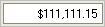

////

|metadata|
{
    "name": "wineditors-limiting-the-number-of-input-characters",
    "controlName": ["WinEditors"],
    "tags": ["Extending","How Do I","Validation"],
    "guid": "{29FE16D6-8952-4ECE-9655-769DEB663AC9}",  
    "buildFlags": [],
    "createdOn": "2005-06-07T00:00:00Z"
}
|metadata|
////

= Limiting the Number of Input Characters

This topic applies to the following WinEditor™ controls:

* WinDateTimeEditor™
* WinNumericEditor™
* WinCurrencyEditor™

In many applications, the user should be limited to inputting certain characters within an editor. The WinDateTimeEditor, WinNumericEditor and WinCurrencyEditor provide a  pick:[win-forms="link:{ApiPlatform}win.ultrawineditors{ApiVersion}~infragistics.win.ultrawineditors.ultranumericeditorbase~maskinput.html[MaskInput]"]  property which can be used to determine which characters are valid input while ignoring invalid keystrokes.

To limit the allowable characters entered into the editors, set the MaskInput property. The mask specified below will only allow numeric characters and stipulate that two decimal places be supplied. The characters used in creating the mask are consistent with Visual Basic formatting standards. For a complete list of the characters that may be used in the input mask, see Input Mask Characters below.

When setting a mask, you may also want to use the MaskDisplay property to determine how the mask is viewed or if prompt characters should be displayed.

*In Visual Basic:*

----
Imports Infragistics.Win.UltraWinMaskedEdit
Imports Infragistics.Win.UltraWinEditors
...
Private Sub Limit_the_Number_of_Input_Characters_Load( _
  ByVal sender As System.Object, _
  ByVal e As System.EventArgs) Handles MyBase.Load
	Me.UltraNumericEditor1.NumericType = NumericType.Double
	Me.UltraNumericEditor1.MaskInput = "$999,99#.##"
	Me.UltraNumericEditor1.MaskDisplayMode = MaskMode.IncludeBoth
End Sub
----

*In C#:*

----
using Infragistics.Win.UltraWinMaskedEdit;
using Infragistics.Win.UltraWinEditors;
...
private void Limit_the_Number_of_Input_Characters_Load(object sender, EventArgs e)
{
	this.ultraNumericEditor1.NumericType = NumericType.Double;
	this.ultraNumericEditor1.MaskInput = "$999,99#.##";
	this.ultraNumericEditor1.MaskDisplayMode = MaskMode.IncludeBoth;
}
----

== Input Mask Characters

The input mask can consist of the following characters:

[options="header", cols="a,a"]
|====
|Character|Description

|#
|Digit placeholder. Character must be numeric (0-9) and entry is required.

|.
|Decimal placeholder. The actual character used is the one specified as the decimal placeholder by the system's international settings. This character is treated as a literal for masking purposes.

|,
|Thousands separator. The actual character used is the one specified as the thousands separator by the system's international settings. This character is treated as a literal for masking purposes.

|:
|Time separator. The actual character used is the one specified as the time separator by the system's international settings. This character is treated as a literal for masking purposes

|/
|Date separator. The actual character used is the one specified as the date separator by the system's international settings. This character is treated as a literal for masking purposes.

|\
|Treat the next character in the mask string as a literal. This allows you to include the '#', '&', 'A', and '?' characters in the mask. This character is treated as a literal for masking purposes.

|&
|Character placeholder. Valid values for this placeholder are ANSI characters in the following ranges: 32-126 and 128-255 (keyboard and foreign symbol characters).

|>
|Convert all the characters that follow to uppercase.

|<
|Convert all the characters that follow to lowercase.

|A
|Alphanumeric character placeholder. For example: a-z, A-Z, or 0-9. Character entry is required.

|a
|Alphanumeric character placeholder. For example: a-z, A-Z, or 0-9. Character entry is not required.

|9
|Digit placeholder. Character must be numeric (0-9) but entry is not required.

|-
|Optional minus sign to indicate negative numbers. Must appear at the beginning of the mask string.

|C
|Character or space placeholder. Character entry is not required. This operates exactly like the '&' placeholder, and ensures compatibility with Microsoft Access.

|?
|Letter placeholder. For example: a-z or A-Z. Character entry is not required.

|Literal
|All other symbols are displayed as literals; that is, they appear as themselves.

|n
|Digit placeholder. A group of n's can be used to create a numeric section where numbers are entered from right to left. Character must be numeric (0-9) but entry is not required.

|mm, dd, yy
|Combination of these three special strings can be used to define a date mask. mm for month, dd for day, yy for two digit year and yyyy for four digit year. Examples: mm/dd/yyyy, yyyy/mm/dd, mm/yy.

|hh, mm, ss, tt
|Combination of these three special strings can be used to define a time mask. hh for hour, mm for minute, ss for second, and tt for AP/PM. Examples: hh:mm, hh:mm tt, hh:mm:ss.

|====