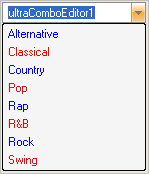

////

|metadata|
{
    "name": "wineditors-modifying-the-drop-down-list--and-appearance",
    "controlName": ["WinEditors"],
    "tags": ["Application Scenarios","How Do I"],
    "guid": "{DE313FD1-7FDA-44E4-A8B8-360E79F00CBC}",  
    "buildFlags": [],
    "createdOn": "2005-06-07T00:00:00Z"
}
|metadata|
////

= Modifying the Drop-Down List and Appearance

This topic applies to the following WinEditor™ controls:

* WinComboEditor™
* WinFontNameEditor™

WinComboEditor's  pick:[win-forms="link:{ApiPlatform}win.ultrawineditors{ApiVersion}~infragistics.win.ultrawineditors.ultracomboeditor~selecteditem.html[SelectedItem]"]  property is of type ValueListItem. A ValueListItem object exposes 2 properties that relate to its value: the  pick:[win-forms="link:{ApiPlatform}win{ApiVersion}~infragistics.win.valuelistitem~datavalue.html[DataValue]"]  property and the  pick:[win-forms="link:{ApiPlatform}win{ApiVersion}~infragistics.win.valuelistitem~displaytext.html[DisplayText]"]  property.

The DataValue property, which is of type object, represents the underlying data value of the ValueListItem. The DisplayText property stores the text that is displayed by the item. The Add method of WinComboEditor's  pick:[win-forms="link:{ApiPlatform}win.ultrawineditors{ApiVersion}~infragistics.win.ultrawineditors.ultracomboeditor~items.html[Items]"]  collection is overloaded such that the value of the DisplayText can be specified, but is not required.

== Setting the appearance of individual items in the drop-down list

Each item in WinComboEditor's drop-down list can have its own  pick:[win-forms="link:{ApiPlatform}win{ApiVersion}~infragistics.win.appearance.html[Appearance]"]  object, separate and distinct from all other items. To apply a uniform appearance to all items in the list, use the element's  pick:[win-forms="link:{ApiPlatform}win.ultrawineditors{ApiVersion}~infragistics.win.ultrawineditors.ultracomboeditor~itemappearance.html[ItemAppearance]"] . Furthermore, each property of the Appearance object is resolved independently of the other properties, making it possible, for example, to specify the same  pick:[win-forms="link:{ApiPlatform}win{ApiVersion}~infragistics.win.appearance~backcolor.html[BackColor]"]  for all items, while assigning a specific  pick:[win-forms="link:{ApiPlatform}win{ApiVersion}~infragistics.win.appearance~forecolor.html[ForeColor]"]  for each individual item.

The following code demonstrates how to set the appearance of the items in WinComboEditor's Items collection:

*In Visual Basic:*

----
Private Sub Modify_the_Drop_Down_Menus_Appearance_and_Item_List_Load( _
  ByVal sender As System.Object, ByVal e As System.EventArgs) _
  Handles MyBase.Load
	' Set the ItemAppearance's BackColor, which will affect all the items in the list
	Me.UltraComboEditor1.ItemAppearance.BackColor = Color.WhiteSmoke
	' Set the Appearance of each individual item in the 
	' UltraComboEditor's Items collection such that odd numbered items 
	' display a different ForeColor than even numbered items
	Dim i As Integer
	For i = 0 To 7
		If i Mod 2 Then
			Me.UltraComboEditor1.Items(i).Appearance.ForeColor = Color.Blue
		Else
			Me.UltraComboEditor1.Items(i).Appearance.ForeColor = Color.Red
		End If
	Next
End Sub
----

*In C#:*

----
private void Modify_the_Drop_Down_Menus_Appearance_and_Item_List_Load(
  object sender, 
  EventArgs e)
{
	// Set the ItemAppearance's BackColor, which will affect all the items in the list;
	this.ultraComboEditor1.ItemAppearance.BackColor = Color.WhiteSmoke;
	// Set the Appearance of each individual item in the 
	// UltraComboEditor's Items collection such that odd numbered items 
	// display a different ForeColor than even numbered items
	for (int i = 0; i $$<=$$ 7; i ++)
	{
		if ((i % 2) == 0)
			this.ultraComboEditor1.Items[i].Appearance.ForeColor = Color.Blue;
		else
			this.ultraComboEditor1.Items[i].Appearance.ForeColor = Color.Red;
	}
}
----

== Selecting an item programmatically

The following code demonstrates how to select an item in WinComboEditor's Items collection programmatically:

*In Visual Basic:*

----
Private Sub btnSelectItem_Click(ByVal sender As System.Object, _
  ByVal e As System.EventArgs) Handles btnSelectItem.Click
	' Select the first item in the list
	Me.UltraComboEditor1.SelectedItem = Me.UltraComboEditor1.Items(1)
End Sub
----

*In C#:*

----
private void btnSelectItem_Click(object sender, System.EventArgs e)
{
	// Select the first item in the list
	this.ultraComboEditor1.SelectedItem = this.ultraComboEditor1.Items[1];
}
----

== Deselecting an item programmatically

The following code demonstrates how to clear the SelectedItem from the WinComboEditor control's Items collection programmatically:

*In Visual Basic:*

----
Private Sub btnDeselectingItem_Click(ByVal sender As System.Object, _
  ByVal e As System.EventArgs) Handles btnDeselectingItem.Click
	' Deselect the SelectedItem, by setting the SelectedIndex to -1
	Me.UltraComboEditor1.SelectedIndex = -1
End Sub
----

*In C#:*

----
private void btnDeselectingItem_Click(object sender, System.EventArgs e)
{       
	// Deselect the SelectedItem, by setting the SelectedIndex to -1
	this.ultraComboEditor1.SelectedIndex = -1;
}
----

== Querying the element's current value

The following code demonstrates how to obtain WinComboEditor's current *Value* , which can be different than the value of its  pick:[win-forms="link:{ApiPlatform}win.ultrawineditors{ApiVersion}~infragistics.win.ultrawineditors.ultracomboeditor~text.html[Text]"]  property:

*In Visual Basic:*

----
Private Sub btnCurrentValue_Click(ByVal sender As System.Object, _
  ByVal e As System.EventArgs) Handles btnCurrentValue.Click
	' Make sure there is a SelectedItem; if there is, get its value, 
	' and display it in a message box
	Dim objValue As Object
	If Not Me.UltraComboEditor1.SelectedItem Is Nothing Then
		objValue = Me.UltraComboEditor1.SelectedItem.DataValue
		MessageBox.Show("SelectedItem's value = " + objValue.ToString())
	Else
		MessageBox.Show("SelectedItem's value = Nothing")
	End If
End Sub
----

*In C#:*

----
private void btnCurrentValue_Click(object sender, System.EventArgs e)
{
	// Make sure there is a SelectedItem; if there is, get its value, 
	// and display it in a message box
	if (this.ultraComboEditor1.SelectedItem != null)
	{
		object objValue = this.ultraComboEditor1.SelectedItem.DataValue;
		MessageBox.Show("SelectedItem's value = " + objValue.ToString());
	}
	else
	MessageBox.Show("SelectedItem's value = null");
}
----