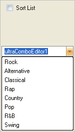
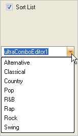

////

|metadata|
{
    "name": "wineditors-sort-items-in-the-drop-down-list",
    "controlName": ["WinEditors"],
    "tags": ["Extending","How Do I","Sorting"],
    "guid": "{681CE6CA-0385-4EBD-9E9B-67FFE3AFA9DE}",  
    "buildFlags": [],
    "createdOn": "2005-06-07T00:00:00Z"
}
|metadata|
////

= Sort Items in the Drop-Down List

This topic applies to the following WinEditor™ controls:

* WinComboEditor™
* WinFontNameEditor™

By default, the WinEditor controls do not sort the items in the drop-down list; however, by setting the  pick:[win-forms="link:{ApiPlatform}win.ultrawineditors{ApiVersion}~infragistics.win.ultrawineditors.ultracomboeditor~sortstyle.html[SortStyle]"]  property, items in the list can be sorted in either ascending or descending order. Since the items in the drop-down list can have a value that is separate and distinct from the text it displays, the SortStyle property supports sorting by either the value or the text of the item.

== Sorting by the item's display text

The following code demonstrates how to sort the items in the drop-down list by the item's display text:

*In Visual Basic:*

----
Imports Infragistics.Win
...
Private Sub UltraCheckEditor1_CheckedChanged(ByVal sender As System.Object, _
  ByVal e As System.EventArgs) Handles UltraCheckEditor1.CheckedChanged
	' Sort the items in the list in ascending order, using the item's 
	' display text as the sort criteria
	Me.UltraComboEditor1.SortStyle = ValueListSortStyle.AscendingByValue
End Sub
----

*In C#:*

----
using Infragistics.Win;
...
private void ultraCheckEditor1_CheckedChanged(object sender, EventArgs e)
{
	// Sort the items in the list in ascending order, using the item's 
	// display text as the sort criteria
	this.ultraComboEditor1.SortStyle = ValueListSortStyle.AscendingByValue;
}
----

Unsorted the drop-down list looks like the following.

When you check the checkbox, the list is now sorted an looks like the following.

