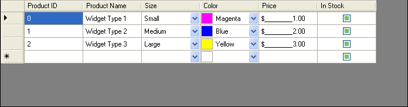

////

|metadata|
{
    "name": "wineditors-using-wineditors-in-the-datagridview-control",
    "controlName": ["WinEditors"],
    "tags": ["Application Scenarios"],
    "guid": "{CCAD02F0-E31F-4C7B-84A9-1063EA4E262E}",  
    "buildFlags": ["win-forms"],
    "createdOn": "0001-01-01T00:00:00Z"
}
|metadata|
////

= Using WinEditors in the DataGridView Control

UltraDataGridViewColumns are components derived from DataGridViewColumn. These columns can be used just like the standard DataGridViewColumn-derived classes that are part of the System.Windows.Forms namespace such as DataGridViewTextColumn or DataGridViewCheckBoxColumn, etc. The UltraDataGridViewColumns provide added functionality of the WinEditors™. This lets you use common Infragistics features like Appearances. You can also use specialized columns for dates, images, calculators, drop-down lists, and much more.

There are 13 different column types. They all have the same basic features, but each one is specialized for a specific purpose. In this example, you will create an application with a DataGridView that utilizes a few of the most common types.

[start=1]
. *Create a new project*

Create a new project in Visual Studio 2005.

Add a DataGridView control to the form.

The DataGridView supports a wide range of data sources, but for the purposes of this example, you will use an WinDataSource™. Add an UltraDataSource component to the form.
[start=2]
. *Set up the schema.*

Right-click the UltraDataSource in the component tray and select "UltraDataSource Designer."

Add the following columns to Band 0 of the UltraDataSource with the specified data types:

** ProductID – System.Int32
** ProductName – System.String
** Size – System.Int32
** Color – System.Drawing.Color
** Price – System.Decimal
** InStock – System.Boolean

If you like, switch to the Data Entry screen and enter some test data for the product table. If you set a value for Size, keep the value between 1 and 3.

Click OK to finish setting up the UltraDataSource.
[start=3]
. *Bind the grid.*

Set the DataSource on the DataGridView to UltraDataSource1.

Set the DataMember to Band 0.

At this point, you will notice that the DataGridView on the form automatically creates columns for each column in the data source. These columns are created using only the default DataGridViewColumns available in Visual Studio 2005. So remove all of the columns. Start by going to the Columns property of the grid and clicking the ellipsis to bring up the Edit Columns dialog. Click Remove until all of the columns are gone. Then click OK.
[start=4]
. *Project References.*

To use any UltraDataGridViewColumns, you must add the following references to your project:

** Infragistics4.Shared.v{ProductVersion}
** Infragistics4.Win.v{ProductVersion}

*Note:* Since this project already contains an UltraDataSource component, these two references will already be in the project.

These two assemblies are Infragistics framework, and they will give you access to almost (but not quite) all of the UltraDataGridViewColumns:

** UltraCheckEditorColumn
** UltraColorPickerColumn
** UltraComboEditorColumn
** UltraDateTimeEditorColumn
** UltraFontNameEditorColumn
** UltraImageRendererColumn
** UltraMaskEditorColumn
** UltraOptionSetEditorColumn
** UltraProgressBarEditorColumn
** UltraTextEditorColumn
** UltraTimeZoneEditorColumn

There are two additional column types provided by other assemblies.

** UltraGridComboColumn is provided by the Infragistics4.Win.UltraWinGrid.v{ProductVersion} assembly.
** UltraCalendarComboColumn is provided by the Infragistics4.Win.UltraWinSchedule.v{ProductVersion} assembly.

This example will not make use of these two column types, so you do not need to add them.
[start=5]
. *Adding the columns at run-time.*

To create the columns in code, add a using/imports statement to your project to include the UltraDataGridView namespace.

*In Visual Basic:*

----
Imports Infragistics.Win.UltraDataGridView
----

*In C#:*

----
using Infragistics.Win.UltraDataGridView;
----

Handle the Form_Load event and add the following code to create the columns.

*In Visual Basic:*

----
Dim column As DataGridViewColumn = Nothing
' Product ID Column
column = New UltraTextEditorColumn()
column.Name = "ProductID"
column.HeaderText = "Product ID"
column.DataPropertyName = "ProductID"
Me.dataGridView1.Columns.Add(column)
' Product Name Column
column = New UltraTextEditorColumn()
column.Name = "ProductName"
column.HeaderText = "Product Name"
column.DataPropertyName = "ProductName"
Me.dataGridView1.Columns.Add(column)
' Product Name Column
column = New UltraComboEditorColumn()
column.Name = "Size"
column.HeaderText = "Size"
column.DataPropertyName = "Size"
Me.dataGridView1.Columns.Add(column)
column = New UltraColorPickerColumn()
column.Name = "Color"
column.HeaderText = "Color"
column.DataPropertyName = "Color"
Me.dataGridView1.Columns.Add(column)
column = New UltraMaskEditorColumn()
column.Name = "Price"
column.HeaderText = "Price"
column.DataPropertyName = "Price"
Me.dataGridView1.Columns.Add(column)
column = New UltraCheckEditorColumn()
column.Name = "In Stock"
column.HeaderText = "In Stock"
column.DataPropertyName = "In Stock"
Me.dataGridView1.Columns.Add(column)
----

*In C#:*

----
DataGridViewColumn column = null;
// Product ID Column
column = new UltraTextEditorColumn();
column.Name = "ProductID";
column.HeaderText = "Product ID";
column.DataPropertyName = "ProductID";
this.dataGridView1.Columns.Add(column);
// Product Name Column
column = new UltraTextEditorColumn();
column.Name = "ProductName";
column.HeaderText = "Product Name";
column.DataPropertyName = "ProductName";
this.dataGridView1.Columns.Add(column);
// Product Name Column
column = new UltraComboEditorColumn();
column.Name = "Size";
column.HeaderText = "Size";
column.DataPropertyName = "Size";
this.dataGridView1.Columns.Add(column);
column = new UltraColorPickerColumn();
column.Name = "Color";
column.HeaderText = "Color";
column.DataPropertyName = "Color";
this.dataGridView1.Columns.Add(column);
column = new UltraMaskEditorColumn();
column.Name = "Price";
column.HeaderText = "Price";
column.DataPropertyName = "Price";
this.dataGridView1.Columns.Add(column);
column = new UltraCheckEditorColumn();
column.Name = "In Stock";
column.HeaderText = "In Stock";
column.DataPropertyName = "In Stock";
this.dataGridView1.Columns.Add(column);
----

[start=6]
. *Setting column properties.*

If you run the application and you will be able to edit the grid and add new rows.

You will notice, that the DropDown arrow in the Size column does not work. This is because there are no items on the list.

To correct this, add the following code to the end of the Form_Load event:

*In Visual Basic:*

----
' Cast the Size column into an UltraComboEditorColumn so
' that we can access UltraComboEditorColumn-specific properties.
Dim ultraComboEditorColumn As UltraComboEditorColumn = _
   DirectCast(Me.dataGridView1.Columns("Size"), UltraComboEditorColumn)
' Populate the list
UltraComboEditorColumn.ValueList.ValueListItems.Add(1, "Small")
UltraComboEditorColumn.ValueList.ValueListItems.Add(2, "Medium")
UltraComboEditorColumn.ValueList.ValueListItems.Add(3, "Large")
----

*In C#:*

----
// Cast the Size column into an UltraComboEditorColumn so
// that we can access UltraComboEditorColumn-specific properties.
UltraComboEditorColumn ultraComboEditorColumn = 
  this.dataGridView1.Columns["Size"] as UltraComboEditorColumn;
// Populate the list
ultraComboEditorColumn.ValueList.ValueListItems.Add(1, "Small");
ultraComboEditorColumn.ValueList.ValueListItems.Add(2, "Medium");
ultraComboEditorColumn.ValueList.ValueListItems.Add(3, "Large");
----

[start=7]
. *Run the application.*

You can now run the application and edit each column. Notice that the Size column's drop-down list now works and when you select an item, the DisplayText is shown and the underlying DataValue is stores in the integer column.

