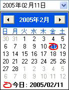
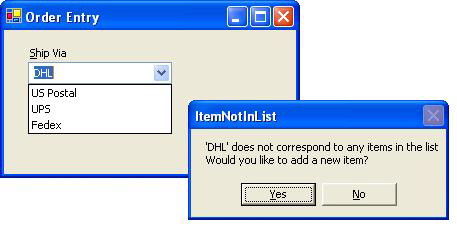
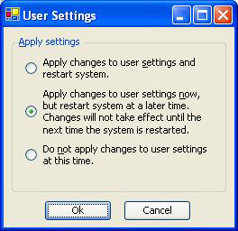
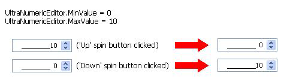
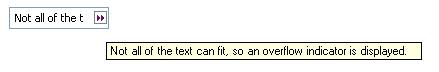

////

|metadata|
{
    "name": "wineditors-whats-new-2005-1",
    "controlName": [],
    "tags": [],
    "guid": "{CC56C053-4707-4299-99EC-71DBF4B58DB4}",  
    "buildFlags": [],
    "createdOn": "0001-01-01T00:00:00Z"
}
|metadata|
////

= WinEditors 2005.1

== Japanese Date Separators (WinDateTimeEditor)

The WinDateTimeEditor™ control now automatically displays localized Japanese character separators between the Year, Month, and Day components when Windows regional settings are set to the Japanese culture. The characters will be displayed when the control's  pick:[win-forms="link:infragistics4.win.ultrawineditors.v{ProductVersion}~infragistics.win.ultrawineditors.ultradatetimeeditor~maskinput.html[MaskInput]"]  property is left unassigned, or assigned a mask that begins with the {LOC} character sequence.

The following screen shot illustrates how the control appears when the Japanese regional settings are in effect:

== LimitToList functionality (WinComboEditor)

A  pick:[win-forms="link:infragistics4.win.ultrawineditors.v{ProductVersion}~infragistics.win.ultrawineditors.ultracomboeditor~limittolist.html[LimitToList]"]  property, an  pick:[win-forms="link:infragistics4.win.ultrawineditors.v{ProductVersion}~infragistics.win.ultrawineditors.ultracomboeditor~itemnotinlist_ev.html[ItemNotInList]"]  event, and overloaded  pick:[win-forms="link:infragistics4.win.ultrawineditors.v{ProductVersion}~infragistics.win.ultrawineditors.ultracomboeditor~isiteminlist.html[IsItemInList]"]  methods have been added to the WinComboEditor™ control. The LimitToList property gets/sets a value indicating whether the control will retain focus upon validation whenever the entered value does not correspond to an item in the control's  pick:[win-forms="link:infragistics4.win.ultrawineditors.v{ProductVersion}~infragistics.win.ultrawineditors.ultracomboeditor~items.html[Items]"]  collection. The ItemNotInList event is fired before the Validating event of the control whenever the text value entered into the editor portion of the control does not correspond to an item in the control's Items collection. The event passes a ValidationErrorEventArgs object that contains InvalidText and LastValidValue properties, as well as properties for specifying that the control should retain focus or beep to provide an auditory cue. The IsItemInList overloaded methods return a boolean indicating whether the value of the control's  pick:[win-forms="link:infragistics4.win.ultrawineditors.v{ProductVersion}~infragistics.win.ultrawineditors.ultracomboeditor~text.html[Text]"]  property, or a specified string, corresponds to an item in the control's Items collection. The LimitToList functionality can be used, for example, to validate the contents of the control's edit portion, and alert the end user when the entered value does not match an item in the list, as illustrated by the screenshot below. For more information about the LimitToList functionality, see link:wineditors-limiting-the-number-of-items-added-to-the-mru-list.html[Limit the Number of Items Added to the MRU List].

== Word wrapping for item text (WinOptionSet)

The WinOptionSet™ control and its associated embeddable editor, OptionSetEditor now expose  pick:[win-forms="link:infragistics4.win.ultrawineditors.v{ProductVersion}~infragistics.win.ultrawineditors.ultraoptionset~mincolumnwidth.html[MinColumnWidth]"]  and  pick:[win-forms="link:infragistics4.win.ultrawineditors.v{ProductVersion}~infragistics.win.ultrawineditors.ultraoptionset~maxcolumnwidth.html[MaxColumnWidth]"]  properties. If the width of an item exceeds the  _MaxColumnWidth_  of a column the item's text is automatically wrapped (i.e., the item becomes multi-line), as illustrated by the following screen shot:

== Spin button wrapping for EditorWithMask-based controls

A  pick:[win-forms="link:infragistics4.win.ultrawineditors.v{ProductVersion}~infragistics.win.ultrawineditors.ultrawineditormaskedcontrolbase~spinwrap.html[SpinWrap]"]  property has been added to the  pick:[win-forms="link:infragistics4.win.ultrawineditors.v{ProductVersion}~infragistics.win.ultrawineditors.ultrawineditormaskedcontrolbase.html[UltraWinEditorMaskedControlBase]"]  class (WinNumericEditor™, WinCurrencyEditor™, WinDateTimeEditor), as well as the WinMaskedEdit™, and WinCalendarCombo™ controls. The SpinWrap property gets/sets a value indicating whether the control's spin button should wrap around when its value has reached the minimum or maximum. If set to true, the spin button will wrap the value incremented/decremented based on the value of the  pick:[win-forms="link:infragistics4.win.ultrawineditors.v{ProductVersion}~infragistics.win.ultrawineditors.ultranumericeditor~minvalue.html[MinValue]"] /  pick:[win-forms="link:infragistics4.win.ultrawineditors.v{ProductVersion}~infragistics.win.ultrawineditors.ultranumericeditor~maxvalue.html[MaxValue]"]  properties. The following illustration demonstrates the control's behavior when the SpinWrap property is set to true, and a spin button is clicked when the control's value is at the maximum or minimum:

== Visual Overflow indicator for EditorWithText-based controls (i.e., an ellipsis)

pick:[win-forms="link:infragistics4.win.ultrawineditors.v{ProductVersion}~infragistics.win.ultrawineditors.texteditorcontrolbase~overflowindicatorimage.html[OverflowIndicatorImage]"]  properties have been added to the  pick:[win-forms="link:infragistics4.win.ultrawineditors.v{ProductVersion}~infragistics.win.ultrawineditors.texteditorcontrolbase.html[TextEditorControlBase]"] -derived controls. If ShowOverflowIndicator is set to true, and the text of the control is not entirely visible when the control is not in edit mode, an overflow indicator image, functionally similar to an ellipsis, appears in the right side of the text area. Hovering the mouse cursor over the image will display a tooltip with the full text. The OverflowIndicatorImage property permits a customized image to be displayed instead of the default image. The following screen shot illustrates the visual overflow indicator functionality:

