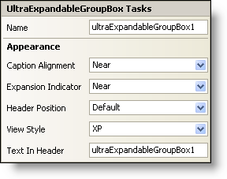

////

|metadata|
{
    "name": "winexpandablegroupbox-smart-tag",
    "controlName": [],
    "tags": ["Design Environment"],
    "guid": "{90FDC2F5-0104-40A1-95C1-EB36A084316E}",  
    "buildFlags": [],
    "createdOn": "2005-07-11T00:00:00Z"
}
|metadata|
////

= WinExpandableGroupBox Smart Tag

In Visual Studio 2005 (.NET Framework 2.0), each Infragistics Windows Forms control/component is equipped with a Smart Tag. By simply selecting the control/component, a Smart Tag anchor appears. When you click this anchor, a pop-up panel appears, providing you with quick and easy access to the most common properties and settings of the control/component.

The WinExpandableGroupBox™ Smart Tag contains the name of the control, as well as the following section:

* Appearance -- Provides common tasks involving the appearance, look, and feel of the control.

See below for a description of the item (e.g., field, drop-down list, checkbox) in each section, as well as the item's corresponding property in the properties grid.

[options="header", cols="a,a,a"]
|====
|Appearance|Description|Corresponding Property

|Caption Alignment
|You can select how you want the text to be aligned (Near, Center, or Far) within the caption header of the control. The alignment of the caption text is dependent on the placement of the caption header (i.e., horizontal or vertical). If you select "Near" from the drop-down list, the text will be aligned such that the first character is close to an edge of the caption header. If you select "Center", the text will be aligned such that it is centered within the caption header. If you select "Far", the text will be aligned such that the last character is close to an edge of the caption header.
| pick:[win-forms="link:{ApiPlatform}win.misc{ApiVersion}~infragistics.win.misc.ultragroupbox~captionalignment.html[CaptionAlignment]"] 

|Expansion Indicator
|The expansion indicator is the plus (+)/minus (-) box in the header. Using the drop-down list, you can specify the location (Near or Far) of the expansion indicator. The location is dependent on whether the header is horizontal or vertical. For example, if the header is horizontal, and you select "Far", the expansion indicator will appear on the right-hand side of the control. If the header is vertical, and you select "Far", the expansion indicator will be positioned near the bottom of the control. If you want the expansion indicator to be hidden, select "None".
| pick:[win-forms="link:{ApiPlatform}win.misc{ApiVersion}~infragistics.win.misc.ultraexpandablegroupbox~expansionindicator.html[ExpansionIndicator]"] 

|Header Position
|You can place the header on any of the four sides of the WinExpandableGroupBox inside, on, or outside of the border.
| pick:[win-forms="link:{ApiPlatform}win.misc{ApiVersion}~infragistics.win.misc.ultragroupbox~headerposition.html[HeaderPosition]"] 

|View Style
|The style of the WinExpandableGroupBox can be changed to mimic Windows XP, Office 2000, Office 2003, Visual Studio 2005, Office 2007.
| pick:[win-forms="link:{ApiPlatform}win.misc{ApiVersion}~infragistics.win.misc.ultraexpandablegroupbox~viewstyle.html[ViewStyle]"] 

|Text In Header
|This is the text that displays in the header.
| pick:[win-forms="link:{ApiPlatform}win.misc{ApiVersion}~infragistics.win.misc.controlbase~text.html[Text]"] 

|====