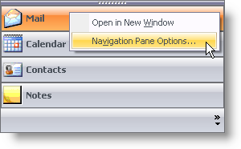

////

|metadata|
{
    "name": "winexplorerbar-hide-the-navigation-pane-context-menu-for-a-particular-group",
    "controlName": ["WinExplorerBar"],
    "tags": ["How Do I","Tips and Tricks"],
    "guid": "{1F0FD427-E81A-4D79-9870-C58BE81E61EE}",  
    "buildFlags": [],
    "createdOn": "0001-01-01T00:00:00Z"
}
|metadata|
////

= Hide the Navigation Pane Context Menu for a Particular Group

Each group can display its own context menu by right-clicking on the group header. This context menu allows the end user to customize the WinExplorerBar control. If you do not want a group's context menu to display on a right-click, you will need to cancel the context menu from the  pick:[win-forms="link:{ApiPlatform}win.ultrawinexplorerbar{ApiVersion}~infragistics.win.ultrawinexplorerbar.ultraexplorerbar~navigationcontextmenuinitializing_ev.html[NavigationContextMenuInitializing]"]  event. Two of the arguments passed into this event are Group and Cancel. The Group property allows you to determine which group the end user right-clicked, and the Cancel property allows you to stop the context menu from displaying.

The following code will stop the context menu from displaying only if the end user right-clicked the fourth group.

*In Visual Basic:*

----
Private Sub UltraExplorerBar1_NavigationContextMenuInitializing( _
  ByVal sender As System.Object, _
  ByVal e As _
  Infragistics.Win.UltraWinExplorerBar.CancelableNavigationContextMenuInitializingEventArgs) _
  Handles UltraExplorerBar1.NavigationContextMenuInitializing
   If e.Group = Me.ultraExplorerBar1.Groups(3) Then
      e.Cancel = True
   End If
End Sub
----

*In C#:*

----
private void ultraExplorerBar1_NavigationContextMenuInitializing(object sender,
  Infragistics.Win.UltraWinExplorerBar.CancelableNavigationContextMenuInitializingEventArgs e)
{
	if(e.Group == this.ultraExplorerBar1.Groups[3]) e.Cancel = true;
}
----