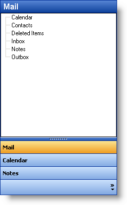
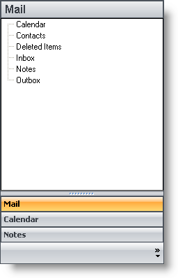

////

|metadata|
{
    "name": "winexplorerbar-select-an-appearance-style",
    "controlName": ["WinExplorerBar"],
    "tags": ["Styling"],
    "guid": "{199151CE-695B-4EF1-85C2-A751F7D4AB09}",  
    "buildFlags": [],
    "createdOn": "2005-07-07T00:00:00Z"
}
|metadata|
////

= Select an Appearance Style

WinExplorerBar™ can assume a wide variety of appearances, enabling to fit in easily with any style of application, and to be deployed in any environment. You can choose between two scenarios: setting up the element's appearance at design-time, which will provide a standard look for the application in any circumstances, or modifying the element's appearance at run-time to suit external factors such as the operating system being used to run the application.

This topic illustrates how to make changes to the control's appearance at run-time. However, the properties discussed are also available at design-time should you choose to set them in advance. Also, the UltraExplorerBar Designer can be used to apply a variety of formatting and behavior settings using organized, interactive interface. The UltraExplorerBar Designer is available in the development environment, either from the element's context menu, or from a link at the bottom of the element's property sheet. See link:winexplorerbar-add-groups-and-items-at-design-time.html[Add Groups and Items at Design Time] for more information.

[start=1]
. Before you start writing any code, you should place using/imports directives in your code-behind so you don't need to always type out a member's fully qualified name.
[start=2]
. *In Visual Basic:*

----
Imports Infragistics.Win.UltraWinExplorerBar
----

*In C#:*

----
using Infragistics.Win.UltraWinExplorerBar;
----

[start=3]
. pick:[win-forms="link:{ApiPlatform}win.ultrawinexplorerbar{ApiVersion}~infragistics.win.ultrawinexplorerbar.ultraexplorerbar~style.html[Style]"]  Property - The Style property of the UltraWinExplorerBar control determines the element's overall mode of behavior. Available choices are:

** *ExplorerBar* - This style provides functionality identical to the ExplorerBar in Windows XP. Groups are expanded or collapsed independently, and more than one group can be expanded at one time. It is also possible for all groups to be collapsed at once. Each Group takes up as much space as needed to display all of its items. If there is not enough space available in the element's client area to display every item of every expanded group, then a scrollbar appears, providing a way to scroll the entire contents of the element.
** *ListBar* - When this style is applied, the element operates identically to the Outlook Bar found in Microsoft Outlook, or in a way consistent with previous versions of the Infragistics ListBar elements. A single groups is visible at all times, with other groups collapsed either above or below the active group. The expanded group has a fixed area for displaying items, and if there are too many items to fit in that area, scroll buttons provide scrolling of just the expanded Group's contents.
** *Toolbox* - This style is used to replicate the functionality of the Visual Studio.NET toolbox. This style is similar to the ListBar style, except that scrollbuttons appear in the group's header area rather than its client area. Also, if the Toolbox style is used, the default Style property for individual Item objects changes from Button to State Button. Other than that, if functions identically, displaying a single group at all times.
** *OutlookNavigationPane* - This style is used to replicate the functionality of the Navigation Pane in Outlook 2003. This style combines a Listbar-like control with a sizable Current Group as well as a Group header and button overflow area that enable selection of other Groups. A 'Navigation Pane Options' dialog can be displayed by the user at runtime (and by the developer at designtime) to change the order and visibility of the Groups.
** *VisualStudio2005Toolbox* - Using this style causes the control to look and feel like the Toolbox found in Visual Studio 2005. When using this style, the control scrolls all of the groups instead of scrolling the items in a particular group. The groups can be expanded/collapsed via an expansion indicator or just by simply clicking on a group header. This style allows for multiple groups to be expanded simultaneously.

Note that although there is a Toolbox setting for the element's Style property, it has no effect on the appearance of the groups Items, and is not enough by itself to produce a toolbox-style interface. To do so, you must set properties not only at the element level, but at the group level. See the topic link:winexplorerbar-control-the-appearance-of-groups-and-items.html[Control the Appearance of Groups and Items] for more information.

*In Visual Basic:*

----
Me.UltraExplorerBar1.Style = UltraExplorerBarStyle.OutlookNavigationPane
----

*In C#:*

----
this.ultraExplorerBar1.Style = UltraExplorerBarStyle.OutlookNavigationPane;
----

[start=4]
. pick:[win-forms="link:{ApiPlatform}win.ultrawinexplorerbar{ApiVersion}~infragistics.win.ultrawinexplorerbar.ultraexplorerbar~viewstyle.html[ViewStyle]"]  Property - The ViewStyle property of the element specifies the look of the interface that will be displayed. Available choices are XP, XP Explorer Bar and Office 2000\.

** *XP* - This view style simulates the look of Windows XP by formatting the element with gradient blended colors and wide, shaded borders. It uses the system colors to match the appearance of other UI elements on the system.
** *XP Explorer Bar* - This view style is similar to the XP view style in that applies a Windows XP appearance to the element. However, this style use the themes functionality of Windows XP to format the element appropriately. (Themes support must be available for this feature to work.)
** *Office 2000* - This view style provides an interface style consistent with Office or Windows 2000, which is essentially an enhanced version of the familiar Windows "9X" interface. This view style also makes use of system colors.
** *Office 2003* - This view style simulates the look of controls found in applications of the Office 2003 suite.
** *Visual Studio 2005* - This view style provides an interface style consistent with the Toolbox found in Visual Studio 2005.
** *Office 2007* - This view style simulates the look of controls found in applications of the Office 2007 suite.

*In Visual Basic:*

----
Me.UltraExplorerBar1.ViewStyle = UltraExplorerBarViewStyle.Office2007
----

*In C#:*

----
this.ultraExplorerBar1.ViewStyle = UltraExplorerBarViewStyle.Office2007;
----

[start=5]
. *AcceptFocus* - This property specifies whether the UltraWinExplorerBar can accept input focus. Commonly, mouse-specific interface elements such as toolbars and the Outlook Bar are unable to accept input focus. When clicked, they do not display a focus rectangle, and the current input focus does not change. Neither are they part of the tab order of an application's controls; they cannot be accessed via the keyboard.

The  pick:[win-forms="link:{ApiPlatform}win.ultrawinexplorerbar{ApiVersion}~infragistics.win.ultrawinexplorerbar.ultraexplorerbar~acceptsfocus.html[AcceptsFocus]"]  property of the UltraWinExplorerBar specifies whether the element will follow this convention, or will accept input focus and participate in the tab order with other controls on the form. You can also use keyboard mnemonics (accelerator keys) for items in the UltraWinExplorerBar if AcceptFocus is set to True. Note that the element's TabStop property is also honored with regard to accepting focus. If set to False, the element cannot be tabbed to. If set to True or if the element is clicked on, then the AcceptFocus property determines whether the element accepts focus. Also, if AcceptFocus is set to False, mnemonic keys will not function.
[start=6]
. pick:[win-forms="link:{ApiPlatform}win.ultrawinexplorerbar{ApiVersion}~infragistics.win.ultrawinexplorerbar.ultraexplorerbar~groupspacing.html[GroupSpacing]"] ,  pick:[win-forms="link:{ApiPlatform}win.ultrawinexplorerbar{ApiVersion}~infragistics.win.ultrawinexplorerbar.ultraexplorerbar~columncount.html[ColumnCount]"]  and  pick:[win-forms="link:{ApiPlatform}win.ultrawinexplorerbar{ApiVersion}~infragistics.win.ultrawinexplorerbar.ultraexplorerbar~columnspacing.html[ColumnSpacing]"]  - While most of the properties that determine how the contents of a Group will look are set at the Group level, these three element-level properties have a significant impact on the appearance of the groups and the Items they contain. Note that theses settings apply only when the element has a Style of 'Explorer Bar.' For ListBar and Toolbox styles, there is no spacing between Groups, and Groups are displayed only in a single column.
[start=7]
. ** Group Spacing - Specifies the amount of vertical space between Groups.
** ColumnCount - Specifies how many Groups will be displayed horizontally within the width of the element.
** ColumnSpacing - Specifies the horizontal space between Groups that are being displayed beside one another. Only applies if ColumnCount is set to a value greater than one.
**  pick:[win-forms="link:{ApiPlatform}win.ultrawinexplorerbar{ApiVersion}~infragistics.win.ultrawinexplorerbar.ultraexplorerbar~scrollbars.html[Scrollbars]"]  - By default the element displays scrollbars on an as-needed basis. You can use this property to specify that scrollbars should be displayed even if not needed, or not displayed even if needed. (always or never). Note that the type of scrolling interface displayed by the element varies according to the Style of the element. For an ExplorerBar-style element, full scrollbars appear in the client area of the element itself. For a ListBar-style element, only scroll buttons appear, and they are displayed inside the Group's client area. For a Toolbox-style element, only scroll buttons appear, and only in the header area of the Group.
**  pick:[win-forms="link:{ApiPlatform}win.ultrawinexplorerbar{ApiVersion}~infragistics.win.ultrawinexplorerbar.ultraexplorerbar~animationenabled.html[AnimationEnabled]"]  and link:{ApiPlatform}win.ultrawinexplorerbar{ApiVersion}~infragistics.win.ultrawinexplorerbar.ultraexplorerbar~animationspeed.html[ pick:[win-forms="AnimationSpeed"] ] - Animation is used when Groups are changing their active state, being expanded or collapsed. These two properties respectively determine whether animation will be used and the speed at which it will be rendered. You can choose a fast, medium or slow animation speed.