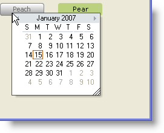

////

|metadata|
{
    "name": "winexplorerbar-show-the-navigation-pane-flyout-at-the-mouse-coordinates-on-a-right-click",
    "controlName": ["WinExplorerBar"],
    "tags": ["How Do I"],
    "guid": "{D990BF5A-1321-4E80-B537-FD182B82E96E}",  
    "buildFlags": [],
    "createdOn": "0001-01-01T00:00:00Z"
}
|metadata|
////

= Show the Navigation Pane Flyout at the Mouse Coordinates on a Right-Click

Instead of showing the Navigation Pane flyout immediately beside the collapsed Navigation Pane, you can have it appear wherever you like, perhaps as a context menu displaying on a right-click. All you need to do is invoke the  pick:[win-forms="link:{ApiPlatform}win.ultrawinexplorerbar{ApiVersion}~infragistics.win.ultrawinexplorerbar.ultraexplorerbar~shownavigationpaneflyout.html[ShowNavigationPaneFlyout]"]  method in a MouseUp event while passing it the mouse coordinates.

The following code will retrieve the mouse coordinates and display the Navigation Pane flyout on a right-click.

.Note
[NOTE]
====
The Navigation Pane flyout cannot be displayed while the Navigation Pane is expanded. If you attempt to do so, an exception will be thrown. You may consider using an if/else statement to make sure the Navigation Pane is collapsed before attempting to display the flyout. Use the  pick:[win-forms="link:{ApiPlatform}win.ultrawinexplorerbar{ApiVersion}~infragistics.win.ultrawinexplorerbar.ultraexplorerbar~isnavigationpaneflyoutvisible.html[IsNavigationPaneFlyoutVisible]"]  property to determine this.
====

*In Visual Basic:*

----
Private Sub btnShowFlyoutPane_MouseUp(ByVal sender As System.Object, _
  ByVal e As System.Windows.Forms.MouseEventArgs) Handles btnShowFlyoutPane.MouseUp
   ' e will give the coordinates with respect to the button,
   ' not the entire form, so we need to add the location
   ' of the button on the form as well.
   Dim point1 As Integer = e.X + Me.btnShowFlyoutPane.Location.X
   Dim point2 As Integer = e.Y + Me.btnShowFlyoutPane.Location.Y
   If e.Button = System.Windows.Forms.MouseButtons.Right Then
      ' This displays the Navigation Pane flyout at the
      ' coordinates we established above.
      Me.ultraExplorerBar1.ShowNavigationPaneFlyout(New Point(point1, point2))
   End If
End Sub
----

*In C#:*

----
private void btnShowFlyoutPane_MouseUp(object sender, MouseEventArgs e)
{
	// e will give the coordinates with respect to the button,
	// not the entire form, so we need to add the location
	// of the button on the form as well.
	int point1 = e.X + this.btnShowFlyoutPane.Location.X;
	int point2 = e.Y + this.btnShowFlyoutPane.Location.Y;
	if (e.Button == System.Windows.Forms.MouseButtons.Right)
	{
		// This displays the Navigation Pane flyout at the
		// coordinates we established above.
		this.ultraExplorerBar1.ShowNavigationPaneFlyout(new Point(point1,point2));
	}
}
----