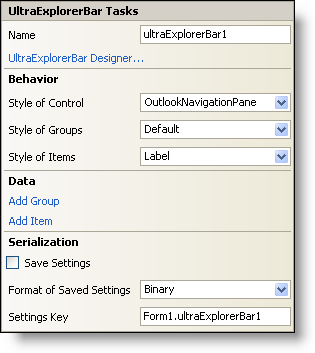

////

|metadata|
{
    "name": "winexplorerbar-smart-tag",
    "controlName": ["WinExplorerBar"],
    "tags": ["Getting Started"],
    "guid": "{40778E2B-2B25-4A1D-8C2E-0358D8007258}",  
    "buildFlags": [],
    "createdOn": "2005-11-11T00:00:00Z"
}
|metadata|
////

= WinExplorerBar Smart Tag

In Visual Studio 2005 (.NET Framework 2.0), each Infragistics Windows Forms control/component is equipped with a Smart Tag. By simply selecting the control/component, a Smart Tag anchor appears. When you click this anchor, a pop-up panel appears, providing you with quick and easy access to the most common properties and settings of the control/component.

The WinExplorerBar™ Smart Tag contains the name of the control, as well as the following sections:

* Behavior -- Provides easy access to properties that govern how the control behaves on the form.
* Data -- Refers to any underlying data the control is using such as data sources and data members.
* Serialization -- Provides quick access to properties used in the IPersistComponentSettings interface.

See below for a description of the item (e.g., field, drop-down list, checkbox) in each section, as well as the item's corresponding property in the properties grid.

[options="header", cols="a,a,a"]
|====
|Behavior|Description|Corresponding Property

|Style of Control
|Choose from several familiar styles for the WinExplorerBar from OutlookNavigationPane to VisualStudio2005Toolbox. You can also change the control's style by setting the Style property in the properties grid.
| pick:[win-forms="link:{ApiPlatform}win.ultrawinexplorerbar.v{ProductVersion}~infragistics.win.ultrawinexplorerbar.ultraexplorerbar~style.html[Style]"] 

|Style of Groups
|Group items can have small or large images with or without text. The group can also be a control container. You can also accomplish this by right-clicking the WinExplorerBar and select UltraExplorerBar Designer. Click on a group, expand the link:infragistics4.win.ultrawinexplorerbar.v{ProductVersion}~infragistics.win.ultrawinexplorerbar.ultraexplorerbargroupsettings.html[Settings] object, and set the Style property.
| pick:[win-forms="link:infragistics4.win.ultrawinexplorerbar.v{ProductVersion}~infragistics.win.ultrawinexplorerbar.ultraexplorerbargroupsettings~style.html[Style]"] 

|Style of Items
|Items can be buttons, state buttons, labels, or separators. You can also change the style of an Item by right-clicking the WinExplorerBar and selecting UltraExplorerBar Designer. Expand a Group and click on an Item. Expand the link:infragistics4.win.ultrawinexplorerbar.v{ProductVersion}~infragistics.win.ultrawinexplorerbar.ultraexplorerbaritemsettings.html[Settings] object and set the Style property.
| pick:[win-forms="link:infragistics4.win.ultrawinexplorerbar.v{ProductVersion}~infragistics.win.ultrawinexplorerbar.ultraexplorerbaritemsettings~style.html[Style]"] 

|====

[options="header", cols="a,a,a"]
|====
|Data|Description|Corresponding Property

|Add Group
|This adds a Group to the WinExplorerBar. You can also add a Group by right-clicking on the WinExplorerBar and selecting Add Group. Additionally, you can right-click on the WinExplorerBar and select UltraExplorerBar Designer. Under the Groups and Items tab, click Add Group.
|n/a

|Add Item
|This adds an Item to a Group of the WinExplorerBar. You can also add an Item by right-clicking on the WinExplorerBar and selecting Add Item. Additionally, you can right-click on the WinExplorerBar and select UltraExplorerBar Designer. Under the Groups and Items tab, select a Group and click Add Item.
|n/a

|====

[options="header", cols="a,a,a"]
|====
|Serialization|Description|Corresponding Property

|Save Settings
|If you select this checkbox, the component will automatically load/save its property settings with the application's settings.
| pick:[win-forms="link:infragistics4.win.ultrawinexplorerbar.v{ProductVersion}~infragistics.win.ultrawinexplorerbar.ultraexplorerbar~savesettings.html[SaveSettings]"] 

|Format of Saved Settings
|The component can save its settings in either binary or XML format.
| pick:[win-forms="link:infragistics4.win.ultrawinexplorerbar.v{ProductVersion}~infragistics.win.ultrawinexplorerbar.ultraexplorerbar~savesettingsformat.html[SaveSettingsFormat]"] 

|Settings Key
|You can specify the settings key that will be used to uniquely identify the settings' values that will be loaded/saved. By default, Visual Studio 2005 sets the settings key value based on the name of the containing form/control and the name of the component.
| pick:[win-forms="link:infragistics4.win.ultrawinexplorerbar.v{ProductVersion}~infragistics.win.ultrawinexplorerbar.ultraexplorerbar~settingskey.html[SettingsKey]"] 

|====