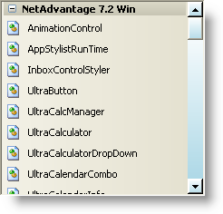

////

|metadata|
{
    "name": "winexplorerbar-style-the-scrollbars-of-winexplorerbar",
    "controlName": ["WinExplorerBar"],
    "tags": ["Styling"],
    "guid": "{370643F3-914D-439F-8231-8923225048AD}",  
    "buildFlags": [],
    "createdOn": "0001-01-01T00:00:00Z"
}
|metadata|
////

= Style the Scrollbars of WinExplorerBar

In Infragistics Windows Forms 2006 Volume 2, you can style the scrollbars in WinExplorerBar™ as you would with WinScrollBar. We added a  pick:[win-forms="link:{ApiPlatform}win.ultrawinexplorerbar{ApiVersion}~infragistics.win.ultrawinexplorerbar.ultraexplorerbar~scrollbarlook.html[ScrollBarLook]"]  property to the WinExplorerBar that exposes several of the same objects as the WinScrollBar™ control. By setting the  pick:[win-forms="link:{ApiPlatform}win{ApiVersion}~infragistics.win.ultrawinscrollbar.scrollbarlook~appearance.html[Appearance]"]  property of the ScrollBarLook property to an  pick:[win-forms="link:{ApiPlatform}win{ApiVersion}~infragistics.win.appearance.html[Appearance]"]  object, you can style the entire scrollbar. Alternatively, if you need more control, you can set properties such as  pick:[win-forms="link:{ApiPlatform}win{ApiVersion}~infragistics.win.ultrawinscrollbar.scrollbarlook~buttonappearance.html[ButtonAppearance]"] ,  pick:[win-forms="link:{ApiPlatform}win{ApiVersion}~infragistics.win.ultrawinscrollbar.scrollbarlook~thumbappearance.html[ThumbAppearance]"] , and  pick:[win-forms="link:{ApiPlatform}win{ApiVersion}~infragistics.win.ultrawinscrollbar.scrollbarlook~trackappearance.html[TrackAppearance]"] .

The following code will create an Appearance object, set a few of its properties to show a light blue, vertical gradient, and than apply that appearance to the WinExplorerBar's scrollbars.

*In Visual Basic:*

----
Imports Infragistics.Win
...
' Create an appearance object
Dim app1 As New Infragistics.Win.Appearance()
' Set the properties of the first appearance object
app1.BackColor = Color.White
app1.BackColor2 = Color.LightBlue
app1.BackGradientStyle = GradientStyle.Vertical
app1.ThemedElementAlpha = Alpha.Transparent
' Set the appearance of the WinExplorerBar's scrollbar
Me.UltraExplorerBar1.ScrollBarLook.Appearance = app1
----

*In C#:*

----
using Infragistics.Win;
...
// Create an appearance object
Infragistics.Win.Appearance app1 = new Infragistics.Win.Appearance();
// Set the properties of the first appearance object
app1.BackColor = Color.White;
app1.BackColor2 = Color.LightBlue;
app1.BackGradientStyle = GradientStyle.Vertical;
app1.ThemedElementAlpha = Alpha.Transparent;
// Set the appearance of the WinExplorerBar's scrollbar
this.ultraExplorerBar1.ScrollBarLook.Appearance = app1;
----