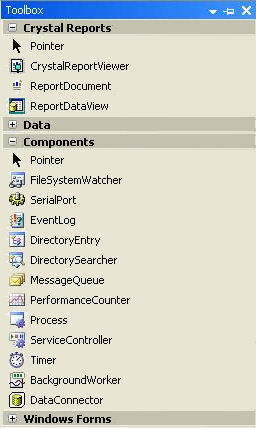

////

|metadata|
{
    "name": "winexplorerbar-whats-new-2004-3",
    "controlName": [],
    "tags": [],
    "guid": "{00826888-220C-444D-A497-3241E9567F2D}",  
    "buildFlags": [],
    "createdOn": "0001-01-01T00:00:00Z"
}
|metadata|
////

= WinExplorerBar 2004.3

* Colors relating to the new Style are now implemented.
* A ShowExpansionIndicator property has been added to the UltraExplorerBarGroupSettings object.
* A new UltraExplorerBarStyle called VisualStudioToolbox2005 has been added which simulates the Toolbox in Visual Studio 2005.
* A new UltraExplorerBarViewStyle called VisualStudioToolbox2005 has been added.

The NAS 2004 Volume 3 release of WinExplorerBar™ adds support for the Visual Studio 2005 "Whidbey" Toolbox style. This functionality is accessible via a new member of the UltraExplorerBarStyle enumeration called VisualStudio2005Toolbox. When the UltraExplorerBar is using this new style it will resemble a toolbox that can have zero or more groups in an expanded state simultaneously. In addition, an expansion indicator will appear on each group header. This new style incorporates the layout/look of the Toolbox style and the expansion capabilities of the ExplorerBar style. For more details, see the image of the new toolbox below:

