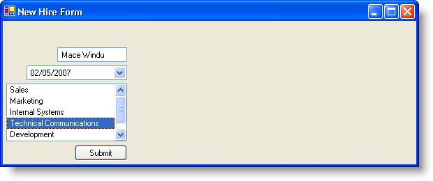

////

|metadata|
{
    "name": "winflowlayoutmanager-aligning-controls-with-winflowlayoutmanager",
    "controlName": [],
    "tags": ["Layouts","Styling"],
    "guid": "{1EB715DE-CEE6-449A-8716-561C0AB3C456}",  
    "buildFlags": [],
    "createdOn": "0001-01-01T00:00:00Z"
}
|metadata|
////

= Aligning Controls with WinFlowLayoutManager

Displaying different controls in a usable pattern can sometimes be a difficult task. Most of the time, you will display controls in a left-to-right or up-to-down pattern. Setting the position on these controls is all well and good, but if the user resizes the form, your controls may not be in the position you'd like them to be. This is where WinFlowLayoutManager™ can help. By allowing WinFlowLayoutManager to manage the layout of controls on a form, you don't need to do any of the complicated resizing calculations.

WinFlowLayoutManager exposes an  pick:[win-forms="link:{ApiPlatform}win.misc{ApiVersion}~infragistics.win.misc.ultraflowlayoutmanager~orientation.html[Orientation]"]  property that determines whether the controls it manages flow horizontally or vertically in the  pick:[win-forms="link:{ApiPlatform}win.misc{ApiVersion}~infragistics.win.misc.controllayoutmanagerbase~containercontrol.html[ControlContainer]"] . There are also  pick:[win-forms="link:{ApiPlatform}win.misc{ApiVersion}~infragistics.win.misc.ultraflowlayoutmanager~horizontalalignment.html[HorizontalAlignment]"]  and  pick:[win-forms="link:{ApiPlatform}win.misc{ApiVersion}~infragistics.win.misc.ultraflowlayoutmanager~verticalalignment.html[VerticalAlignment]"]  properties that give you even further control over how the controls are aligned with respect to the ControlContainer and with respect to the controls themselves. For example, if you were to set the Orientation property to Horizontal (the default setting), the controls would flow in a left-to-right pattern across the ControlContainer, wrapping to a row below if needed (only if the  pick:[win-forms="link:{ApiPlatform}win.misc{ApiVersion}~infragistics.win.misc.ultraflowlayoutmanager~wrapitems.html[WrapItems]"]  property is set to True). Setting the HorizontalAlignment property will then determine the alignment of the controls with respect to the ControlContainer: the Near value will left-align the controls whereas the Far value will right-align the controls. The VerticalAlignment property will then align the controls with respect to each other: the Near value will align the top of the controls with each other and the Far value will align the bottom of the controls.

Depending on the Orientation property, the HorizontalAlignment and VerticalAlignment properties will function slightly differently. When the Orientation property is set to Horizontal, the HorizontalAlignment aligns the controls with respect to the ControlContainer. When the Orientation property is set to Vertical, the VerticalAlignment aligns the controls with respect to the ControlContainer.

To further understand these alignment properties, it is best to see them in action. The following code will set all three of the above-mentioned properties. This code assumes that there is a WinTextEditor™, WinDateTimeEditor™, WinListView™, and WinButton™ on the form. WinFlowLayoutManager is managing all controls in the main Form. Setting the Orientation property to Horizontal, the HorizontalAlignment property to Near, and the VerticalAlignment property to Near will display similar to this:

*In Visual Basic:*

----
Imports Infragistics.Win
Imports Infragistics.Win.Layout
...
Me.UltraFlowLayoutManager1.Orientation = Orientation.Horizontal
Me.UltraFlowLayoutManager1.HorizontalAlignment = _
  DefaultableFlowLayoutAlignment.Near
Me.UltraFlowLayoutManager1.VerticalAlignment = _
  DefaultableFlowLayoutAlignment.Near
----

*In C#:*

----
using Infragistics.Win;
using Infragistics.Win.Layout;
...
this.ultraFlowLayoutManager1.Orientation = Orientation.Horizontal;
this.ultraFlowLayoutManager1.HorizontalAlignment = 
  DefaultableFlowLayoutAlignment.Near;
this.ultraFlowLayoutManager1.VerticalAlignment = 
  DefaultableFlowLayoutAlignment.Near;
----

 

If you were to change the two alignment properties to their opposites, setting them both to Far, the Form would then look something like this:

Changing the Orientation property to Vertical will produce a significant change in layout. The controls will now flow vertically down the Form. Setting the HorizontalAlignment now maintains the control's alignment with respect to each other while the VerticalAlignment maintains the control's alignment with respect to the entire Form. Setting the Orientation to Vertical, HorizontalAlignment to Near, and VerticalAlignment to Near will produce a layout similar to this:

image::images/WinFlowLayoutManager_Aligning_Controls_with_WinFlowLayoutManager_03.png[aligning controls with ultraflowlayoutmanager]

Changing both the HorizontalAlignment and VerticalAlignment properties to Far will achieve a layout similar to this:

