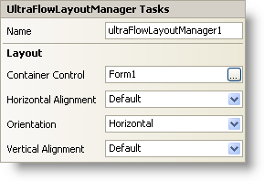

////

|metadata|
{
    "name": "winflowlayoutmanager-smart-tag",
    "controlName": [],
    "tags": ["Getting Started","Layouts"],
    "guid": "{7DA287E3-3047-4A34-A668-FC8B517B4B61}",  
    "buildFlags": [],
    "createdOn": "2005-07-11T00:00:00Z"
}
|metadata|
////

= WinFlowLayoutManager Smart Tag

In Visual Studio 2005 (.NET Framework 2.0), each Infragistics Windows Forms control/component is equipped with a Smart Tag. By simply selecting the control/component, a Smart Tag anchor appears. When you click this anchor, a pop-up panel appears, providing you with quick and easy access to the most common properties and settings of the control/component.

The WinFlowLayoutManager™ Smart Tag contains the name of the component, as well as the following section:

* Layout -- Offers properties that will determine how the WinFlowLayoutManager component positions and arranges the controls that it manages on the form.

See below for a description of the item (e.g., field, drop-down list, checkbox) in each section, as well as the item's corresponding property in the properties grid.

[options="header", cols="a,a,a"]
|====
|Layout|Description|Corresponding Property

|Container Control
|If you are using the WinGroupBox or WinExpandableGroupBox for instance, the WinFlowLayoutManager will control the layout of whatever child controls are inside the container control. For example, set the container control (also available in the properties grid via the ContainerControl property) to "ultraGroupBox1" and the WinFlowLayoutManager will manage the layout of the controls inside of "ultraGroupBox1."
| pick:[win-forms="link:{ApiPlatform}win.misc{ApiVersion}~infragistics.win.misc.controllayoutmanagerbase~containercontrol.html[ContainerControl]"] 

|Horizontal Alignment
|When the Orientation property is set to Horizontal, this property aligns the managed controls with respect to the ControlContainer. When the Orientation property is set to Vertical, this property aligns the managed controls with respect to each other.
| pick:[win-forms="link:{ApiPlatform}win.misc{ApiVersion}~infragistics.win.misc.ultraflowlayoutmanager~horizontalalignment.html[HorizontalAlignment]"] 

|Orientation
|You can orient the controls inside the containers either vertically or horizontally.
| pick:[win-forms="link:{ApiPlatform}win.misc{ApiVersion}~infragistics.win.misc.ultraflowlayoutmanager~orientation.html[Orientation]"] 

|Vertical Alignment
|When the Orientation property is set to Horizontal, this property aligns the managed controls with respect to each other. When the Orientation property is set to Vertical, this property aligns the managed controls with respect to the ControlContainer.
| pick:[win-forms="link:{ApiPlatform}win.misc{ApiVersion}~infragistics.win.misc.ultraflowlayoutmanager~verticalalignment.html[VerticalAlignment]"] 

|====