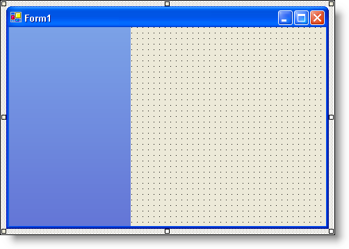
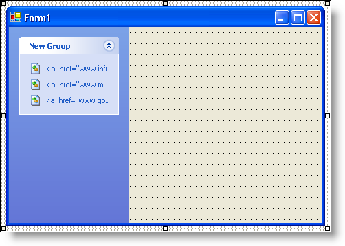
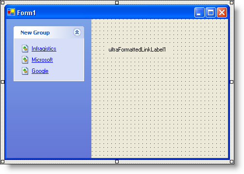
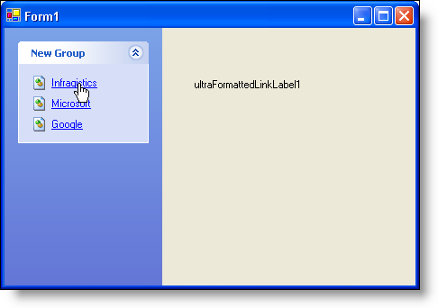

////

|metadata|
{
    "name": "winformattedlinklabel-adding-a-hyperlink-as-an-item-in-winexplorerbar",
    "controlName": ["WinFormattedLinkLabel"],
    "tags": ["How Do I"],
    "guid": "{CDC2C50A-D02C-4E7B-8E44-EDEC8E0B6397}",  
    "buildFlags": [],
    "createdOn": "2006-11-01T00:00:00Z"
}
|metadata|
////

= Adding a Hyperlink as an Item in WinExplorerBar

The  pick:[win-forms="link:{ApiPlatform}win{ApiVersion}~infragistics.win.formattedlinklabel.formattedlinkeditor.html[FormattedLinkEditor]"]  class gives you the ability to add hyperlinks to any Infragistics Windows Forms control which uses embeddable editors. FormattedLinkEditor derives from the embeddable editors base class in order to give Infragistics Windows Forms controls this functionality. This topic will guide you through the task of setting up the WinExplorerBar™ control with a single group containing three items, all using the FormattedLinkEditor class.

[start=1]
. *Create a WinExplorerBar*

.. Drag an UltraExplorerBar control from the toolbox onto your Windows form.
.. In the Properties window, find the Dock property and set it to Left.

[start=2]
. *Create a group and three items*

.. Right-click on the ExplorerBar and select "Add Group". A group is added.
.. Right-click on the Group and select "Add Item". An item is added to the group.
.. Add two more items to the group by repeating the previous step twice.

[start=3]
. *Create hyperlinks in the three items*

.. Right-click the WinExplorerBar control and select "UltraExplorerBar Designer…". The UltraExplorerBar Designer displays.
.. Expand the first group.
.. Select the first item in the group and set its Text property to "<a href="www.infragistics.com">Infragistics</a>".
.. Select the second item in the group and set its Text property to "<a href="www.microsoft.com">Microsoft</a>".
.. Select the third item in the group and set its Text property to "<a href="www.google.com">Google</a>".
.. Click Close.

[start=4]
. *Set WinExplorerBar's editor control to a WinFormattedLinkLabel*

.. Drag an UltraFormattedLinkLabel control from the toolbox onto your Windows form.
.. Make sure the WinExplorerBar is selected and expand ItemSettings in the Properties window.
.. Find the EditorControl property and set it to ultraFormattedLinkLabel1. The items in the WinExplorerBar change from raw text to formatted hyperlinks.

[start=5]
. *Run the Program*

Click on any of the links and an Internet Explorer window will open with the appropriate link.

.Note
[NOTE]
====
The WinFormattedLinkLabel control will always use the .NET Process class to open a new link. Therefore, it is up to the system, not WinFormattedLinkLabel, to decide how to handle the opened link.
====