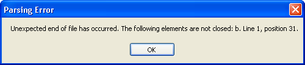

////

|metadata|
{
    "name": "winformattedlinklabel-handle-an-error-while-parsing-formatted-text",
    "controlName": ["WinFormattedLinkLabel"],
    "tags": ["How Do I"],
    "guid": "{A904FF22-7713-4F92-9418-3D00C98A30D4}",  
    "buildFlags": [],
    "createdOn": "2006-11-01T00:00:00Z"
}
|metadata|
////

= Handle an Error While Parsing Formatted Text

When parsing formatted text, you may encounter a parsing error. This can result from forgetting to close a tag, mismatching tags, etc. For example, you have a text box, button, and WinFormattedLinkLabel™ control on a form. When you click the button, the text in the box is fed into the WinFormattedLinkLabel control. In this case, it would be simple to mistype the text, resulting in the  pick:[win-forms="link:{ApiPlatform}win{ApiVersion}~infragistics.win.formattedlinklabel.formattedlinkeditor~parseerror_ev.html[ParseError]"]  event being thrown when the button is clicked.

The ParseError event gives you the option to handle several aspects of the WinFormattedLinkLabel control. You can show the specific error with the  pick:[win-forms="link:{ApiPlatform}win{ApiVersion}~infragistics.win.formattedlinklabel.parseerroreventargs.html[Exception]"]  parameter. You can also set the Value to something more meaningful with the  pick:[win-forms="link:{ApiPlatform}win{ApiVersion}~infragistics.win.formattedlinklabel.parseerroreventargs.html[Value]"]  parameter.

The following code gives an example of using the ParseError event to show a message box that specifies the exception. The Value of the WinFormattedLinkLabel control is then changed to Parsing Error.

*In Visual Basic:*

----
Private Sub UltraFormattedLinkLabel1_ParseError(ByVal sender As Object, _
  ByVal e As Infragistics.Win.FormattedLinkLabel.ParseErrorEventArgs) _
  Handles UltraFormattedLinkLabel1.ParseError
	' Show a message box containing the exception
	MessageBox.Show(e.Exception.Message.ToString(), "Parsing Error")
	' Set the value of the LinkLabel to Parsing Error
	e.Value = "Parsing Error"
End Sub
----

*In C#:*

----
private void ultraFormattedLinkLabel1_ParseError(object sender, 
  Infragistics.Win.FormattedLinkLabel.ParseErrorEventArgs e)
{
	// Show a message box containing the exception
	MessageBox.Show(e.Exception.Message.ToString(), "Parsing Error");
	// Set the value of the LinkLabel to Parsing Error
	e.Value = "Parsing Error";
}
----