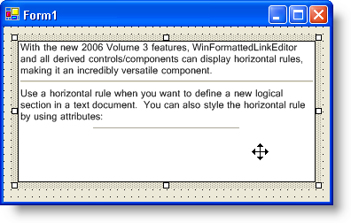

////

|metadata|
{
    "name": "winformattedlinklabel-new-horizontal-rule-tag-whats-new-20063",
    "controlName": [],
    "tags": [],
    "guid": "{1C735E8E-B107-4657-BE6C-92CDA577F118}",  
    "buildFlags": [],
    "createdOn": "0001-01-01T00:00:00Z"
}
|metadata|
////

= New Horizontal Rule Tag

The WinFormattedLinkLabel™ control was fitted with a new graphical element this release. This element, the HR tag, can be used to separate sections of text and images. Using the HR tag is simple; all you need to do for default functionality is add an 
 tag wherever you want a horizontal rule. You also have the option of customizing the horizontal rule by setting the width, color, 3D look, and many other options.

== Related Topics

link:winformattedlinklabel-formatting-text-and-hyperlinks.html[Formatting Text and Hyperlinks]