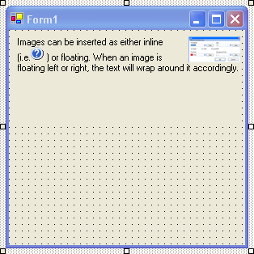

////

|metadata|
{
    "name": "winformattedlinklabel-new-image-tag-whats-new-20063",
    "controlName": [],
    "tags": [],
    "guid": "{065CFDBF-388A-4592-B1D7-CCFABC27E28F}",  
    "buildFlags": [],
    "createdOn": "0001-01-01T00:00:00Z"
}
|metadata|
////

= New Image Tag

With the new image tag, you can insert any image into WinFormattedLinkLabel™. Insert images either with the SRC attribute similar to HTML or by embedding the image into the XML value with the DATA attribute. All images, by default, are rendered inline with text. However, if you need text to wrap around an image, use the ALIGN attribute to float the image.

The image tag is available in WinFormattedLinkEditor, WinFormattedLinkLabel, WinFormattedTextEditor, and any ToolTip whose ToolTipTextFormatted property is being used.

== Related Topics

link:winformattedlinklabel-formatting-text-and-hyperlinks.html[Formatting Text and Hyperlinks]

link:winformattedtexteditor-style-attribute.html[Style Attribute]