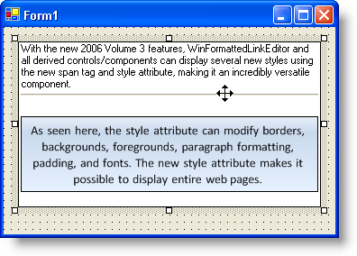

////

|metadata|
{
    "name": "winformattedlinklabel-new-span-tag-and-style-attribute-whats-new-20063",
    "controlName": [],
    "tags": [],
    "guid": "{C9D4B11A-01BA-4DE9-B99D-EB9728088B00}",  
    "buildFlags": [],
    "createdOn": "0001-01-01T00:00:00Z"
}
|metadata|
////

= New Span Tag and Style Attribute

One of the more impressive additions to WinFormattedLinkLabel™ is the STYLE attribute. Using this attribute, you can set styles ranging from padding to foreground color to border styles. The STYLE attribute can be used on the pre-existing 
 tag, as well as the new , 
, and  tags.

The  tag was created specifically to display inline styles. By itself, the  tag does nothing. However, add the style attribute to the  tag, and you can do so much more. You can change the background color, use a background gradient, change border color and styles, edit font styles just like the  tag, modify the height and width of the section, apply extra padding and margins, etc. For a complete list of available styles that can be used in the  tag, see Using the Style Attribute.

== Related Topics

link:winformattedlinklabel-formatting-text-and-hyperlinks.html[Formatting Text and Hyperlinks]

link:winformattedtexteditor-style-attribute.html[Style Attribute]