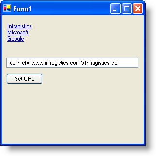

////

|metadata|
{
    "name": "winformattedlinklabel-new-winformattedlinklabel-control-whats-new-2006-1",
    "controlName": [],
    "tags": [],
    "guid": "{FDAD210D-4EBE-4D03-9EE2-C6A2ACFB3585}",  
    "buildFlags": [],
    "createdOn": "0001-01-01T00:00:00Z"
}
|metadata|
////

= New WinFormattedLinkLabel Control

In the past, it required a great deal of work to make HTML function properly in WinGrid™ or other controls. To address this difficulty, we have now implemented an entirely new control, WinFormattedLinkLabel™, which uses the  pick:[win-forms="link:{ApiPlatform}win{ApiVersion}~infragistics.win.formattedlinklabel.formattedlinkeditor.html[FormattedLinkEditor]"]  class, allowing you to display formatted text, as well as one or more hyperlinks, in WinGrid, WinTree, and any other control that supports embeddable editors.

You have complete control over how the FormattedLinkEditor displays formatted text. You can use several standard tags (similar to HTML tags, but seen by the editor as well-formed XML tags) to format your text such as bold (<b>, <strong>), italics (<i>, <em>), underline (<u>), and font (, , ). You can also perform custom actions when a link is clicked with the  pick:[win-forms="link:{ApiPlatform}win{ApiVersion}~infragistics.win.formattedlinklabel.linkclickedeventargs.html[LinkClicked]"]  event.

== Related Topics

link:winformattedlinklabel-about-winformattedlinklabel.html[About WinFormattedLinkLabel]

link:winformattedlinklabel-formatting-text-and-hyperlinks.html[Formatted Text and Hyperlinks]

link:winformattedlinklabel-create-a-link-using-winformattedlinklabel.html[Create a Link with the WinFormattedLinkLabel]

link:winformattedlinklabel-handle-an-error-while-parsing-formatted-text.html[Handle an Error While Parsing Formatted Text]

link:winformattedlinklabel-adding-a-hyperlink-to-a-cell-in-wingrid.html[Adding a Hyperlink to a Cell in WinGrid]

link:winformattedlinklabel-adding-a-hyperlink-as-an-item-in-winexplorerbar.html[Adding a Hyperlink as an Item in WinExplorerBar]