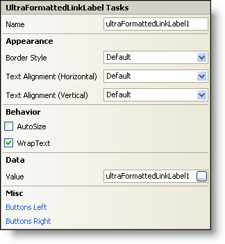

////

|metadata|
{
    "name": "winformattedlinklabel-smart-tag",
    "controlName": ["WinFormattedLinkLabel"],
    "tags": ["Extending"],
    "guid": "{7C47A751-10FB-4BD9-A9F0-7DC55565A6DC}",  
    "buildFlags": [],
    "createdOn": "0001-01-01T00:00:00Z"
}
|metadata|
////

= WinFormattedLinkLabel Smart Tag

In Visual Studio® 2005 (.NET Framework 2.0), each Infragistics Windows Forms control/component is equipped with a Smart Tag. By simply selecting the control/component, a Smart Tag anchor appears. When you click this anchor, a pop-up panel appears, providing you with quick and easy access to the most common properties and settings of the control/component.

The WinFormattedLinkLabel™ Smart Tag contains the name of the control, as well as the following sections:

* Appearance -- Provides common tasks involving the appearance, look, and feel of the control.
* Behavior -- Provides easy access to properties that govern how the control behaves on the form.
* Data -- Refers to the XML document the FormattedLinkEditor class will use to render the formatted text.
* Misc -- Provides various options that will enhance the overall look or performance of the control.

See below for a description of the item (e.g., field, drop-down list, checkbox) in each section, as well as the item's corresponding property in the properties grid.

[options="header", cols="a,a,a"]
|====
|Appearance|Description|Corresponding Property

|Border Style
|This property will put a border around the entire control, not just one link or line of text. Choose from Solid, Dotted, Raised, and several other styles. You can also have no border, which is the same as the default setting.
| pick:[win-forms="link:{ApiPlatform}win.misc{ApiVersion}~infragistics.win.formattedlinklabel.ultraformattedtexteditorbase~borderstyle.html[BorderStyle]"] 

|Text Alignment (Horizontal)
|Align the text in the control to either Left, Center, or Right. The default setting is the same as Left.
| pick:[win-forms="link:{ApiPlatform}win{ApiVersion}~infragistics.win.appearance~texthalign.html[TextHAlign]"] 

|Text Alignment (Vertical)
|Align the text in the control to either Top, Middle, or Bottom. The default setting is the same as Top.
| pick:[win-forms="link:{ApiPlatform}win{ApiVersion}~infragistics.win.appearance~textvalign.html[TextVAlign]"] 

|====

[options="header", cols="a,a,a"]
|====
|Behavior|Description|Corresponding Property

|AutoSize
|Selecting this check box will cause the control to automatically resize itself to fit its contents. By default, AutoSize is set to False.
| pick:[win-forms="link:{ApiPlatform}win.misc{ApiVersion}~infragistics.win.formattedlinklabel.ultraformattedtexteditorbase~autosize.html[AutoSize]"] 

|WrapText
|By selecting this check box, the control will wrap the text if it doesn't all fit on one line. By default, WrapText is set to False.
| pick:[win-forms="link:{ApiPlatform}win.misc{ApiVersion}~infragistics.win.formattedlinklabel.ultraformattedtexteditorbase~wraptext.html[WrapText]"] 

|====

[options="header", cols="a,a,a"]
|====
|Data|Description|Corresponding Property

|Value
|By clicking the right editor button, you can edit the Value in the WinFormattedLinkLabel value Editor. In the Editor, you will be able to see what the formatted text will look like prior to actually setting the value. Alternatively, you can just type the value in the text box of the smart tag if you feel comfortable with basic HTML tags. For more information on specific tags supported by the WinFormattedLinkLabel control, see link:winformattedlinklabel-formatting-text-and-hyperlinks.html[Formatting Text and Hyperlinks].
| pick:[win-forms="link:{ApiPlatform}win.misc{ApiVersion}~infragistics.win.formattedlinklabel.ultraformattedtexteditorbase~value.html[Value]"] 

|====

[options="header", cols="a,a,a"]
|====
|Misc|Description|Corresponding Property

|Buttons Left
|Click the ellipsis (...) to open the ButtonsLeft collection. This is a collection of custom buttons that can be placed on the left of the editor.
|ButtonsLeft

|Buttons Right
|Click the ellipsis (...) to open the ButtonsRight collection. This is a collection of custom buttons that can be placed on the right of the editor.
|ButtonsRight

|====