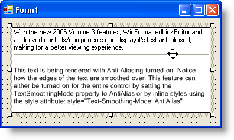

////

|metadata|
{
    "name": "winformattedlinklabel-you-can-now-smooth-text-with-anti-aliasing-whats-new-20063",
    "controlName": [],
    "tags": [],
    "guid": "{8D964A01-50CF-45E3-B83B-03A08D5035F6}",  
    "buildFlags": [],
    "createdOn": "0001-01-01T00:00:00Z"
}
|metadata|
////

= You Can Now Smooth Text with Anti-Aliasing

Sometimes, simply setting a simple property to True can make a world of difference. That's the theory behind the  pick:[win-forms="link:{ApiPlatform}win.misc{ApiVersion}~infragistics.win.formattedlinklabel.ultraformattedtexteditorbase~textsmoothingmode.html[TextSmoothingMode]"]  property. When set to True, WinFormattedLinkLabel™ will render all of its text with anti-aliasing. Anti-aliasing is a special smoothing technique that is most prevalent in the 3-D computer graphics and gaming communities. At lower resolutions, the edges of three dimensional objects may seem jagged. This technique smooths those jagged edges for a much more visually appealing and realistic representation. The same concept is being applied to WinFormattedLinkLabel's text. Not quite the same as ClearType, but still a visual enhancement that is definitely easier on the eyes when reading.

== Related Topics

link:winformattedtexteditor-smooth-formatted-text.html[Smooth Formatted Text]