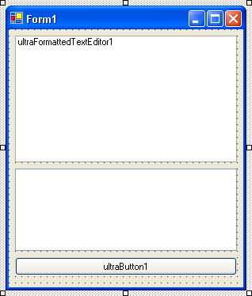
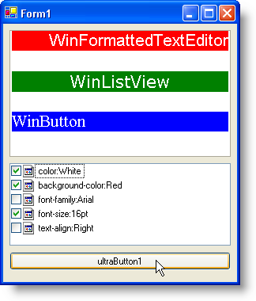
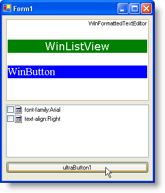

////

|metadata|
{
    "name": "winformattedtexteditor-clearing-specific-styles-from-formatted-text",
    "controlName": [],
    "tags": ["How Do I","Styling"],
    "guid": "{C3FCAC77-28B4-4B13-8423-8EA39D6D5D84}",  
    "buildFlags": [],
    "createdOn": "2006-12-09T13:44:30Z"
}
|metadata|
////

= Clearing Specific Styles from Formatted Text

== Before You Begin

The WinFormattedTextEditor™ control can gather all style information applied to text. WinFormattedTextEditor can also remove individual styles from text. Using basic string manipulation, you can use the  pick:[win-forms="link:{ApiPlatform}win{ApiVersion}~infragistics.win.formattedlinklabel.formattedtexteditinfo~getcurrentstyle.html[GetCurrentStyle]"]  method along with the  pick:[win-forms="link:{ApiPlatform}win{ApiVersion}~infragistics.win.formattedlinklabel.formattedtexteditinfo~clearstyleattributes.html[ClearStyleAttributes]"]  method to discover what styles are applied to text and then pick and choose only the styles you'd like to remove.

The GetCurrentStyle method returns a string of all style sub-attributes. For more information on these sub-attributes, see link:winformattedtexteditor-style-attribute.html[Style Attribute]. Once these sub-attributes are collected, they need to be sorted into an array of strings. The String.Split method is perfect for separating all the sub-attributes. Once all the sub-attributes have been collected, you need only to pass the undesired sub-attributes to the ClearStyleAttributes method. We split the string of styles into an array of strings because that is what needs to be passed into the ClearStyleAttributes method.

== What You Will Accomplish

This walkthrough will guide you through the process of removing only the styles that you select from either the currently selected text, or text at the cursor. You will use the GetCurrentStyle method to gather a string of style sub-attributes. You will then use the String.Split method to dissect that string into individual styles, adding them as items to a WinListView control. The WinListView control will be in List view with check boxes. When you select a specific check box and click the Remove Styles button, the SelectedItems from WinListView will be passed into the ClearStyleAttributes method. The correct styles will be removed.

== Follow these Steps

[start=1]
. You need to set up the form with the appropriate controls. Drag and drop an UltraFormattedTextEditor, UltraListView, and UltraButton from the toolbox onto the form. Arrange them from top to bottom in that order. Your form should look similar to this:

[start=2]
. Copy and paste the following formatted text into the  pick:[win-forms="link:{ApiPlatform}win.misc{ApiVersion}~infragistics.win.formattedlinklabel.ultraformattedtexteditorbase~value.html[Value]"]  property of ultraFormattedTextEditor1:

WinFormattedTextEditor

WinListView

WinButton

[start=3]
. *Setup the WinListView control.*

You want ultraListView1 to display Items in a list with checkboxes. With ultraListView1 selected, find the  pick:[win-forms="link:{ApiPlatform}win.ultrawinlistview{ApiVersion}~infragistics.win.ultrawinlistview.ultralistview~view.html[View]"]  property in the Properties window and set it to List. Expand the ViewSettingsList object and set CheckBoxStyle to CheckBox.
[start=4]
. *Create an EditStateChanged event for ultraFormattedTextEditor1 and a Click event for ultraButton1.*

If you are creating this application in C#, make sure ultraFormattedTextEditor1 is selected and click the Events button located at the top of the Properties window. Locate the EditStateChanged event and double-click it. In Visual Basic, switch to Code view and select UltraFormattedTextEditor1 from the upper-left drop-down just above the code area. The drop-down to the right will change its contents based on the left drop-down. Select EditStateChanged from the right drop-down.

You will also need a Click event for the button. You can either follow the same procedure as you did for ultraFormattedTextEditor1, or you can simply double-click the button in Design view.
[start=5]
. *Write the code for the EditStateChanged event.*

Whenever the cursor is moved or text is modified, added, or deleted, the EditStateChanged event fires. We want to fill ultraListView1 with the different styles currently applied to the text at the cursor. Therefore, we are first going to need to gather the styles using the GetCurrentStyle method. We will split that string into sub-strings and place them into an array of strings. You will then loop through that array of strings and add each string to ultraListView1. Add the following code to the EditStateChanged event:

*In Visual Basic:*

----
'Clear any previous list items
Me.UltraListView1.Items.Clear()
'Create a string array of styles.
Dim styles As String() = _
  Me.UltraFormattedTextEditor1.EditInfo.GetCurrentStyle().ToString().Split( _
    New Char() {";"})
'Add the strings from the array to the ListView.
Dim s As String
For Each s In styles
	If s = "" Then
		Exit For ' Don't add empty strings.
	End If
	Me.UltraListView1.Items.Add(s.Trim(), s.Trim())
Next s
----

*In C#:*

----
//Clear any previous list items
this.ultraListView1.Items.Clear();
//Create a string array of styles.
string[] styles =
  this.ultraFormattedTextEditor1.EditInfo.GetCurrentStyle().ToString().Split(
    new char[] {';'});
//Add the strings from the array to the ListView.
foreach(string s in styles)
{
	if(s == "") break; // Don't add empty strings.
	this.ultraListView1.Items.Add(s.Trim(),s.Trim());
}
----

[start=6]
. *Write the code for the Click event.*

When you click the button, the checked items from ultraListView1 will be gathered into a new array of strings. This new array will then be passed to the ClearStyleAttributes method of the WinFormattedTextEditor's EditInfo object. Add the following code to the Click event for ultraButton1:

*In Visual Basic:*

----
'Declare a string array with as many elements
'as are in the CheckedItems collection of the
'ListView control.
Dim styles(Me.UltraListView1.CheckedItems.Count - 1) As String
'Add whatever styles are checked in the ListView 
'to the previously declared string array.
Dim i As Integer
For i = 0 To (Me.UltraListView1.CheckedItems.Count - 1)
	'Get checked items.
	Dim item As String = Me.UltraListView1.CheckedItems(i).Key.ToString()
	'Split the string yet again. The ClearStyleAttributes method
	'expects only the attribute name to be passed on, not what it
	'is set to. So we split the individual string into two strings
	'at the colon (:).
	Dim nameValuePair As String() = item.Split(":"c)
	'We then take the first part of that string.
	Dim name As String = nameValuePair(0)
	'Add the checked item's attribute to the array.
	styles(i) = name
	'OPTIONAL: So we know what's in the array...
	Console.WriteLine(styles(i).ToString())
Next i
'Remove whatever items that were added to the 
'string array from the selected text.
Me.UltraFormattedTextEditor1.EditInfo.ClearStyleAttributes(styles, True)
----

*In C#:*

----
//Declare a string array with as many elements
//as are in the CheckedItems collection of the
//ListView control.
string[] styles = new string[this.ultraListView1.CheckedItems.Count];
//Add whatever styles are checked in the ListView 
//to the previously declared string array.
for(int i = 0; i < this.ultraListView1.CheckedItems.Count; i++)
{
	//Get checked items.
	string item = this.ultraListView1.CheckedItems[i].Key.ToString();
	//Split the string yet again. The ClearStyleAttributes method
	//expects only the attribute name to be passed on, not what it
	//is set to. So we split the individual string into two strings
	//at the colon (:).
	string[] nameValuePair = item.Split( ':' );
	//We then take the first part of that string.
	string name = nameValuePair[0];
	//Add the checked item's attribute to the array.
	styles[i] = name;
	//OPTIONAL: So we know what's in the array...
	Console.WriteLine(styles[i].ToString());
}
//Remove whatever items that were added to the 
//string array from the selected text.
this.ultraFormattedTextEditor1.EditInfo.ClearStyleAttributes(styles, true);
----

[start=7]
. *Run the application.*

Place the cursor over 'WinFormattedTextEditor'. The applied styles shows up in the WinListView control. Select a few styles and click the button.

After you click the button, those specific styles are removed from the 'WinFormattedTextEditor' text. You will also notice that the styles were removed from the WinListView control as well.

