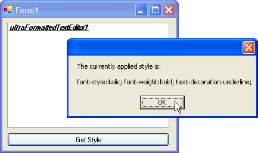

////

|metadata|
{
    "name": "winformattedtexteditor-determine-the-current-style",
    "controlName": [],
    "tags": ["Styling"],
    "guid": "{C4767B26-11F4-4ECD-9B94-DD20869F315A}",  
    "buildFlags": [],
    "createdOn": "2006-12-09T13:30:54Z"
}
|metadata|
////

= Determine the Current Style

This topic discusses the procedure for gathering all style information applied to text, if you need to determine specific styles, see link:winformattedtexteditor-determining-if-text-is-in-a-specific-format.html[Determining if Text is in a Specific Format].

There will be times when you need to know what style is currently applied to text. You can do this by invoking the  pick:[win-forms="link:{ApiPlatform}win{ApiVersion}~infragistics.win.formattedlinklabel.formattedtexteditinfo~getcurrentstyle.html[GetCurrentStyle]"]  method. This method returns a string of style information. Each style sub-attribute is separated by a semi-colon (;), making it easy to split if you needed an array of styles. See link:winformattedtexteditor-clearing-specific-styles-from-formatted-text.html[Clearing Specific Styles from Formatted Text] for more information on the  pick:[win-forms="link:{ApiPlatform}win{ApiVersion}~infragistics.win.formattedlinklabel.formattedtexteditinfo~clearstyleattributes.html[ClearStyleAttributes]"]  method which handles arrays of style information.

The following code demonstrates how to retrieve the style that is currently applied to the selected text and display it in a message box from a button click.

*In Visual Basic:*

----
Private Sub btnGetStyle_Click(ByVal sender As System.Object,_
  ByVal e As System.EventArgs) Handles btnGetStyle.Click
	If Me.UltraFormattedTextEditor1.EditInfo.GetCurrentStyle().ToString() <> "" Then
		MessageBox.Show("The currently applied style is:" & _
	  	  ControlChars.Lf + ControlChars.Lf & _
		Me.UltraFormattedTextEditor1.EditInfo.GetCurrentStyle().ToString())
	Else : MessageBox.Show("No style applied to selected text")
	End If
End Sub
----

*In C#:*

----
private void btnGetStyle_Click(object sender, EventArgs e)
{
	if(this.ultraFormattedTextEditor1.EditInfo.GetCurrentStyle().ToString() != "")
	{
		MessageBox.Show("The currently applied style is:\n\n" + 
		  this.ultraFormattedTextEditor1.EditInfo.GetCurrentStyle().ToString());
	}
	else MessageBox.Show("No style applied to selected text");
}
----