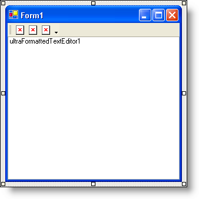
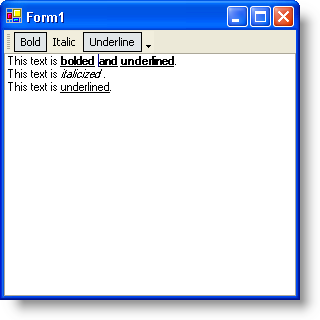

////

|metadata|
{
    "name": "winformattedtexteditor-determining-if-text-is-in-a-specific-format",
    "controlName": [],
    "tags": ["How Do I"],
    "guid": "{B31E95E9-2B58-4528-8472-4C3FBE4AF787}",  
    "buildFlags": [],
    "createdOn": "2006-12-09T13:41:05Z"
}
|metadata|
////

= Determining if Text is in a Specific Format

== Before You Begin

Fully functioning word processors notify the end user at a glance what formatting the text at the cursor is using. Text can be bolded, left-aligned, and displayed in a certain color. You can use state buttons in toolbars to show that the text is in those specific states. The application needs a way to know when the cursor has changed position so that it can test the current text to see what formatting has been applied to it. WinFormattedTextEditor™ has an event that does just that. The  pick:[win-forms="link:{ApiPlatform}win.misc{ApiVersion}~infragistics.win.formattedlinklabel.ultraformattedtexteditor~editstatechanged_ev.html[EditStateChanged]"]  event occurs whenever the state of the editor has changed. This means that whenever the cursor moves, whenever the text is edited, whenever styles are applied or removed, the event will fire.

Inside the EditStateChanged event, you can perform testing to find out if the text at the cursor is in a certain state. To determine if the text is in a specific format, you can use the  pick:[win-forms="link:{ApiPlatform}win{ApiVersion}~infragistics.win.formattedlinklabel.formattedtexteditinfo~getcurrentstyle.html[GetCurrentStyle]"]  method off the  pick:[win-forms="link:{ApiPlatform}win{ApiVersion}~infragistics.win.formattedlinklabel.formattedtexteditinfo.html[EditInfo]"]  object. This method returns a string of all the styles currently applied to the text at the cursor's position. Used in conjunction with the EditStateChanged event, every time the cursor position changes, you invoke the GetCurrentStyle method to determine the format of the text at that position. Once you have the string of styles, you need to search it for specific sub-strings.

.Note
[NOTE]
====
If you're a little rusty on WinFormattedTextEditor's Style attribute, see link:winformattedtexteditor-style-attribute.html[Style Attribute] for a comprehensive list of supported styles. You will need a good understanding of the styles that WinFormattedTextEditor supports in order to get the most out of this walkthrough.
====

In order to change the state of a StateButton without setting off the button's Click event, you need to turn off ToolClick events with WinToolbarsManager's™  pick:[win-forms="link:{ApiPlatform}win.ultrawintoolbars{ApiVersion}~infragistics.win.ultrawintoolbars.ultratoolbarsmanager~eventmanager.html[EventManager]"] . Turning off and on the events is very simple, but extremely important. If you do not turn the ToolClick events off while setting the state, the tool will be clicked, which will set off the EditStateChanged event, which will again change the state of the button, and fire the EditStateChanged event, causing an infinite loop.

== What You Will Accomplish

* You will create an EditStateChanged event; which will determine if the text at the cursor is bold, italic, or underlined by using the GetCurrentStyle method.
* You will use the EventManager of WinToolbarsManager to turn off ToolClick events before changing the state of a button and then back on again after changing the state of the button.
* You will also use the IndexOf method off the System.String object to search a string of styles for a specific sub-string.

== Follow these Steps

[start=1]
. *Add a toolbar, three state buttons, and a WinFormattedTextEditor control to your form.*

.. Double-click UltraToolbarsManager from the toolbox and click Yes in the dialog box.
.. Click New Toolbar… at the top of the form and click OK in the dialog box to add the toolbar to the form.
.. Click Insert New Tool on the new toolbar. In the New Tool dialog box, change the Tool Type to State Button. Click Add three times to add three state buttons. Click Close to close the New Tool dialog box.
.. Double-click the UltraFormattedTextEditor control in the toolbox to add it to the form. Find its Dock property in the Properties window and set it to Fill.

Your form should now look like this.

[start=2]
. Before you start writing any code, you want to place a few using/imports directives in your code-behind so you don't need to always type out a member's fully qualified name.

*In Visual Basic:*

----
Imports Infragistics.Win
Imports Infragistics.Win.UltraWinToolbars
Imports Infragistics.Win.FormattedLinkLabel
----

*In C#:*

----
using Infragistics.Win;
using Infragistics.Win.UltraWinToolbars;
using Infragistics.Win.FormattedLinkLabel;
----

[start=3]
. *Add a FormLoad event.*

Add a FormLoad event by double-clicking on the form's title bar in design view. You are going to set a few properties on the state buttons as well as create event handlers for the ToolClick event of the toolbar and EditStateChanged event of WinFormattedTextEditor. You need to remove the images from the tools as well as add some descriptive text.

*In Visual Basic:*

----
Private Sub Determining_if_Text_is_in_a_Specific_Format_Load( _
  ByVal sender As System.Object, ByVal e As System.EventArgs)_
  Handles MyBase.Load
        ' Make the StateButtons always display text.
        Me.UltraToolbarsManager1.Toolbars(0).Tools(0).InstanceProps.DisplayStyle = _
          ToolDisplayStyle.TextOnlyAlways
        Me.UltraToolbarsManager1.Toolbars(0).Tools(1).InstanceProps.DisplayStyle = _
          ToolDisplayStyle.TextOnlyAlways
        Me.UltraToolbarsManager1.Toolbars(0).Tools(2).InstanceProps.DisplayStyle = _
          ToolDisplayStyle.TextOnlyAlways
        ' Change the caption of the StatButtons to 'Bold',
        ' 'Italic', and 'Underline' respectively.
        Me.UltraToolbarsManager1.Toolbars(0).Tools(0).SharedProps.Caption = "Bold"
        Me.UltraToolbarsManager1.Toolbars(0).Tools(1).SharedProps.Caption = "Italics"
        Me.UltraToolbarsManager1.Toolbars(0).Tools(2).SharedProps.Caption = "Underline"
    End Sub
----

*In C#:*

----
private void Determining_if_Text_is_in_a_Specific_Format_Load(object sender, EventArgs e)
{
	// Make the StateButtons always display text.
	this.ultraToolbarsManager1.Toolbars[0].Tools[0].InstanceProps.DisplayStyle =
	  ToolDisplayStyle.TextOnlyAlways;
	this.ultraToolbarsManager1.Toolbars[0].Tools[1].InstanceProps.DisplayStyle =
	  ToolDisplayStyle.TextOnlyAlways;
	this.ultraToolbarsManager1.Toolbars[0].Tools[2].InstanceProps.DisplayStyle =
	  ToolDisplayStyle.TextOnlyAlways;
	// Change the caption of the StateButtons to 'Bold',
	// 'Italic', and 'Underline' respectively.
	this.ultraToolbarsManager1.Toolbars[0].Tools[0].SharedProps.Caption = "Bold";
	this.ultraToolbarsManager1.Toolbars[0].Tools[1].SharedProps.Caption = "Italic";
	this.ultraToolbarsManager1.Toolbars[0].Tools[2].SharedProps.Caption = 
	  "Underline";
	// Create the ToolClick event for ultraToolbarsManager1.
	this.ultraToolbarsManager1.ToolClick +=
	  new ToolClickEventHandler(this.ultraToolbarsManager1_ToolClick);
	// Create the EditStateChanged event for UltraFormattedTextEditor1.
	this.ultraFormattedTextEditor1.EditStateChanged +=
	  new EditStateChangedEventHandler( 
	    this.ultraFormattedTextEditor1_EditStateChanged);
}
----

[start=4]
. *Add the ToolClick event.*

You can use the WinToolbarManager's ToolClick event for all tools on the toolbar rather than creating an individual event for each tool. You can access each tool through the Key property off of 'e'. Each tool is going to use the toggle methods from the WinFormattedTextEditor control to toggle bold, italics, and underline formatting. Add the following code after the FormLoad event.

*In Visual Basic:*

----
Private Sub UltraToolbarsManager1_ToolClick(ByVal sender As Object,_
  ByVal e As Infragistics.Win.UltraWinToolbars.ToolClickEventArgs)_
  Handles UltraToolbarsManager1.ToolClick
        Select Case (e.Tool.Key)
            Case "StateButtonTool1" ' Bold Tool
                Me.UltraFormattedTextEditor1.EditInfo.PerformAction( _
                  FormattedLinkEditorAction.ToggleBold)
            Case "StateButtonTool2" ' Italic Tool
                Me.UltraFormattedTextEditor1.EditInfo.PerformAction( _
                  FormattedLinkEditorAction.ToggleItalics)
            Case "StateButtonTool3" ' Underline Tool
                Me.UltraFormattedTextEditor1.EditInfo.PerformAction( _
                  FormattedLinkEditorAction.ToggleUnderline)
        End Select
    End Sub
----

*In C#:*

----
private void ultraToolbarsManager1_ToolClick(object sender, ToolClickEventArgs e)
{
	switch(e.Tool.Key)
	{
		case "StateButtonTool1": // Bold Tool
			this.ultraFormattedTextEditor1.EditInfo.PerformAction(
			  FormattedLinkEditorAction.ToggleBold);
			break;
		case "StateButtonTool2": // Italic Tool
			this.ultraFormattedTextEditor1.EditInfo.PerformAction(
			  FormattedLinkEditorAction.ToggleItalics);
			break;
		case "StateButtonTool3": // Underline Tool
			this.ultraFormattedTextEditor1.EditInfo.PerformAction(
			  FormattedLinkEditorAction.ToggleUnderline);
			break;
	}
}
----

[start=5]
. *Add the EditStateChanged event.*

In the EditStateChanged event, you are going to do two things: create an integer that identifies whether or not the specific style is applied to the text, and a means to toggle the checked state of the state buttons based on that integer's value. First, add the EditStateChanged event after the previous ToolClick event.

*In Visual Basic:*

----
Private Sub UltraFormattedTextEditor1_EditStateChanged( _
  ByVal sender As Object, _
  ByVal e As Infragistics.Win.FormattedLinkLabel.EditStateChangedEventArgs) _
  Handles UltraFormattedTextEditor1.EditStateChanged
End Sub
----

*In C#:*

----
private void ultraFormattedTextEditor1_EditStateChanged(object sender,
  EditStateChangedEventArgs e)
{
}
----

Using the IndexOf method off the System.String object, you can identify whether or not a specific substring is contained in a string. If the sub-string exists, the index of the sub-string is returned. If the substring does not exist, the method returns -1. Insert the following code into the EditStateChanged event.

*In Visual Basic:*

----
' Use the IndexOf method off the System.String object to
' find where in the string the specified sub-string exists.
' If the sub-string does not exist, -1 is returned.
Dim boldIndex As Integer = _
  Me.UltraFormattedTextEditor1.EditInfo.GetCurrentStyle().ToString().IndexOf( _
  "font-weight:bold", 0, _
  Me.UltraFormattedTextEditor1.EditInfo.GetCurrentStyle().ToString().Length)
Dim italicIndex As Integer = _
  Me.UltraFormattedTextEditor1.EditInfo.GetCurrentStyle().ToString().IndexOf( _
  "font-style:italic", 0, _
  Me.UltraFormattedTextEditor1.EditInfo.GetCurrentStyle().ToString().Length)
Dim underlineIndex As Integer = _
  Me.UltraFormattedTextEditor1.EditInfo.GetCurrentStyle().ToString().IndexOf( _
  "text-decoration:underline", 0, _
  Me.UltraFormattedTextEditor1.EditInfo.GetCurrentStyle().ToString().Length)
----

*In C#:*

----
// Use the IndexOf method off the System.String object to
// find where in the string the specified sub-string exists.
// If the sub-string does not exist, -1 is returned.
int boldIndex =
  this.ultraFormattedTextEditor1.EditInfo.GetCurrentStyle().ToString().IndexOf("font-weight:bold", 0,
  this.ultraFormattedTextEditor1.EditInfo.GetCurrentStyle().ToString().Length);
int italicIndex =
  this.ultraFormattedTextEditor1.EditInfo.GetCurrentStyle().ToString().IndexOf("font-style:italic", 0,
  this.ultraFormattedTextEditor1.EditInfo.GetCurrentStyle().ToString().Length);
int underlineIndex =
  this.ultraFormattedTextEditor1.EditInfo.GetCurrentStyle().ToString().IndexOf("text-decoration:underline", 0,
  this.ultraFormattedTextEditor1.EditInfo.GetCurrentStyle().ToString().Length);
----

You are going to create a few IF/ELSE statements to test the integers and toggle the StateButtons. Add the following code after the previous integer declarations.

*In Visual Basic:*

----
If boldIndex <> -1 Then  ' If boldIndex is NOT -1, then the style exists.
	' Turn off the ToolClick event so it doesn't fire when
	' you change the checked state of the state button.
	Me.UltraToolbarsManager1.EventManager.SetEnabled(ToolbarEventIds.ToolClick, False)
	' Right now, WinToolbarsManager doesn't know that this
	' tool is a StateButton, so we have to cast it. Once
	' cast, you can set the Checked property to true,
	' signifying that the text is bolded.
	CType(Me.UltraToolbarsManager1.Toolbars(0).Tools(0), StateButtonTool).Checked = _
	  True
	' Turn on the ToolClick event so that it will fire when
	' the end user clicks the state button.
	Me.UltraToolbarsManager1.EventManager.SetEnabled(ToolbarEventIds.ToolClick, _
	  True)
Else ' If boldIndex IS -1, then the style doesn't exist.
	' Turn off the ToolClick event.
	Me.UltraToolbarsManager1.EventManager.SetEnabled(ToolbarEventIds.ToolClick, _
	  False)
	' Set the Checked state of the StateButton to false,
	' signifying that the text is NOT bolded.
	CType(Me.UltraToolbarsManager1.Toolbars(0).Tools(0), StateButtonTool).Checked = _
	  False
	' Turn the ToolClick event back on.
	Me.UltraToolbarsManager1.EventManager.SetEnabled(ToolbarEventIds.ToolClick, _
	  True)
End If
If italicIndex <> -1 Then  ' Do the same as above, except for the italic button.
	Me.UltraToolbarsManager1.EventManager.SetEnabled(ToolbarEventIds.ToolClick, _
	  False)
	CType(Me.UltraToolbarsManager1.Toolbars(0).Tools(1), StateButtonTool).Checked = _
	  True
	Me.UltraToolbarsManager1.EventManager.SetEnabled(ToolbarEventIds.ToolClick, _
	  True)
Else
	Me.UltraToolbarsManager1.EventManager.SetEnabled(ToolbarEventIds.ToolClick, _
	  False)
	CType(Me.UltraToolbarsManager1.Toolbars(0).Tools(1), StateButtonTool).Checked = _
	  False
	Me.UltraToolbarsManager1.EventManager.SetEnabled(ToolbarEventIds.ToolClick, _
	  True)
End If
If underlineIndex <> -1 Then  ' Do the same as above, except for the underline button.
	Me.UltraToolbarsManager1.EventManager.SetEnabled(ToolbarEventIds.ToolClick, _
	  False)
	CType(Me.UltraToolbarsManager1.Toolbars(0).Tools(2), StateButtonTool).Checked = _
	  True
	Me.UltraToolbarsManager1.EventManager.SetEnabled(ToolbarEventIds.ToolClick, _
	  True)
Else
	Me.UltraToolbarsManager1.EventManager.SetEnabled(ToolbarEventIds.ToolClick, _
	  False)
	CType(Me.UltraToolbarsManager1.Toolbars(0).Tools(2), StateButtonTool).Checked = _
	  False
	Me.UltraToolbarsManager1.EventManager.SetEnabled(ToolbarEventIds.ToolClick, _
	  True)
End If
----

*In C#:*

----
if(boldIndex != -1) { // If boldIndex is NOT -1, then the style exists.
	// Turn off the ToolClick event so it doesn't fire when
	// you change the checked state of the state button.
	this.ultraToolbarsManager1.EventManager.SetEnabled(ToolbarEventIds.ToolClick, 
	  false); 
	// Right now, WinToolbarsManager doesn't know that this
	// tool is a StateButton, so we have to cast it. Once
	// cast, you can set the Checked property to true,
	// signifying that the text is bolded.
	((StateButtonTool)this.ultraToolbarsManager1.Toolbars[0].Tools[0]).Checked = 
	  true;
	// Turn on the ToolClick event so that it will fire when
	// the end user clicks the state button.
	this.ultraToolbarsManager1.EventManager.SetEnabled(ToolbarEventIds.ToolClick, 
	  true);
}
else { // If boldIndex IS -1, then the style doesn't exist.
	// Turn off the ToolClick event.
	this.ultraToolbarsManager1.EventManager.SetEnabled(ToolbarEventIds.ToolClick, 
	  false);
	// Set the Checked state of the StateButton to false,
	// signifying that the text is NOT bolded.
	((StateButtonTool)this.ultraToolbarsManager1.Toolbars[0].Tools[0]).Checked = 
	  false;
	// Turn the ToolClick event back on.
	this.ultraToolbarsManager1.EventManager.SetEnabled(ToolbarEventIds.ToolClick, 
	  true);
}
if(italicIndex != -1) { // Do the same as above, except for the italic button.
	this.ultraToolbarsManager1.EventManager.SetEnabled(ToolbarEventIds.ToolClick, 
	  false); 
	((StateButtonTool)this.ultraToolbarsManager1.Toolbars[0].Tools[1]).Checked = 
	  true;
	this.ultraToolbarsManager1.EventManager.SetEnabled(ToolbarEventIds.ToolClick, 
	  true);
}
else {
	this.ultraToolbarsManager1.EventManager.SetEnabled(ToolbarEventIds.ToolClick, 
	  false);
	((StateButtonTool)this.ultraToolbarsManager1.Toolbars[0].Tools[1]).Checked = 
	  false;
	this.ultraToolbarsManager1.EventManager.SetEnabled(ToolbarEventIds.ToolClick, 
	  true);
}
if(underlineIndex != -1) { // Do the same as above, except for the underline button.
	this.ultraToolbarsManager1.EventManager.SetEnabled(ToolbarEventIds.ToolClick, 
	  false); 
	((StateButtonTool)this.ultraToolbarsManager1.Toolbars[0].Tools[2]).Checked = 
	  true;
	this.ultraToolbarsManager1.EventManager.SetEnabled(ToolbarEventIds.ToolClick, 
	  true);
}
else {
	this.ultraToolbarsManager1.EventManager.SetEnabled(ToolbarEventIds.ToolClick, 
	  false);
	((StateButtonTool)this.ultraToolbarsManager1.Toolbars[0].Tools[2]).Checked = 
	  false;
	this.ultraToolbarsManager1.EventManager.SetEnabled(ToolbarEventIds.ToolClick, 
	  true);
}
----

[start=6]
. *Run the application.*

Type some text into WinFormattedTextEditor. Highlight some of the text and click the Bold button. Do the same for some other words, but use the Italics and Underline buttons as well. Once you have a mix of bold, italicized, and underlined words, start clicking on different words. You will notice that whichever style is applied, the state buttons reflect that.

