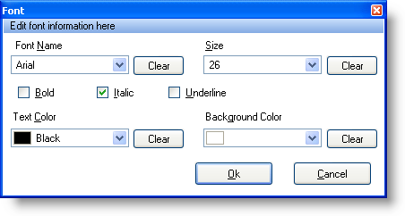

////
|metadata|
{
    "name": "winformattedtexteditor-font-dialog-box",
    "controlName": [],
    "tags": ["Styling"],
    "guid": "{E82892E2-7B9E-41B9-89CC-41F180393EC6}",
    "buildFlags": [],
    "createdOn": "2006-12-09T12:13:39Z"
}
|metadata|
////

= Font Dialog Box

WinFormattedTextEditor™ includes three dialog boxes which help the end user format text. These dialog boxes can be accessed through the custom context menu or methods designed to show them. You can display the Font dialog box by invoking the  pick:[win-forms="link:{ApiPlatform}win{ApiVersion}~infragistics.win.formattedlinklabel.formattedtexteditinfo~showfontdialog.html[ShowFontDialog]"]  method off the  pick:[win-forms="link:{ApiPlatform}win{ApiVersion}~infragistics.win.formattedlinklabel.formattedtexteditinfo.html[EditInfo]"]  object. This method will only function if there is a selection made in the WinFormattedTextEditor control.

The Font dialog box allows the end user to change styles such as font family, size, and color of formatted text. Below is a screen shot of the Font dialog box along with a description of each option.

* *Font Name* -- Specifies which font the selected text should be. Surrounds the selected text with the following style tag:

----

----

* *Size* -- Specifies which size the selected text should be. Surrounds the selected text with the following style tag:

----

----

* *Bold, Italic, Underline* -- Specifies whether the selected text should be bold, italic, or underlined. Surrounds the selected text with the following style tags:

----

----

* *Text Color* -- Specifies what color the text should be. Surrounds the selected text with the following style tag:

----

----

* *Background Color* -- Specifies what color the background of the text should be. Surrounds the selected text with the following style tag:

----

----