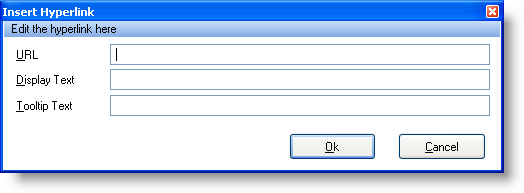

////

|metadata|
{
    "name": "winformattedtexteditor-hyperlink-dialog-box",
    "controlName": [],
    "tags": ["How Do I"],
    "guid": "{072C8167-B372-426F-BEF9-6AFAC60A7023}",  
    "buildFlags": [],
    "createdOn": "2006-12-09T12:14:37Z"
}
|metadata|
////

= Hyperlink Dialog Box

WinFormattedTextEditor™ includes three dialog boxes which help the end user format text. These dialog boxes can be accessed through the custom context menu or methods designed to show them. You can display the Hyperlink dialog box by invoking the  pick:[win-forms="link:{ApiPlatform}win{ApiVersion}~infragistics.win.formattedlinklabel.formattedtexteditinfo~showlinkdialog.html[ShowLinkDialog]"]  method off the  pick:[win-forms="link:{ApiPlatform}win{ApiVersion}~infragistics.win.formattedlinklabel.formattedtexteditinfo.html[EditInfo]"]  object.

The Hyperlink dialog box will insert a hyperlink at the current cursor position if there is no text selected. If text is selected, it is transformed into a hyperlink. The Display Text textbox does not display if text is selected when the dialog box is invoked. Below is a screenshot of the Hyperlink dialog box along with a description of each textbox.

* *URL* -- The Web address that will be opened when the link is clicked. Clicking OK will Surround the selected text, or create new text with the following tag:

* *Display Text* -- The text to display in the document. Clicking OK will Surround the selected text, or create new text with the following tag:

<a href="http://www.infragistics.com">`Display Text`</a>

* *Tooltip Text* -- When the mouse hovers over the link, a ToolTip is displayed with this text. Clicking OK will Surround the selected text, or create new text with the following tag:

<a title=`"A link to Infragistics' web site"` href="http://www.infragistics.com">Display Text</a>