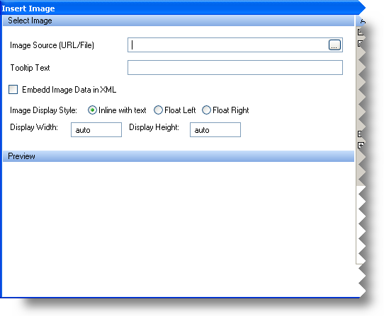

////
|metadata|
{
    "name": "winformattedtexteditor-image-dialog-box",
    "controlName": [],
    "tags": ["How Do I"],
    "guid": "{93E41CCC-B771-4A41-A3AC-F54264697B0C}",
    "buildFlags": [],
    "createdOn": "2006-12-09T12:14:05Z"
}
|metadata|
////

= Image Dialog Box

WinFormattedTextEditor™ includes three dialog boxes which help the end user format text. These dialog boxes can be accessed through the custom context menu or methods designed to show them. You can display the Image dialog box by invoking the  pick:[win-forms="link:infragistics4.win.v{ProductVersion}~infragistics.win.formattedlinklabel.formattedtexteditinfo~showimagedialog.html[ShowImageDialog]"]  method off the  pick:[win-forms="link:infragistics4.win.v{ProductVersion}~infragistics.win.formattedlinklabel.formattedtexteditinfo.html[EditInfo]"]  object.

The Image dialog box inserts an image at the current cursor position regardless of what text is selected. Below is a screen shot of the Image dialog box along with a description of each option.

* *Image Source* -- Clicking on the ellipsis (…) will display an Open File dialog box. Through this dialog box, the end user can choose a file to insert in the document. Inserts an image tag with the following attribute:

----

----

* *Tooltip Text* -- When the mouse hovers over the image, this text will display in a ToolTip.

----

----

* *Embed Image Data in XML* -- Select the checkbox to embed the image data rather than point to a source. This option is useful as you don't have to possess an actual image file at run time.

----

----

* *Image Display Style* -- By default, images are displayed inline with the text and no text-wrapping occurs. Selecting Float Left or Float Right will cause the image to left or right align with its container. The text will wrap around the picture.

----
 
----

* *Display Width and Height* -- By default, the image's height and width are automatically set. However, you can change these options, and stretch or shrink the image.

----

----