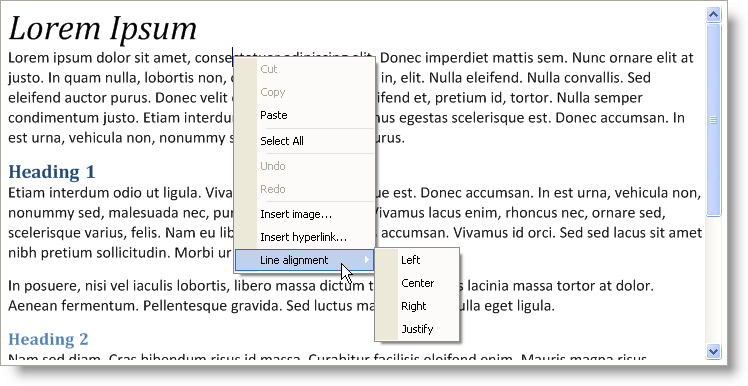

////

|metadata|
{
    "name": "winformattedtexteditor-new-winformattedtexteditor-control-whats-new-20063",
    "controlName": [],
    "tags": ["Editing"],
    "guid": "{B0B44C7A-BD2E-499A-9D04-5FE36DD5E424}",  
    "buildFlags": [],
    "createdOn": "0001-01-01T00:00:00Z"
}
|metadata|
////

= New WinFormattedTextEditor Control

In Infragistics Windows Forms 2006 Volume 3, we added an editing counterpart to WinFormattedLinkLabel™: the WinFormattedTextEditor™ control. Using the WinFormattedTextEditor control, you can display any of the formatted text that WinFormattedLinkLabel can display, but with the addition of editing support.

The WinFormattedTextEditor control includes basic editing functionality expected of an Infragistics editor, along with several advanced features only found in WinFormattedTextEditor. Use standard KeyActionMappings to perform tasks such as navigation, content modifications (including clipboard support), and formatting.

We even implemented a standard context menu by default that can support functions such as Cut, Copy, Paste, Delete, and several other content modifications. You can decide what you want to appear on the menu by using the ContextMenuItems property.

== Related Topics

link:winformattedtexteditor-about-winformattedtexteditor.html[About WinFormattedTextEditor]

link:win-winformattedtexteditor-using-winformattedtexteditor.html[Using WinFormattedTextEditor]

link:winformattedtexteditor-api-overview.html[API Overview]