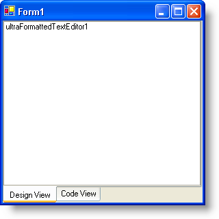
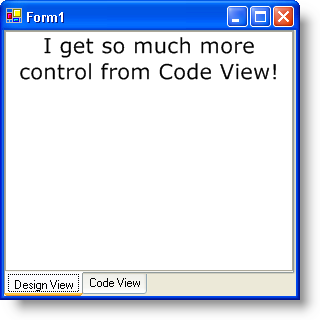

////

|metadata|
{
    "name": "winformattedtexteditor-switching-between-design-view-and-code-view",
    "controlName": [],
    "tags": ["How Do I"],
    "guid": "{413779BD-8B57-4D39-88C0-6673295D6463}",  
    "buildFlags": [],
    "createdOn": "2006-12-09T13:42:01Z"
}
|metadata|
////

= Switching Between Design View and Code View

== Before You Begin

The XML tags that the WinFormattedTextEditor™ control uses are very similar to HTML tags. Because of this, you can actually use WinFormattedTextEditor as a type of HTML editor. One feature that HTML editors contain is Design View vs. Code View. It is possible to get this kind of functionality out of WinFormattedTextEditor. By doing this, you give your end user two different ways to change the contents of a document: graphically and scripting. You can create a user interface that can assist the end user in formatting a document through design view, or the end user can add tags through code view.

== What You Will Accomplish

You will create a tabbed interface containing two tabs. One of these tabs will contain a WinFormattedTextEditor control, the other tab, an in-box RichTextBox control. These two controls will contain the same data, but in different formats. The WinFormattedTextEditor control will contain the formatted text and the RichTextBox will contain the raw text (including tags). When the end user changes tabs, the editors are updated with the other editor's contents.

== Follow these Steps

[start=1]
. *Add the WinTabControl, WinFormattedTextEditor, and RichTextBox controls to the form.*

.. Double-click UltraTabControl from the toolbox and set its Dock property to Fill. Find the  pick:[win-forms="link:{ApiPlatform}win.ultrawintabcontrol{ApiVersion}~infragistics.win.ultrawintabcontrol.ultratabscollection.html[Tabs]"]  collection in the properties window and click the ellipsis (…). Click Add to add a tab. Change the tab's  pick:[win-forms="link:{ApiPlatform}win.ultrawintabcontrol{ApiVersion}~infragistics.win.ultrawintabcontrol.ultratab~text.html[Text]"]  property to 'Design View'. Click Add to add another tab. Change its Text property to 'Code View'. Click the OK button to close the UltraTab Collection Editor dialog box. Find the  pick:[win-forms="link:{ApiPlatform}win.ultrawintabcontrol{ApiVersion}~infragistics.win.ultrawintabcontrol.ultratabcontrolbase~taborientation.html[TabOrientation]"]  property in the Properties window and change it to BottomLeft.
.. Select the Design View tab. Click and drag the UltraFormattedTextEditor from the toolbox into the Design View tab page. Set ultraFormattedTextEditor1's Dock property to Fill.
.. Select the Code View tab. Click and drag the RichTextBox control from the toolbox into the Code View tab page. Set richTextBox1's Dock property to Fill.

Your form should look like this:

[start=2]
. *Create the code-behind in the SelectedTabChanged event.*

Create a  pick:[win-forms="link:{ApiPlatform}win.ultrawintabcontrol{ApiVersion}~infragistics.win.ultrawintabcontrol.ultratabcontrolbase~selectedtabchanged_ev.html[SelectedTabChanged]"]  event by double-clicking on either the Design View or Code View tab. You are going to use an if/else statement to test whether the end user is switching to Design View or Code View. If the end user switches to Design View, then WinFormattedTextEditor's Value needs to be updated with the text from the RichTextBox control. If the end user switches to Code View, then the RichTextBox control's Text property needs to be updated with the raw text in WinFormattedTextEditor's Value property. You can get the raw text by using the ToString method off the Value property.

.Note
[NOTE]
====
If you are using WinFormattedTextEditor's  pick:[win-forms="link:{ApiPlatform}win.misc{ApiVersion}~infragistics.win.formattedlinklabel.ultraformattedtexteditor~editstatechanged_ev.html[EditStateChanged]"]  event in your application, you may need to disable it each time you switch to a different view. You can turn off all events by setting the AllEventsEnabled property off of WinFormattedTextEditor's EventManager object to False. Depending on the code in your EditStateChanged event, not disabling it could give you undesired results in the code below.
====

Place the following code inside the SelectedTabChanged event:

*In Visual Basic:*

----
If e.Tab.Text Is "Design View" Then
	Me.UltraFormattedTextEditor1.Value = Me.RichTextBox1.Text
End If
If e.Tab.Text Is "Code View" Then
	Me.RichTextBox1.Text = Me.UltraFormattedTextEditor1.Value.ToString()
End If
----

*In C#:*

----
if(e.Tab.Text == "Design View") // If the end user switches to Design View...
{
	// Set the Value of WinFormattedTextEditor to the text of
	// the RichTextBox control.
	this.ultraFormattedTextEditor1.Value = this.richTextBox1.Text;
}
else  // If the end user switches to Code View...
{
	// Set the Text of the RichTextBox control to the Value of
	// WinFormattedTextEditor.
	this.richTextBox1.Text = this.ultraFormattedTextEditor1.Value.ToString();
}
----

[start=3]
. *Run the Application.*

Switch to Code View in your application and paste the following text:

I get so much more control from Code View!

Switch to Design View and you'll see this:

Go ahead and explore the different styles you can use with the WinFormattedTextEditor control. For a complete list of styles, see link:winformattedtexteditor-style-attribute.html[Style Attribute]. For a list of supported tags, see link:winformattedlinklabel-formatting-text-and-hyperlinks.html[Formatting Text and Hyperlinks].