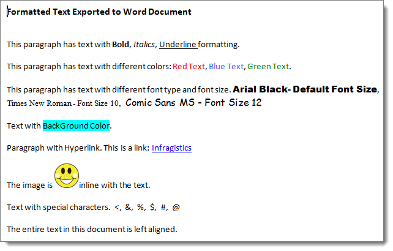

////

|metadata|
{
    "name": "winformattedtextwordwriter-export-formattedtexteditor-text-to-word",
    "controlName": ["WinFormattedTextWordWriter"],
    "tags": ["Exporting","How Do I"],
    "guid": "99689e4b-e319-44b1-805b-a9a0b9829e9f",  
    "buildFlags": [],
    "createdOn": "2011-03-15T14:51:43.7994688Z"
}
|metadata|
////

= Export FormattedTextEditor Text to Word

The WinFormattedTextWordWriter™ component enables export of formatted text from WinFormattedTextEditor™ or WinFormattedLinkLabel™ to a new Word document. The WinFormattedTextWordWriter uses the link:infragistics4.documents.io.v{ProductVersion}~infragistics.documents.word.worddocumentwriter.html[WordDocumentWriter] object to export the data. To accomplish this, simply call one of the Export methods of the UltraFormattedTextWordWriter object. The link:infragistics4.win.ultrawinformattedtext.wordwriter.v{ProductVersion}~infragistics.win.ultrawinformattedtext.wordwriter.ultraformattedtextwordwriter~export.html[Export] method has several overloads which take a different set of arguments to work as per user needs.

The following code exports the formatted text of the UltraFormattedTextEditor control to Word document using the Export method that takes in the UltraFormattedTextEditor control and the WordDocumentWriter object as parameters. This code also names the Word document “FormattedTextInWord.docx" and places it in the “C:\ WordDocuments” folder.

To begin, drag and drop an UltraFormattedTextWordWriter component and an UltraFormattedTextEditor control onto the form and set the Value property of the UltraFormattedTextEditor control to some formatted text.

.Note
[NOTE]
====
A reference to the Infragistics3.Documents.IO assembly is required for the following code.
====

*In C#:*

----
using Infragistics.Documents.Word;
// Create a new instance of the WordDocumentWriter class
// using the static 'Create' method.
// After writing content, this instance must be closed.
WordDocumentWriter wordWriter = WordDocumentWriter.Create("C:\\WordDocuments\\FormattedTextInWord.docx");
wordWriter.StartDocument();
// Export formatted text to Word
this.ultraFormattedTextWordWriter1.Export(this.ultraFormattedTextEditor1, wordWriter);
wordWriter.EndDocument();
// Close the writer
wordWriter.Close();
----

*In Visual Basic:*

----
Imports Infragistics.Documents.Word
' Create a new instance of the WordDocumentWriter class
' using the static 'Create' method.
' After writing content, this instance must be closed.
Dim wordWriter As WordDocumentWriter = WordDocumentWriter.Create("C:\WordDocuments\FormattedTextInWord.docx")
wordWriter.StartDocument()
' Export formatted text to Word
Me.ultraFormattedTextWordWriter1.Export(Me.ultraFormattedTextEditor1, wordWriter)
wordWriter.EndDocument()
' Close the writer
wordWriter.Close()
----

In the following code the Export method accepts the raw formatted string text and a file name as parameters.

.Note
[NOTE]
====
You must modify the source URL for the image to match your environment.
====

*In C#:*

----
using Infragistics.Documents.Word;
this.ultraFormattedTextWordWriter1.Export("
Formatted Text Exported to Word Document   This paragraph has text with Bold, Italics, Underline formatting.  This paragraph has text with different colors: Red Text, Blue Text, Green Text.  This paragraph has text with different font type and font size. Arial Black- Default Font Size,&edsp;&edsp;Times New Roman - Font Size 10,&edsp;&edsp;Comic Sans MS - Font Size 12  Text with BackGround Color.  Paragraph with Hyperlink. This is a link: <a title="infragistics" href="www.infragistics.com">Infragistics</a>  The image is inline with the text.  Text with special characters.&edsp;&edsp;&lt;,&edsp;&edsp;&amp;,&edsp;&edsp;%,&edsp;&edsp;$,&edsp;&edsp;#,&edsp;&edsp;@  The entire text in this document is left aligned.   
", "C:\\WordDocuments\\FormattedTextInWord.docx");
----

*In Visual Basic:*

----
Imports Infragistics.Documents.Word
Me.ultraFormattedTextWordWriter1.Export("
Formatted Text Exported to Word Document   This paragraph has text with Bold, Italics, Underline formatting.  This paragraph has text with different colors: Red Text, Blue Text, Green Text.  This paragraph has text with different font type and font size. Arial Black- Default Font Size,&edsp;&edsp;Times New Roman - Font Size 10,&edsp;&edsp;Comic Sans MS - Font Size 12  Text with BackGround Color.  Paragraph with Hyperlink. This is a link: <a title="infragistics" href="www.infragistics.com">Infragistics</a>  The image is inline with the text.  Text with special characters.&edsp;&edsp;&lt;,&edsp;&edsp;&amp;,&edsp;&edsp;%,&edsp;&edsp;$,&edsp;&edsp;#,&edsp;&edsp;@  The entire text in this document is left aligned.   
", "C:\WordDocuments\FormattedTextInWord.docx")
----

The following screenshot shows a Word document with the formatted text exported.

== Related Topic

* link:winformattedtextwordwriter-about-winformattedtextwordwriter.html[About WinFormattedTextWordWriter]