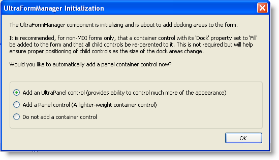
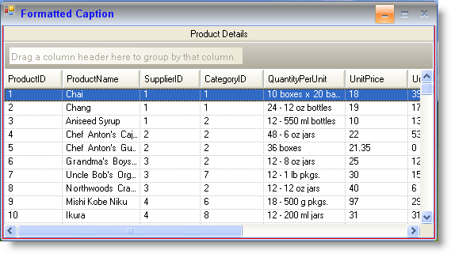

////

|metadata|
{
    "name": "winformmanager-customize-a-form-with-winformmanager",
    "controlName": ["WinFormManager"],
    "tags": ["How Do I","Styling"],
    "guid": "77a20dcc-2ee4-41ee-ac7c-e95c8147a9ec",  
    "buildFlags": [],
    "createdOn": "2010-06-03T22:04:44.4030067Z"
}
|metadata|
////

= Customize a Form with WinFormManager

This topic illustrates setting up a form with the WinFormManager™component and customizing it to style the different areas of the form such as the caption area, the form borders, and the close, restore, maximize, minimize and context help buttons.

Follow the steps below to set up a form with UltraFormManager.

1. At design-time drag and drop the UltraFormManager component from the Toolbox onto your form. As soon as you add the component to the form, you will see the following dialog:

.Note
[NOTE]
====
This dialog will not be displayed if the form is set to be an MDI Parent form. Also if the form already contains a control whose Dock property is set to Fill, you will not see the following dialog.
====

This dialog prompts you to choose an option. If you choose to add an UltraPanel or a Panel control, dock areas are created on the form and the panel fills the client area. You can choose between filling the form with a standard Panel control or an UltraPanel control that provides more styling support.

2. Click ‘ok’ to have the component automatically add a container control. Once the container control is added to your form, you can then place controls within the container.

Select the UltraFormManager component in the component tray, and view the properties window that provides all the style settings to style the form. By default, the link:{ApiPlatform}win{ApiVersion}~infragistics.win.ultrawinform.formstylesettings~formdisplaystyle.html[FormDisplayStyle] property of the link:{ApiPlatform}win{ApiVersion}~infragistics.win.ultrawinform.ultraformmanager~formstylesettings.html[FormStyleSeetings] object resolves to RoundedSizable and the link:{ApiPlatform}win{ApiVersion}~infragistics.win.ultrawinform.formstylesettings~isglasssupported.html[IsGlassSupported] property is set to false.

Applying style settings:

*In Visual Basic:*

----
' Set the formatted text for the caption area 
Me.ultraFormManager1.FormStyleSettings.Caption = "Formatted Caption" 
' Set the display style for the form 
Me.ultraFormManager1.FormStyleSettings.FormDisplayStyle = Infragistics.Win.UltraWinToolbars.FormDisplayStyle.RoundedSizable 
' Set a specific style for the form 
Me.ultraFormManager1.FormStyleSettings.Style = Infragistics.Win.UltraWinForm.UltraFormStyle.Office2007 
' Set the border back color for the form 
Me.ultraFormManager1.FormStyleSettings.FormBorderAppearance.BackColor = Color.Red 
' Set the back color for the caption area 
Me.ultraFormManager1.FormStyleSettings.CaptionAreaAppearance.BackColor = Color.Gray 
' Set the back color for the maximum caption button when hot tracked 
Me.ultraFormManager1.FormStyleSettings.CaptionButtonsAppearances.MaximizeButtonAppearances.HotTrackAppearance.BackColor = Color.Red 
' Set the default back color for the close button when pressed 
Me.ultraFormManager1.FormStyleSettings.DefaultCaptionButtonsAppearances.CloseButtonAppearances.PressedAppearance.BackColor = Color.Blue
----

*In C#:*

----
// Set the formatted text for the caption area
this.ultraFormManager1.FormStyleSettings.Caption = "Formatted Caption";
// Set the display style for the form
this.ultraFormManager1.FormStyleSettings.FormDisplayStyle = Infragistics.Win.UltraWinToolbars.FormDisplayStyle.RoundedSizable;
// Set a specific style for the form
this.ultraFormManager1.FormStyleSettings.Style = Infragistics.Win.UltraWinForm.UltraFormStyle.Office2007;
// Set the border back color for the form
this.ultraFormManager1.FormStyleSettings.FormBorderAppearance.BackColor = Color.Red;
// Set the back color for the caption area
this.ultraFormManager1.FormStyleSettings.CaptionAreaAppearance.BackColor = Color.Gray;
// Set the back color for the maximum caption button when hot tracked
this.ultraFormManager1.FormStyleSettings.CaptionButtonsAppearances.MaximizeButtonAppearances.HotTrackAppearance.BackColor = Color.Red;
// Set the default back color for the close button when pressed
this.ultraFormManager1.FormStyleSettings.DefaultCaptionButtonsAppearances.CloseButtonAppearances.PressedAppearance.BackColor = Color.Blue;
----

