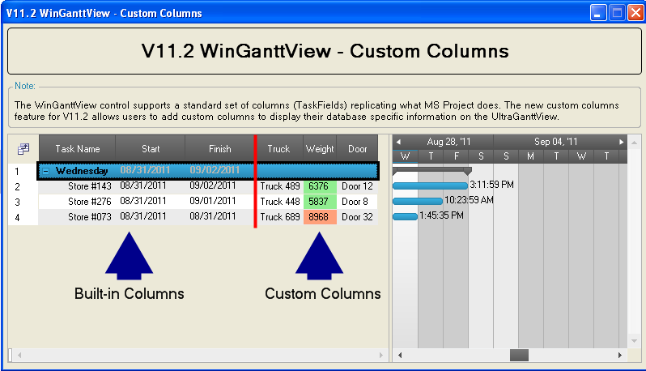

////

|metadata|
{
    "name": "winganttview-custom-columns",
    "controlName": ["WinGanttView"],
    "tags": ["Application Scenarios","Grids","Layouts","Scheduling"],
    "guid": "d59ef0c1-a62b-4161-a1c1-5ee8c899c979",  
    "buildFlags": [],
    "createdOn": "2011-09-26T12:27:44.0239439Z"
}
|metadata|
////

= Custom Columns

This topic outlines the custom columns support for the WinGanttView™ control and includes code examples to demonstrate usage scenarios.

The topic is organized as follows:

* <<One,Introduction>>
* <<Two,Adding Custom Columns>>

** <<TwoOne,Preview>>
** <<TwoTwo,Overloads for the Add Method>>
** <<TwoThree,Adding Custom Columns Code Snippet>>

* <<Three,Get and Set Custom Column Cell Values>>

** <<ThreeOne,Get and Set Custom Column Cell Value Code Snippet>>

* <<Four,Related Topics>>

[[One]]
== Introduction

The WinGanttView control supports a standard set of columns (TaskFields) that replicate the Microsft® Project™ defaults. In addition, to these default columns the control also supports custom columns that allow you to tailor your own project specific data fields to display in the WinGanttView.

[[Two]]
== Adding Custom Columns

To add custom columns to the WinGanttView, use the * link:{ApiPlatform}win.ultrawinschedule{ApiVersion}~infragistics.win.ultrawinschedule.taskcolumnscollection~add.html[Add]* method found in the * link:{ApiPlatform}win.ultrawinschedule{ApiVersion}~infragistics.win.ultrawinschedule.ultracalendarinfo~customtaskcolumns.html[CustomTaskColumns]* property of the WinCalendarInfo component. For more information on the configuration and use of WinGanttView, see the topics contained in link:winganttview-using-winganttview.html[Using WinGanttView].

[[TwoOne]]
== Preview

Figure 1: WinGanttView custom column sample from the Samples' Browser.

[[TwoTwo]]
== Overloads for the Add Method

The table below lists the available overloads for the Add method found in the *CustomTaskColumns* property of the WinCalendarInfo component.

[options="header", cols="a,a"]
|====
|Method Return Type|Overload Definition

|int
|Add(TaskColumn taskColumn)

|TaskColumn
|Add(string key, Type type, bool isPersisted)

|TaskColumn
|Add(string key, Type type, bool isPersisted, object defaultValue) 

.Note 

[NOTE] 

==== 

This definition is used in the Adding Custom Columns Code Snippet and the WinGanttView Custom Columns sample found in the Samples’ Browser. 

====

|====

[[TwoThree]]
== Adding Custom Columns Code Snippet

The code below is a snippet from the WinGanttView Custom Columns sample found in the link:http://www.infragistics.com/products/windows-forms/gantt-view/[Infragistics samples browser] and uses the WinCalendarInfo component instance to add custom columns to the WinGanttView. The examples featured in the code listing create three columns of type string that are not persisted from a data source. For a preview of the custom columns created in this snippet refer to *Figure 1* .

*In C#:*

----
// Add custom columns
calendarInfoShipping.CustomTaskColumns.Add("Truck", typeof(String), false, "Truck 123");
calendarInfoShipping.CustomTaskColumns.Add("Weight", typeof(String), false, "13000");
calendarInfoShipping.CustomTaskColumns.Add("Door", typeof(String), false, "Door 123");
----

*In Visual Basic:*

----
' Add custom columns
calendarInfoShipping.CustomTaskColumns.Add("Truck", GetType([String]), False, "Truck 123")
calendarInfoShipping.CustomTaskColumns.Add("Weight", GetType([String]), False, "13000")
calendarInfoShipping.CustomTaskColumns.Add("Door", GetType([String]), False, "Door 123")
----

[[Three]]
== Get and Set Custom Column Cell Values

To get or set cell values within the custom columns, you use the * link:{ApiPlatform}win.ultrawinschedule{ApiVersion}~infragistics.win.ultrawinschedule.task~getcustomproperty.html[GetCustomProperty]* and * link:{ApiPlatform}win.ultrawinschedule{ApiVersion}~infragistics.win.ultrawinschedule.task~setcustomproperty.html[SetCustomProperty]* methods found in the associated Task.

[[ThreeOne]]
== Get and Set Custom Column Cell Value Code Snippet

The code below starts off by setting the cell value of the custom column named Truck in the first WinGanttView task to “Big Truck 113”. The value is then retrieved and casted to the cell value’s data type and placed into the string variable named truckName.

*In C#:*

----
// Set a property on a custom column
ganttViewShipping.CalendarInfo.Tasks[0].SetCustomProperty("Truck", "Big Truck 113");
// Get a property from a custom column
// The GetCustomProperty returns an object, so cast to the proper data type
String truckName = (String)ganttViewShipping.CalendarInfo.Tasks[0].GetCustomProperty("Truck");
----

*In Visual Basic:*

----
' Set a property on a custom column
ganttViewShipping.CalendarInfo.Tasks(0).SetCustomProperty("Truck", "Big Truck 113")
' Get a property from a custom column
' The GetCustomProperty returns an object, so cast to the proper data type
Dim truckName As [String] = DirectCast(ganttViewShipping.CalendarInfo.Tasks(0).GetCustomProperty("Truck"), [String])
----

[[Four]]
== Related Topics

* link:winganttview-adding-tasks-to-winganttview.html[Adding Tasks to WinGanttView]
* link:winganttview-databinding-support-for-winganttview.html[DataBinding Support for WinGanttView]
* link:winganttview-task-settings-for-winganttview.html[Task Settings for WinGanttView]