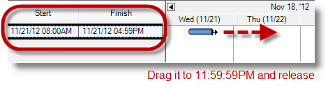

////

|metadata|
{
    "name": "winganttview-timeline-task-positioning",
    "controlName": ["WinGanttView"],
    "tags": ["How Do I","Scheduling"],
    "guid": "7fc04236-5adc-48af-9a24-f4b2b6d63b6a",  
    "buildFlags": [],
    "createdOn": "2013-01-23T14:13:34.7168845Z"
}
|metadata|
////

= TimeLine Task Positioning

== Topic Overview

=== Purpose

This topic provides you with a conceptual overview and examples configuring the position and size of the tasks, and its timelines proportional to the amount of time over which the tasks span in the  _WinGanttView_™ control.

=== Required background

The following topics are prerequisites to understanding this topic:

[options="header", cols="a,a"]
|====
|Topic|Purpose

| link:winganttview-understanding-winganttview.html[Understanding WinGanttView]
|This is a great place for you to start learning about the _WinGanttView_ control, and its key features and functionalities.

| link:winganttview-using-winganttview.html[Using WinGanttView]
|In this section, you will find short, task-based topics that explain how to perform a specific task related to the _WinGanttView_ control.

|====

=== In this topic

This topic contains the following sections:

* <<_Ref341350040,Introduction>>
* <<_Ref341350050,Timeline Property Reference>>
* <<_Ref341350059,New Features Behavior and Configuration>>
* <<_Ref341350073,Configuring Timeline Positioning with AutoAdjust Mode of Working Hours>>
* <<_Ref341350089,Configuring Timeline Positioning with Manual Mode of Working Hours>>
* <<_Ref341350100,Configuring Task Positioning of the Percent Element>>
* <<_Ref341350109,Configuring Task Deadline Positioning>>
* <<_Ref341350120,Configuring Task Start Date Positioning>>
* <<_Ref341704481,Task Working Hours Behavior>>
* <<_Ref341350139,Related Content>>

[[_Ref341350040]]
== Introduction

=== WinGanttView summary

New features introduced with the 13.1 release of the  _WinGanttView™_   control allowing you to configure the positions and size of tasks proportional to their duration using a minimal number of properties. With this configuration, notice how accurate the timeline positioning renders relative to the width of the time slot.

You can easily customize the interface parameters related to the tasks by repositioning and resizing them without any size restrictions. Using the left mouse button dragging operation you will be able to fine-tune your project’s task interface to accommodate your application’s needs.

[[_Ref341350050]]
== Timeline Property Reference

=== Introduction

The following table lists the properties added to the link:{ApiPlatform}win.ultrawinganttview{ApiVersion}~infragistics.win.ultrawinganttview.timeline_members.html[Timeline] class to support timeline task sizing and positioning feature.

=== Timeline property reference chart

[options="header", cols="a,a,a"]
|====
|Property|Description|Default Value

|TaskPositioning
|Returns or sets a value that determines whether the size and position of a link:{ApiPlatform}win.ultrawinganttview{ApiVersion}~infragistics.win.ultrawinganttview.uielements.taskuielement_members.html[TaskUIElement] adjusts accounting for the difference between the task's start/end time and the start/end times of the link:{ApiPlatform}win.ultrawinschedule{ApiVersion}~infragistics.win.ultrawinschedule.timelineview.timeslotuielement_members.html[TimeSlotUIElement] with which the task element intersects. *Possible Value:* 

* _FillTimeSlots_ 

* _Proportional_ 

| _FillTimeSlots_ 

|MinimumTaskWidth
|Returns or sets a value defining the minimum width (in pixels) for a link:{ApiPlatform}win.ultrawinganttview{ApiVersion}~infragistics.win.ultrawinganttview.uielements.taskuielement_members.html[TaskUIElement]. 

.Note: 

[NOTE] 

==== 

This property is only applicable when the `TaskPositioning` property is set to _Proportional_ . 

====
|10 pixels

|TaskDragIncrement
|Returns or sets a value defining the increment (minutes, hours, days etc.,) for each movement of a task drag operation. 

.Note: 

[NOTE] 

==== 

This property is only applicable when the `TaskPositioning` property is set to _Proportional_ . 

====
|TimeSpan.Zero

|====

[[_Ref341350059]]
== New Features Behavior and Configuration

=== New features summary chart

The following table summarizes the new features of the  _WinGanttView_   control. Additional details are available following the summary table.

[options="header", cols="a,a"]
|====
|Feature|Description

|Timeline Positioning with *AutoAdjust* Mode
|Illustrates timeline positioning using default settings

|Timeline Positioning with *Manual* Mode
|Illustrates timeline positioning using user defined property settings

|Task Positioning of the Percent Element
|Demonstrates the task’s `PercentComplete` element configuration

|Task Deadline Positioning
|Demonstrates the task’s `Deadline` element configuration

|Task Start Date Positioning
|Demonstrates the task’s `StartDateTime` element configuration

|Task Working Hours Positioning
|Demonstrates the configuration of the working hours for all tasks within working hours range.

|====

[[_Ref341350073]]
== Configuring Timeline Positioning with AutoAdjust Mode of Working Hours

=== Timeline positioning with AutoAdjust Mode

As the cursor moves, when dragging the timeline, the right-edge of the task changes its position accordingly, even when the cursor is not at the edge of a time slot. Since link:{ApiPlatform}win.ultrawinganttview{ApiVersion}~infragistics.win.ultrawinganttview.timeline~taskdragincrement.html[TaskDragIncrement] resolves to one hour for a primary interval of one day, this raises the link:{ApiPlatform}win.ultrawinganttview{ApiVersion}~infragistics.win.ultrawinganttview.ultraganttview~taskelementdragging_ev.html[TaskElementDragging] event. The task element’s width changes when the cursor moves approximately 1/24th the width of the time slot. The link:{ApiPlatform}win.ultrawinschedule{ApiVersion}~infragistics.win.ultrawinschedule.task~enddatetime.html[EndDateTime] and link:{ApiPlatform}win.ultrawinschedule{ApiVersion}~infragistics.win.ultrawinschedule.task~duration.html[Duration] properties change by one hour with each mouse movement.

=== Property settings

`TaskWorkingHourMode = AutoAdjust`

`TaskPositioning = FillTimeSlots`

`TaskDragIncrement = 2h` (2 hours)

`PrimaryInterval = Days`

.Note:
[NOTE]
====
The TaskDragIncrement’s default value is dependent on the `PrimaryInterval`.
====

The following table lists the various `TaskDragIncrement` values of corresponding `PrimaryInterval` types.

[options="header", cols="a,a"]
|====
|Interval|Drag Increment

|Year
|7 days

|Month/Week
|1 day

|Day
|1 hour

|Hour
|15 minutes

|10 Minutes or more
|¼ of the time spanned by one time slot

|Less than 10 Minutes
|1 minute

|====

=== Code

Property settings in code.

*In C#:*

[source,csharp]
----ultraCalendarInfo1.TaskWorkingHourMode = TaskWorkingHourMode.AutoAdjust;
ultraGanttView1.TimelineSettings.TaskPositioning = TimelineTaskPositioning.FillTimeSlots;
ultraGanttView1.TimelineSettings.PrimaryInterval = new DateInterval(1, DateIntervalUnits.Days);
ultraGanttView1.TimelineSettings.TaskDragIncrement = TimeSpan.FromHours(2);
----

*In Visual Basic:*

[source,vb]
----ultraCalendarInfo1.TaskWorkingHourMode = TaskWorkingHourMode.AutoAdjust
ultraGanttView1.TimelineSettings.TaskPositioning = TimelineTaskPositioning.FillTimeSlots
ultraGanttView1.TimelineSettings.PrimaryInterval = New DateInterval(1, DateIntervalUnits.Days)
ultraGanttView1.TimelineSettings.TaskDragIncrement = TimeSpan.FromHours(2)
----

=== Steps

Image  *before*  dragging the timeline.

1. Drag the right edge of a task over one or more time slots.

Image  *after*  dragging the timeline.

[[_Ref341350089]]
== Configuring Timeline Positioning with Manual Mode of Working Hours

=== Timeline positioning with Manual Mode

As the cursor moves, when dragging the timeline, the right edge of the task changes position accordingly, even when the cursor is not at the edge of a time slot. Since link:{ApiPlatform}win.ultrawinganttview{ApiVersion}~infragistics.win.ultrawinganttview.timeline~taskdragincrement.html[TaskDragIncrement] is explicitly set to four hours, the link:{ApiPlatform}win.ultrawinganttview{ApiVersion}~infragistics.win.ultrawinganttview.ultraganttview~taskelementdragging_ev.html[TaskElementDragging] event is raised. The task element’s width changes when the cursor moves approximately 1/6th the width of the time slot. The link:{ApiPlatform}win.ultrawinschedule{ApiVersion}~infragistics.win.ultrawinschedule.task~enddatetime.html[EndDateTime] and link:{ApiPlatform}win.ultrawinschedule{ApiVersion}~infragistics.win.ultrawinschedule.task~duration.html[Duration] properties change by four hours with each mouse movement.

=== Property settings

`TaskWorkingHourMode = Manual`

`TaskPositioning = Proportional`

`TaskDragIncrement = 4h (4 hours)`

`PrimaryInterval = Days`

=== Code

Property settings in code

*In C#:*

[source,csharp]
----ultraCalendarInfo1.TaskWorkingHourMode = TaskWorkingHourMode.Manual;
ultraGanttView1.TimelineSettings.TaskPositioning = TimelineTaskPositioning.Proportional;
ultraGanttView1.TimelineSettings.PrimaryInterval = new DateInterval(1, DateIntervalUnits.Days);
ultraGanttView1.TimelineSettings.TaskDragIncrement = TimeSpan.FromHours(4);
----

*In Visual Basic:*

[source,vb]
----ultraCalendarInfo1.TaskWorkingHourMode = TaskWorkingHourMode.Manual
ultraGanttView1.TimelineSettings.TaskPositioning = TimelineTaskPositioning.Proportional
ultraGanttView1.TimelineSettings.PrimaryInterval = New DateInterval(1, DateIntervalUnits.Days)
ultraGanttView1.TimelineSettings.TaskDragIncrement = TimeSpan.FromHours(4)
----

=== Steps

Image  *before*  dragging the timeline

1. Drag the right edge of a task over one or more time slots.

Image  *after*  dragging the timeline

[[_Ref341350100]]
== Configuring Task Positioning of the Percent Element

=== Task Positioning of the Percent Element

This section demonstrates the percent element’s behavior and configuration.

As the cursor moves, the percent complete bar becomes wider, ending approximately at the cursor position. Each cursor movement of approximately 1/12th of the time slot’s width raises the link:{ApiPlatform}win.ultrawinganttview{ApiVersion}~infragistics.win.ultrawinganttview.ultraganttview~taskelementdragging_ev.html[TaskElementDragging] event. The event executes 14 times (once for the  *beginning phase* , 12 times for the  *moving phase* , and once for the  *ending phase* ) during the course of the drag operation.

=== Property settings

User defined property settings with percent element are:

`TaskWorkingHourMode = Manual`

`TaskPositioning = Proportional`

`TaskDragIncrement = 2h (2 hours)`

`PrimaryInterval = Days`

Task spans exactly one day

=== Code

Property settings in code

*In C#:*

[source,csharp]
----ultraCalendarInfo1.TaskWorkingHourMode = TaskWorkingHourMode.Manual;
ultraGanttView1.TimelineSettings.TaskPositioning = TimelineTaskPositioning.Proportional;
ultraGanttView1.TimelineSettings.PrimaryInterval = new DateInterval(1, DateIntervalUnits.Days);
ultraGanttView1.TimelineSettings.TaskDragIncrement = TimeSpan.FromHours(2);
----

*In Visual Basic:*

[source,vb]
----ultraCalendarInfo1.TaskWorkingHourMode = TaskWorkingHourMode.Manual
ultraGanttView1.TimelineSettings.TaskPositioning = TimelineTaskPositioning.Proportional
ultraGanttView1.TimelineSettings.PrimaryInterval = New DateInterval(1, DateIntervalUnits.Days)
ultraGanttView1.TimelineSettings.TaskDragIncrement = TimeSpan.FromHours(2)
----

=== Steps

Image  *before*  dragging the percent complete bar over a timeline

1. Move the mouse cursor over the left-edge of a task element until you see the percent complete cursor indicator.

2. Press the left mouse button down and drag the percent complete bar to the right.

Image  *after*  dragging the percent complete bar over a timeline

[[_Ref341350109]]
== Configuring Task Deadline Positioning

=== Task Deadline Positioning

This section demonstrates the task deadline indicator’s behavior and configuration.

As the cursor moves, the deadline indicator moves in a manner similar to the duration and percent complete drag operations. In this case, every four-mouse move segments bring the indicator across one time slot.

You can add a deadline to any task by using the task’s link:{ApiPlatform}win.ultrawinschedule{ApiVersion}~infragistics.win.ultrawinschedule.task~deadline.html[Deadline] property, and assigning a start date to it.

`[Task name].Deadline = [Task name].StartDateTime.AddDays([n days]);`

=== Property settings

User defined property settings of the deadline indicator are:

`TaskWorkingHourMode = Manual`

`TaskPositioning = Proportional`

`TaskDragIncrement = 6h (6 hours)`

`PrimaryInterval = Days`

=== Code

Property settings in code

*In C#:*

[source,csharp]
----ultraCalendarInfo1.TaskWorkingHourMode = TaskWorkingHourMode.Manual;
ultraGanttView1.TimelineSettings.TaskPositioning = TimelineTaskPositioning.Proportional;
ultraGanttView1.TimelineSettings.PrimaryInterval = new DateInterval(1, DateIntervalUnits.Days);
ultraGanttView1.TimelineSettings.TaskDragIncrement = TimeSpan.FromHours(6);
----

*In Visual Basic:*

[source,vb]
----ultraCalendarInfo1.TaskWorkingHourMode = TaskWorkingHourMode.Manual
ultraGanttView1.TimelineSettings.TaskPositioning = TimelineTaskPositioning.Proportional
ultraGanttView1.TimelineSettings.PrimaryInterval = New DateInterval(1, DateIntervalUnits.Days)
ultraGanttView1.TimelineSettings.TaskDragIncrement = TimeSpan.FromHours(6)
----

=== Steps

Image  *before*  dragging the deadline indicator

1. Press the left mouse button down on the deadline indicator 

and drag it to the right.

Image  *after*  dragging the deadline indicator

[[_Ref341350120]]
== Configuring Task Start Date Positioning

=== Task Start Date Positioning

This section demonstrates the task start date behavior and configuration.

On each mouse move, the left edge of the task snaps to match the drag position on the timeline. As the cursor moves by each mouse drag increment, the link:{ApiPlatform}win.ultrawinschedule{ApiVersion}~infragistics.win.ultrawinschedule.task~startdatetime.html[StartDateTime] and link:{ApiPlatform}win.ultrawinschedule{ApiVersion}~infragistics.win.ultrawinschedule.task~enddatetime.html[EndDateTime] property values change accordingly.

=== Property settings

User defined property settings of the task start date are:

`TaskWorkingHourMode = Manual`

`TaskPositioning = Proportional`

`TaskDragIncrement = 6h (6 hours)`

`PrimaryInterval = Days`

=== Code

Property settings in code

*In C#:*

[source,csharp]
----ultraCalendarInfo1.TaskWorkingHourMode = TaskWorkingHourMode.Manual;
ultraGanttView1.TimelineSettings.TaskPositioning = TimelineTaskPositioning.Proportional;
ultraGanttView1.TimelineSettings.PrimaryInterval = new DateInterval(1, DateIntervalUnits.Days);
ultraGanttView1.TimelineSettings.TaskDragIncrement = TimeSpan.FromHours(6);
----

*In Visual Basic:*

[source,vb]
----ultraCalendarInfo1.TaskWorkingHourMode = TaskWorkingHourMode.Manual
ultraGanttView1.TimelineSettings.TaskPositioning = TimelineTaskPositioning.Proportional
ultraGanttView1.TimelineSettings.PrimaryInterval = New DateInterval(1, DateIntervalUnits.Days)
ultraGanttView1.TimelineSettings.TaskDragIncrement = TimeSpan.FromHours(6)
----

=== Steps

Image  *before*  dragging the task start date

1. Press the left mouse button down at about the center of the task element and drag it to the right.

Image  *after*  dragging the task start date

image::images/WinGanttView_Task_And_TimeLine_Positioning_11.png[]

[[_Ref341350129]]
[[_Ref341704481]]
== Task Working Hours Behavior

=== Task Working Hours Positioning

This section demonstrates the task-working hour’s behavior.

The task’s width increases with each mouse drag movement as it does when you set link:{ApiPlatform}win.ultrawinschedule{ApiVersion}~infragistics.win.ultrawinschedule.taskworkinghourmode.html[TaskWorkingHourMode] to  _AutoAdjust_  . The duration increases by 2 hours with each drag movement. When the drag operation is committed to ending at 12AM, however, the right edge snaps back to 5PM, necessary to enforce the working hours.

=== Property settings

User defined property settings of the task’s working hours are:

`TaskWorkingHourMode = AutoAdjust`

`TaskPositioning = Proportional`

`TaskDragIncrement = 2h (2 hours)`

`PrimaryInterval = Days`

.Note:
[NOTE]
====
Workday = 8AM – 5PM, with an hour lunch break starting at noon.
====

=== Code

Property settings in code

*In C#:*

[source,csharp]
----ultraCalendarInfo1.TaskWorkingHourMode = TaskWorkingHourMode.AutoAdjust;
ultraGanttView1.TimelineSettings.TaskPositioning = TimelineTaskPositioning.Proportional;
ultraGanttView1.TimelineSettings.PrimaryInterval = new DateInterval(1, DateIntervalUnits.Days);
ultraGanttView1.TimelineSettings.TaskDragIncrement = TimeSpan.FromHours(2);
----

*In Visual Basic:*

[source,vb]
----ultraCalendarInfo1.TaskWorkingHourMode = TaskWorkingHourMode.AutoAdjust
ultraGanttView1.TimelineSettings.TaskPositioning = TimelineTaskPositioning.Proportional
ultraGanttView1.TimelineSettings.PrimaryInterval = New DateInterval(1, DateIntervalUnits.Days)
ultraGanttView1.TimelineSettings.TaskDragIncrement = TimeSpan.FromHours(2)
----

=== Steps

Image  *before*  changing the task’s working hours are `8AM – 5PM`

1. Drag the right edge of the task element (starting at 5PM) to the right edge of the time slot (11:59:59PM) and release the left mouse button, committing the drag operation.

Image  *after*  the task working hours change is committed at `04:59PM`. The task spans up to the end of working hours even when dragged beyond working hours.

[[_Ref341350139]]
== Related Content

=== Topics

The following topic provides additional information related to this topic.

[options="header", cols="a,a"]
|====
|Topic|Purpose

| link:winganttview.html[WinGanttView]
|This section contains valuable information about _WinGanttView_, ranging from what the control does and why you would want to use it in your application, to step-by-step procedures on how to accomplish a common task using the control.

|====