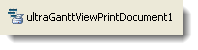

////

|metadata|
{
    "name": "winganttviewprintdocument-about-winganttviewprintdocument",
    "controlName": ["WinGanttView"],
    "tags": ["Getting Started","Printing"],
    "guid": "f5cf25e9-12b7-4e65-a3d4-816d936bc4c2",  
    "buildFlags": [],
    "createdOn": "2012-02-09T15:20:15.2683016Z"
}
|metadata|
////

= About WinGanttViewPrintDocument

WinGanttViewPrintDocument™ is a Windows Forms component that allows you to easily print out, or preview the WinGanttView™. The following is a list of some of the functionalities available in WinGanttViewPrintDocument:

* Print Preview -- The WinGanttViewPrintDocument component can be used with the WinPrintPreviewDialog component in order to preview a WinGanttView document before it is printed. See link:winganttviewprintdocument-print-preview-with-winganttviewprintdocument.html[Using WinPrintPreviewDialog with WinGanttViewPrintDocument] for details.
* Headers/Footers -- Allows you to specify custom headers and footers to print along with the WinGanttView control.
* InitializeGanttView Event – Allows the changing of properties on the WinGanttView that are used for printing, without affecting any WinGanttView control that might appear on-screen.

