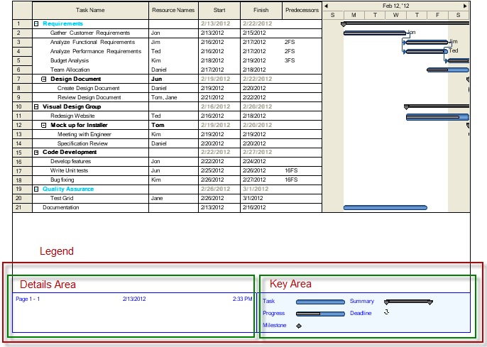

////

|metadata|
{
    "name": "winganttviewprintdocument-configuring-the-legend",
    "controlName": ["WinGanttView"],
    "tags": ["How Do I","Layouts"],
    "guid": "c5092c01-f834-44a4-a9b9-a452066901ea",  
    "buildFlags": [],
    "createdOn": "2012-03-09T18:26:23.8467219Z"
}
|metadata|
////

= Configuring the Legend

== Topic Overview

=== Purpose

This topic provides information about the Legend feature of the WinGanttViewPrintDocument™ component.

=== Required background

The following table lists the topics required as a prerequisite to understanding this topic.

[options="header", cols="a,a"]
|====
|Topic|Purpose

| link:winganttviewprintdocument-winganttviewprintdocument-features.html[WinGanttViewPrintDocument Features]
|This topic introduces the features of the WinGanttViewPrintDocument™ component.

|====

=== In this topic

This topic contains the following sections:

* <<_Ref317267478,Legend Visual Elements>>

** <<_Ref317267491,Introduction>>
** <<_Ref317267505,Visual elements overview>>
** <<_Ref317267510,Details Area>>
** <<_Ref317267514,Key Area>>

* <<_Ref317267525,Legend Customizations>>
* <<_Ref317267550,Legend Property Reference>>

** <<_Ref317267562,Introduction>>
** <<_Ref317267865,Legend reference chart>>

* <<_Setting_Up_a,Setting Up a Sample Legend – Code Example>>

** <<_Ref317267610,Description>>
** <<_Ref317267616,Preview>>
** <<_Ref317267624,Code>>

* <<_Ref317267938,Related Content>>

[[_Ref317267478]]
== Legend’s Configurable Elements

[[_Ref317267491]]

=== Introduction

The legend that the WinGanttViewPrintDocument™delivers in print, consists of two parts:

* Details Area
* Key Area

Each of them is explained in the text blocks that follow.

[[_Ref317267505]]

=== Configurable elements overview

The following table summarizes the visual elements of the Legend. Additional details are available after following the summary table.

[options="header", cols="a,a"]
|====
|Visual element|Description

|Details Area
|Used to place any arbitrary text. This area also allows for replacement codes which provide document-specific or user-specific information

|Key Area
|Displays a graphical key for the end user to identify the bars on the timeline section of the WinGanttView.

|====

[[_Ref317267510]]

=== Details Area

The Details Area is used to place any arbitrary text. This area also allows for replacement codes which provide document-specific or user-specific information such as:

* Start date of the print operation
* Start time of the print operation
* Current user name
* Current page number
* Total number of pages
* The current vertical page number
* The current horizontal page number

[[_Ref317267514]]

=== Key Area

The Key Area displays a graphical key for the end user to identify the bars on the timeline section of the WinGanttView. WinGanttView supports the following types:

* Task
* Progress
* Milestone
* Summary
* Deadline

[[_Ref317267525]]
== Legend Customizations

=== Legend Customizations Summary

The following table lists the configurable aspects of the Legend.

[options="header", cols="a,a,a,a"]
|====
|Area|Configurable aspects|Details|Properties

|Details Area
|Appearance
|The appearance of the Details Area can be configured.
|Appearance

|
|Text position
|The position of the text displayed in the Details Area can be configured.
| link:{ApiPlatform}win.ultrawinganttview{ApiVersion}~infragistics.win.ultrawinganttview.detailsareasettings~textcenter.html[TextCenter] link:{ApiPlatform}win.ultrawinganttview{ApiVersion}~infragistics.win.ultrawinganttview.detailsareasettings~textleft.html[TextLeft] link:{ApiPlatform}win.ultrawinganttview{ApiVersion}~infragistics.win.ultrawinganttview.detailsareasettings~textright.html[TextRight]

|
|Width
|The width of the details area can be configured.
| link:{ApiPlatform}win.ultrawinganttview{ApiVersion}~infragistics.win.ultrawinganttview.legendsettings~detailsareawidth.html[DetailsAreaWidth]

|Key Area
|Appearance
|The appearance used to render the key area can be configured.
|Appearance

|====

[[_Ref317267550]]
== Legend Property Reference

[[_Ref317267562]]

=== Introduction

The main properties managing the Legend are listed below. They belong to the link:{ApiPlatform}win.ultrawinganttview{ApiVersion}~infragistics.win.ultrawinganttview.legendsettings_members.html[LegendSettings] object.

[[_Ref317267595]]

=== Legend property reference chart

The following table summarizes the properties of the WinGanttViewPrintDocument component. None of these properties are required for displaying the Legend, but some, if not set explicitly, take certain default values (indicated in the table).

[options="header", cols="a,a,a,a"]
|====
|Property name|Description|Property type|Default value

|Appearance
|Appearance settings to render the Legend.
|AppearanceBase
|Not set

| link:{ApiPlatform}win.ultrawinganttview{ApiVersion}~infragistics.win.ultrawinganttview.detailsareasettings_members.html[DetailsAreaSettings]
|Properties specific to Details Area such as Appearances, where to display text within the details area etc.
|Infragistics.Win.UltraWinGanttView.DetailsAreaSettings
|Not set

| link:{ApiPlatform}win.ultrawinganttview{ApiVersion}~infragistics.win.ultrawinganttview.legendsettings~detailsareawidth.html[DetailsAreaWidth]
|Sets the width of the Details Area of the Legend, in inches.
|float
|2 inches

| link:{ApiPlatform}win.ultrawinganttview{ApiVersion}~infragistics.win.ultrawinganttview.keyareasettings_members.html[KeyAreaSettings]
|Properties specific to Key Area such as Appearance settings.
|Infragistics.Win.UltraWinGanttView.KeyAreaSettings
|Not set

| link:{ApiPlatform}win.ultrawinganttview{ApiVersion}~infragistics.win.ultrawinganttview.legendsettings~showlegend.html[ShowLegend]
|Sets the location of the Legend in the printed document, (i.e. on what page(s)). 

The valid settings are: 

* `Never` – no legend is displayed on any page. 

* `OnEveryPage` – the legend appears at the bottom of every page. This is the default. 

* `OnTheLegendPage` – The legend displays only once, on a separate dedicated page, after all of the GanttView content has been printed. 

.Note: 

[NOTE] 

==== 

In Microsoft® Project, each printed page leaves a space for the legend, even when the print option is set to `OnTheLegendPage`. With UltraGanttView, the entire height of the page will be used to display the contents of the GanttView component. 

==== 

* `OnBottomOfLastVerticalPage` – The legend displays only on each horizontal page in the last vertical row of pages. 

.Note: 

[NOTE] 

==== 

If the last page has content such that the legend will not fit, the legend will print alone on a separate page. 

====
|Infragistics.Win.UltraWinGanttView.ShowLegend
|OnEveryPage

|====

[[_Setting_Up_a]]
== Setting Up a Sample Legend – Code Example

[[_Ref317267610]]

=== Description

The following code customizes the Legend caption area in the following aspects:

* The Legend is shown in the bottom of the last vertical page.
* The fore color of the legend is set to blue, so that the text displayed in the legend and the borders of the legend appear blue.
* Replacement codes are displayed in the center and right positions of the Details Area.
* The width of the Details Area is set and the remaining area is occupied by the Key Area.
* The back color of the Key Area is set to blue.

[[_Ref317267616]]

=== Preview

The following picture demonstrates the Legend as customized by the sample code.

[[_Ref317267624]]

=== Code

*In Visual Basic:*

[source,vb]
----Me.ultraGanttViewPrintDocument1.LegendSettings.ShowLegend = Infragistics.Win.UltraWinGanttView.ShowLegend.OnBottomOfLastVerticalPage
Me.ultraGanttViewPrintDocument1.LegendSettings.Appearance.ForeColor = Color.Blue
Me.ultraGanttViewPrintDocument1.LegendSettings.DetailsAreaSettings.TextCenter = Infragistics.Win.UltraWinGanttView.UltraGanttViewPrintDocument.DatePrintedToken
Me.ultraGanttViewPrintDocument1.LegendSettings.DetailsAreaSettings.TextRight = Infragistics.Win.UltraWinGanttView.UltraGanttViewPrintDocument.TimePrintedToken
Me.ultraGanttViewPrintDocument1.LegendSettings.DetailsAreaWidth = 5
Me.ultraGanttViewPrintDocument1.LegendSettings.KeyAreaSettings.Appearance.BackColor = Color.AliceBlue
----

*In C#:*

[source,vb]
----this.ultraGanttViewPrintDocument1.LegendSettings.ShowLegend = Infragistics.Win.UltraWinGanttView.ShowLegend.OnBottomOfLastVerticalPage;
this.ultraGanttViewPrintDocument1.LegendSettings.Appearance.ForeColor = Color.Blue;
this.ultraGanttViewPrintDocument1.LegendSettings.DetailsAreaSettings.TextCenter = Infragistics.Win.UltraWinGanttView.UltraGanttViewPrintDocument.DatePrintedToken;
this.ultraGanttViewPrintDocument1.LegendSettings.DetailsAreaSettings.TextRight = Infragistics.Win.UltraWinGanttView.UltraGanttViewPrintDocument.TimePrintedToken;
this.ultraGanttViewPrintDocument1.LegendSettings.DetailsAreaWidth = 5;
this.ultraGanttViewPrintDocument1.LegendSettings.KeyAreaSettings.Appearance.BackColor = Color.AliceBlue;
----

[[_Ref317267938]]
== Related Content

=== Topics

The following topics provide additional information related to this topic.

[options="header", cols="a,a"]
|====
|Topic|Purpose

| link:winganttviewprintdocument-winganttviewprintdocument-features.html[WinGanttViewPrintDocument Features]
|This topic introduces the features of the WinGanttViewPrintDocument™ component.

| link:winganttviewprintdocument-print-preview-with-winganttviewprintdocument.html[Print Preview with WinGanttViewPrintDocument]
|This topic explains how to use the Print Preview feature of the WinGanttViewPrintDocument™. In the particular example in this topic, the WinGanttViewPrintDocument™ is used with the WinPrintPreviewDialog™ to print preview the WinGanttView™ control.

| link:winganttviewprintdocument-customizing-the-print-version-of-the-winganttview-control.html[Customizing the Print Version of the WinGanttView Control]
|This topic explains, with code examples, how to customize the Print Version of the WinGanttView control using the link:{ApiPlatform}win.ultrawinganttview{ApiVersion}~infragistics.win.ultrawinganttview.ultraganttviewprintdocument~initializeganttview_ev.html[InitializeGanttView] event.

|====