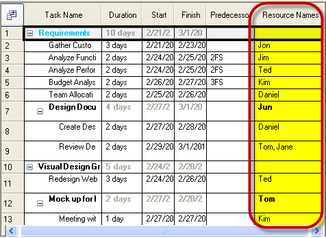
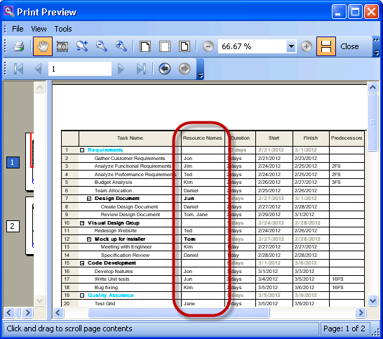

////
|metadata|
{
    "name": "winganttviewprintdocument-customizing-the-print-version-of-the-winganttview-control",
    "controlName": ["WinGanttView"],
    "tags": ["Application Scenarios","How Do I","Printing"],
    "guid": "28023138-5d9a-4a63-a3e7-00180fe44eae",
    "buildFlags": [],
    "createdOn": "2012-03-09T15:20:20.4781061Z"
}
|metadata|
////

= Customizing the Print Version of the WinGanttView Control

== Topic Overview

=== Purpose

This topic explains, with code examples, how to customize the Print Version of the WinGanttView control using the link:{ApiPlatform}win.ultrawinganttview{ApiVersion}~infragistics.win.ultrawinganttview.ultraganttviewprintdocument~initializeganttview_ev.html[InitializeGanttView] event.

=== Required background

The following table lists the topics required as a prerequisite to understanding this topic.

[options="header", cols="a,a"]
|====
|Topic|Purpose

| link:winganttviewprintdocument-winganttviewprintdocument-features.html[WinGanttViewPrintDocument Features]
|This topic introduces the features of the WinGanttViewPrintDocument™ component.

|====

=== In this topic

This topic contains the following sections:

* <<_Customizing_the_Print,Customizing the Print Version of the WinGanttView Control – Conceptual Overview>>
** <<Introduction,Introduction>>
** <<Supported_Customizations,Supported Customizations>>

* <<Customizing_the_Print_Code,Customizing the Print Version of the WinGanttView Control – Code Example>>
** <<Description,Description>>
** <<Preview,Preview>>
** <<Code,Code>>

* <<Related,Related Content>>

[[_Customizing_the_Print]]
== Customizing the Print Version of the WinGanttView Control – Conceptual Overview

[[Introduction]]

=== Introduction

At times, you may need to modify the WinGanttView control such that it affects the print version of the control but not the on-screen control. The  _InitializeGanttView_  event of the UltraGanttViewPrintDocument is used for this purpose.

The UltraGanttViewPrintDocument component renders the control’s information to the printer by creating an instance of the UltraGanttView control. When the UltraGanttView control instance is created, it is initialized based on the link:{ApiPlatform}win.ultrawinganttview{ApiVersion}~infragistics.win.ultrawinganttview.ultraganttview_members.html[GanttView] property and then the  _InitializeGanttView_  event is invoked to allow any further customizations to the control. This event can be used to set a different visual state of the UltraGanttView control for printing without modifying the control’s original or on-screen visual state.

[NOTE]
.NOTE
The UltraGanttView instance that is created for printing is hooked up to the same UltraCalendarInfo™ and UltraCalendarLook™ components of the on-screen UltraGanttView control. Hence any changes made to the link:{ApiPlatform}win.ultrawinganttview{ApiVersion}~infragistics.win.ultrawinganttview.ultraganttview~calendarinfo.html[CalendarInfo] and link:{ApiPlatform}win.ultrawinganttview{ApiVersion}~infragistics.win.ultrawinganttview.ultraganttview~calendarlook.html[CalendarLook] properties within the InitializeGanttView event affect both the print and the on-screen UltraGanttView control. This includes properties on any individual tasks since the tasks are stored in the  _CalendarInfo_  object, and also in the link:{ApiPlatform}win.ultrawinganttview{ApiVersion}~infragistics.win.ultrawinganttview.ultraganttview~activetask.html[ActiveTask] object.

[[Supported_Customizations]]

=== Supported customizations

The print version of the WinGanttView control can be customized in the following aspects:

* Hiding columns that show on the screen but which you do not want to print.
* Showing columns in the print that are not shown on the screen.
* Changing the order of the columns
* Changing appearances such as printing with a white background to save ink.

[[Customizing_the_Print_Code]]
== Customizing the Print Version of the WinGanttView Control – Code Example

[[Description]]

=== Description

The following code affects the display of the printed UltraGanttView control, which is different from the on-screen control.

The sample code changes the position of the  _Resource_   _Names_  column and modifies the cell appearance of the  _Resource Names_  column on the printed UltraGanttView control.

[[Preview]]

=== Preview

The following pictures demonstrate the difference between the on-screen version of the WinGanttView control (top) and its print version (bottom) as customized by the sample code.

'''

[[Code]]

=== Code

*In Visual Basic:*

[source,vb]
----
Private Sub ultraGanttViewPrintDocument1_InitializeGanttView(sender As Object, e As Infragistics.Win.UltraWinGanttView.Printing.InitializeGanttViewEventArgs)
      ' Change the position of the ‘Resource Names’ column
      e.Control.GridSettings.ColumnSettings(TaskField.Resources).VisiblePosition = 1
' Change the cell appearance of the ‘Resource Names’ column
e.Control.GridSettings.ColumnSettings(TaskField.Resources).CellAppearance.BackColor = Color.White
End Sub
----

*In C#:*

[source,csharp]
----
private void ultraGanttViewPrintDocument1_InitializeGanttView(object sender, Infragistics.Win.UltraWinGanttView.Printing.InitializeGanttViewEventArgs e)
{
    // Change the position of the ‘Resource Names’ column
    e.Control.GridSettings.ColumnSettings [TaskField.Resources].VisiblePosition = 1;
 // Change the cell appearance of the ‘Resource Names’ column
    e.Control.GridSettings.ColumnSettings[TaskField.Resources].CellAppearance.BackColor = Color.White;
}
----

[[Related]]
== Related Content

=== Topics

The following topics provide additional information related to this topic.

[options="header", cols="a,a"]
|====
|Topic|Purpose

| link:winganttviewprintdocument-winganttviewprintdocument-features.html[WinGanttViewPrintDocument Features]
|This topic introduces the features of the WinGanttViewPrintDocument™ component.

| link:winganttviewprintdocument-print-preview-with-winganttviewprintdocument.html[Print Preview with WinGanttViewPrintDocument]
|This topic explains how to use the Print Preview feature of theWinGanttViewPrintDocument™. In the particular example in this topic, the WinGanttViewPrintDocument™ is used with the WinPrintPreviewDialog™ to print preview the WinGanttView™ control.

| link:winganttviewprintdocument-configuring-the-legend.html[Configuring the Legend]
|This topic provides information about the Legend feature of the WinGanttViewPrintDocument™ component.

|====