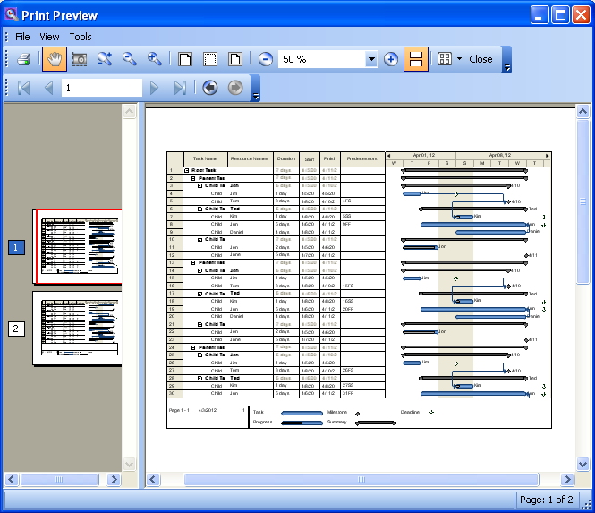

////

|metadata|
{
    "name": "winganttviewprintdocument-print-preview-with-winganttviewprintdocument",
    "controlName": ["WinGanttView"],
    "tags": ["How Do I","Printing"],
    "guid": "0b4a00bb-0708-4522-b72b-6e799739e5bf",  
    "buildFlags": [],
    "createdOn": "2012-03-12T14:25:51.2578886Z"
}
|metadata|
////

= Print Preview with WinGanttViewPrintDocument

== Topic Overview

=== Purpose

This topic explains how to print preview the WinGanttViewPrintDocument™. In the particular example in this topic, the WinGanttViewPrintDocument™ is used with the WinPrintPreviewDialog™ to print preview the WinGanttView™ control.

=== Required background

The following table lists the topics required as a prerequisite to understanding this topic.

[options="header", cols="a,a"]
|====
|Topic|Purpose

| link:winganttviewprintdocument-winganttviewprintdocument-features.html[WinGanttViewPrintDocument Features]
|Introduces the features of the WinGanttViewPrintDocument component

|====

=== In this topic

This topic contains the following sections:

* <<_Ref317523170,Using Print Preview with the WinGanttView Control>>
** <<_Ref317523196,Introduction>>
** <<_Ref317523203,Preview>>
** <<_Ref317523211,Requirements>>
** <<_Ref317523217,Steps>>

* <<_Ref317523239,Related Content>>

[[_Ref317523170]]
== Using Print Preview with the WinGanttView Control

[[_Ref317523196]]

=== Introduction

The WinPrintPreviewDialog works with any .NET PrintDocument, including the WinGanttViewPrintDocument™ that is used to print the WinGanttView™ control.

[[_Ref317523203]]

=== Preview

The following screenshot is a preview of the final result.

[[_Ref317523211]]

=== Requirements

To complete the procedure, you need:

* UltraPrintPreviewDailog, UltraGanttViewPrintDocument, UltraCalendarInfo and UltraGanttView controls dropped onto your form.
* An UltraButton™ control dropped onto the form with its Text property set to `‘Print Preview’`.
* The UltraGanttView control bound to data in order to display tasks and task information. For more information, refer to the link:winganttview-databinding-support-for-winganttview.html[DataBinding Support for WinGanttView] topic.

[[_Ref317523217]]

=== Steps

The following steps demonstrate how to setup WinGanttView, WinGanttViewPrintDocument and WinPrintPreviewDialog controls in order to print preview the GanttView control.

=== Assign UltraGanttView control to UltraGanttViewPrintDocument component.

The UltraGanttViewPrintDocument component exposes a link:{ApiPlatform}win.ultrawinganttview{ApiVersion}~infragistics.win.ultrawinganttview.ultraganttview_members.html[GanttView] property to which the UltraGanttView control on the form must be assigned.

*In Visual Basic:*

[source,vb]
----
Me.ultraGanttViewPrintDocument1.GanttView = Me.ultraGanttView1
----

*In C#:*

[source,csharp]
----
this.ultraGanttViewPrintDocument1.GanttView = this.ultraGanttView1;
----

=== Assign UltraGanttViewPrintDocument to UltraPrintPreviewDialog component.

The UltraGanttViewPrintDocument component must be assigned to the link:{ApiPlatform}win.ultrawinprintpreviewdialog{ApiVersion}~infragistics.win.printing.ultraprintpreviewdialog~document.html[Document] property of UltraPrintPreviewDialog.

*In Visual Basic:*

[source,vb]
----
Me.ultraPrintPreviewDialog1.Document = Me.ultraGanttViewPrintDocument1
----

*In C#:*

[source,csharp]
----
this.ultraPrintPreviewDialog1.Document = this.ultraGanttViewPrintDocument1;
----

=== Bring the print preview dialog showing the WinGanttView control.

Write this code within the Print Preview button click event.

*In Visual Basic:*

[source,vb]
----
Me.ultraPrintPreviewDialog1.ShowDialog(Me)
----

*In C#:*

[source,csharp]
----
this.ultraPrintPreviewDialog1.ShowDialog(this);
----

=== Run the Application

Run the application and click on the Print Preview button. The print preview dialog pops up displaying the GanttView control.

[[_Ref317523239]]
== Related Content

=== Topics

The following topics provide additional information related to this topic.

[options="header", cols="a,a"]
|====
|Topic|Purpose

| link:winganttviewprintdocument-winganttviewprintdocument-features.html[WinGanttViewPrintDocument Features]
|This topic introduces the features of the WinGanttViewPrintDocument™ component.

| link:winganttviewprintdocument-configuring-the-legend.html[Configuring the Legend]
|This topic provides information about the Legend feature of the WinGanttViewPrintDocument™ component.

| link:winganttviewprintdocument-customizing-the-print-version-of-the-winganttview-control.html[Customizing the Print Version of the WinGanttView Control]
|This topic explains, with code examples, how to customize the Print Version of the WinGanttView control using the link:{ApiPlatform}win.ultrawinganttview{ApiVersion}~infragistics.win.ultrawinganttview.ultraganttviewprintdocument~initializeganttview_ev.html[InitializeGanttView] event.

|====