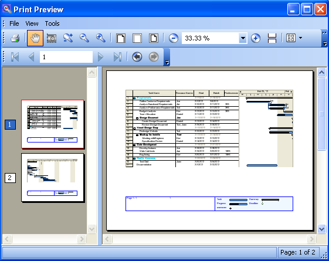
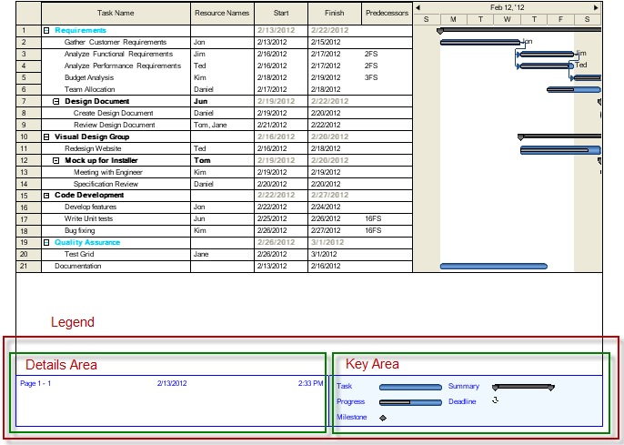

////

|metadata|
{
    "name": "winganttviewprintdocument-winganttviewprintdocument-features",
    "controlName": ["WinGanttView"],
    "tags": ["Layouts","Printing"],
    "guid": "fe8424e7-6457-4e11-95c4-7140335884bb",  
    "buildFlags": [],
    "createdOn": "2012-03-09T19:29:25.6215742Z"
}
|metadata|
////

= WinGanttViewPrintDocument Features

== Topic Overview

=== Purpose

This topic introduces the features of the WinGanttViewPrintDocument™ component.

=== Required background

The following table lists the topics required as a prerequisite to understanding this topic.

[options="header", cols="a,a"]
|====
|Topic|Purpose

| link:winprintdocument.html[WinPrintDocument]
|Introduces the WinPrintDocument™ component which is the base for WinGanttViewPrintDocument component.

|====

=== In this topic

This topic contains the following sections:

* <<_Features_Overview,Features Overview>>
** <<_Features_summary,Features summary>>
** <<_Print_Preview,Print Preview>>
** <<_Print,Print>>
** <<_Legend,Legend>>

* <<_Related_content,Related Content>>

[[_Features_Overview]]
== *Features Overview*

[[_Features_summary]]

=== Features summary

The following table summarizes the features of the WinGanttViewPrintDocument component. Further details about some of the features are provided in the text blocks following the table.

[options="header", cols="a,a"]
|====
|Feature|Description

|Print Preview
|Displays a print preview of the content of the WinGanttView control.

|Print
|Prints directly without showing a preview by calling the `Print` method on the UltraGanttViewPrintDocument component.

|Legend
|Print a legend.

|====

[[_Print_Preview]]

=== Print Preview

The print preview feature of WinGanttViewPrintDocument enables you to preview content of the WinGanttView control before printing. For the purpose of print preview any of the following controls can be used with the WinGanttViewPrintDocument component:

* Infragistics WinPrintPreviewDialog™ component
* Infragistics WinPrintPreview™ control
* Microsoft® PrintPreviewControl
* Microsoft® PrintPreviewDialog

When a print preview is invoked, a Print Preview window is opened as shown below that displays the contents of the WinGanttView control.

==== Related Topics:

link:winganttviewprintdocument-print-preview-with-winganttviewprintdocument.html[Print Preview with WinGanttViewPrintDocument]

[[_Print]]

=== Print

The Print feature enables you to print directly without showing a preview by calling the `Print` method on the UltraGanttViewPrintDocument component.

*In Visual Basic:*

[source,vb]
----
Me.ultraGanttViewPrintDocument1.Print()
----

*In C#:*

[source,csharp]
----
this.ultraGanttViewPrintDocument1.Print();
----

[[_Legend]]

=== Legend

The WinGanttViewPrintDocument component provides the ability to print a legend of the project displayed in the WinGanttView control. The legend consists of two basic parts:

* Details Area – This area can take any arbitrary text. Also allows for certain replacement codes which provide document-specific or user-specific information such as the current date, the user name, page numbers, etc.
* Key Area – Displays a graphical key for the user to identify the bars on the timeline section of UltraGanttView.

== Related Topics
:

* link:winganttviewprintdocument-configuring-the-legend.html[Configuring the Legend]

[[_Related_Content]]
== Related Content

=== Topics

The following topics provide additional information related to this topic.

[options="header", cols="a,a"]
|====
|Topic|Purpose

| link:winganttviewprintdocument-print-preview-with-winganttviewprintdocument.html[Print Preview with WinGanttViewPrintDocument]
|This topic explains how to use the Print Preview feature of theWinGanttViewPrintDocument™. In the particular example in this topic, the WinGanttViewPrintDocument™ is used with the WinPrintPreviewDialog™ to print preview the WinGanttView™ control.

| link:winganttviewprintdocument-configuring-the-legend.html[Configuring the Legend]
|Provides information about the Legend feature of the WinGanttViewPrintDocument component.

| link:winganttviewprintdocument-customizing-the-print-version-of-the-winganttview-control.html[Customizing the Print Version of the WinGanttView Control]
|This topic explains, with code examples, how to customize the Print Version of the WinGanttView control using the link:{ApiPlatform}win.ultrawinganttview{ApiVersion}~infragistics.win.ultrawinganttview.ultraganttviewprintdocument~initializeganttview_ev.html[InitializeGanttView] event.

|====