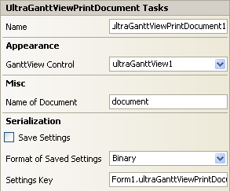

////

|metadata|
{
    "name": "winganttviewprintdocument-winganttviewprintdocument-smart-tag",
    "controlName": ["WinGanttView"],
    "tags": ["Design Environment"],
    "guid": "08a75fff-af73-4c0e-bd81-262c7c66ea33",  
    "buildFlags": [],
    "createdOn": "2012-02-08T22:16:05.2071496Z"
}
|metadata|
////

= WinGanttViewPrintDocument Smart Tag

In Visual Studio, each Infragistics Windows Forms control/component is equipped with a Smart Tag. By simply selecting the control/component, a Smart Tag anchor appears. When you click this anchor, a pop-up panel appears, providing you with quick and easy access to the most common properties and settings of the control/component.

The WinGanttViewPrintDocument™ Smart Tag contains the name of the component, as well as the following sections:

Appearance -- Provides common tasks involving the appearance, look, and feel of the control.

Misc -- Provides various options that will enhance the overall look or performance of the control.

Serialization -- Provides quick access to properties used in the IPersistComponentSettings interface.

Figure1: WinGanttViewPrintDocument Smart Tag

See below for a description of the item (e.g., field, drop-down list, checkbox) in each section, as well as the item's corresponding property in the properties grid.

[options="header", cols="a,a,a"]
|====
|Appearance|Description|Corresponding Property

|GanttView Control
|Upon clicking the drop-down, the available UltraGanttView control on the form will be displayed.
| link:{ApiPlatform}win.ultrawinganttview{ApiVersion}~infragistics.win.ultrawinganttview.printing.ganttviewcontrolplaceholderuielement~ganttview.html[GanttView]

|====

[options="header", cols="a,a,a"]
|====
|Misc|Description|Corresponding Property

|Name of Document
|Enter a name for the document that will be shown to the user.
|`DocumentName`

|====

[options="header", cols="a,a,a"]
|====
|Serialization|Description|Corresponding Property

|Save Settings
|Selecting True from the drop-down will allow the control to automatically save the applications' settings properties.
| link:{ApiPlatform}win{ApiVersion}~infragistics.win.printing.ultraprintdocument~savesettings.html[SaveSettings]

|Format of Saved Settings
|The control can save its settings to either Binary or XML files.
| link:{ApiPlatform}win{ApiVersion}~infragistics.win.printing.ultraprintdocument~savesettingsformat.html[SaveSettingsFormat]

|Settings Key
|You can set the settings key of the current instance of the control.
| link:{ApiPlatform}win{ApiVersion}~infragistics.win.printing.ultraprintdocument~settingskey.html[SettingsKey]

|====