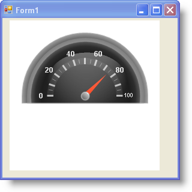

////

|metadata|
{
    "name": "wingauge-about-gauge-labels",
    "controlName": ["WinGauge"],
    "tags": ["Charting"],
    "guid": "{9409A37A-EB7F-4662-84CD-1D1E149850D9}",  
    "buildFlags": [],
    "createdOn": "0001-01-01T00:00:00Z"
}
|metadata|
////

= About Gauge Labels

Labels are numeric or text values that are used to represent the points of the scale. They are associated with the tick marks on the scale, and can help the end user to read the value that the marker is pointing to.

For example, if you created a Linear gauge to represent a thermometer, you could read the temperature by the label value.

The following screen shot shows an example of a Radial gauge with labels associated with every 20^th^ tick mark.

== Related Topic

link:wingauge-add-labels-to-a-gauge.html[Add Labels to a Gauge]