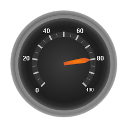

////

|metadata|
{
    "name": "wingauge-about-gauge-scales",
    "controlName": ["WinGauge"],
    "tags": ["Charting"],
    "guid": "{2F6A4890-9C6D-4734-9841-B6A3688A1C48}",  
    "buildFlags": [],
    "createdOn": "0001-01-01T00:00:00Z"
}
|metadata|
////

= About Gauge Scales

The  pick:[win-forms="link:{ApiPlatform}win.ultrawingauge{ApiVersion}~infragistics.ultragauge.resources.radialgauge~scales.html[Scales]"]  property of the WinGauge control is used to display a range of values on your Linear or Radial gauge. Scales are used to show the start and end measuring point for your gauge.

The following screen shot shows an example of a Radial gauge with a scale.

== Related Topic

link:wingauge-add-a-scale-to-a-gauge.html[Add a Scale to a Gauge]