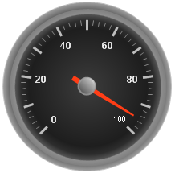

////

|metadata|
{
    "name": "wingauge-about-gauge-tick-marks",
    "controlName": ["WinGauge"],
    "tags": ["Charting"],
    "guid": "{08B024B5-51CA-4994-8213-147939532864}",  
    "buildFlags": [],
    "createdOn": "0001-01-01T00:00:00Z"
}
|metadata|
////

= About Gauge Tick Marks

You can add tick marks to your gauge to display the values of the gauge's scale. The TickMarks property has two attributes:

* Minor TickMarks
* Major TickMarks

You can configure both of them to display "ticks" at specific values. Major tick marks are usually larger than minor tick marks. They are configured to highlight every n^th^ value on the scale.

The following screen shot shows a Radial gauge with major tick marks display at every 5^th^ interval and minor tick marks displayed at every interval.

== Related Topic

link:wingauge-add-tick-marks-to-a-scale-on-a-gauge.html[Add Tick Marks to a Scale on a Gauge]