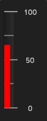

////

|metadata|
{
    "name": "wingauge-add-a-bar-marker-to-a-gauge",
    "controlName": ["WinGauge"],
    "tags": ["Charting"],
    "guid": "{D2EC7150-5936-4FCC-B9A2-7EFE05804379}",  
    "buildFlags": [],
    "createdOn": "0001-01-01T00:00:00Z"
}
|metadata|
////

= Add a Bar Marker to a Gauge

Bar Markers are displayed as bars that have a start and end point on the scale.

.Note
[NOTE]
====
This topic assumes that you already created a Linear gauge. For information on how to do this, see link:wingauge-getting-started-with-wingauge.html[Getting Started with WinGauge].
====

You can add a bar marker to your gauge:

* <<gaugeDesigner,using the Gauge Designer>>
* <<designTime,at design time>>
* <<runTime,at run time>>

When you save and run your application after completing the following steps, your gauge should look similar to the gauge below.

[[gaugeDesigner]]
*To add a bar marker to an existing Linear gauge using the Gauge Designer:*

[start=1]
. In the Gauge Explorer, expand Markers.
[start=2]
. Click Add Marker and select New Bar Marker.
[start=3]
. In the link:wingauge-properties-panel.html[Properties panel], click link:wingauge-bar-marker-layout-tab.html[Bar Marker Layout tab]. In the link:wingauge-bar-marker-extent-pane.html[Extent pane], set the following properties:

** Inner -- 10
** Outer -- 70

[start=4]
. In the link:wingauge-bar-marker-value-pane.html[Value pane] of the Bar Marker Layout tab, set the following property:

** Value -- 65

[start=5]
. Click the link:wingauge-appearance-tab.html[Appearance tab.] In the link:wingauge-brush-pane.html[Brush pane], set the following properties:

** Type -- Solid
** Color -- Red

[[designTime]]
*To add a bar marker to an existing Linear gauge at design time:*

[start=1]
. Within the Gauges collection editor, click Linear Gauge.
[start=2]
. Locate the  pick:[win-forms="link:{ApiPlatform}win.ultrawingauge{ApiVersion}~infragistics.ultragauge.resources.lineargauge~scales.html[Scales]"]  property and click the Ellipsis (…) to launch the Scales collection editor.
[start=3]
. Locate the  pick:[win-forms="link:{ApiPlatform}win.ultrawingauge{ApiVersion}~infragistics.ultragauge.resources.lineargaugescale~markers.html[Markers]"]  property and click the Ellipsis (…) to launch the Markers collection editor.
[start=4]
. Click Add, and select Add Bar Marker.
[start=5]
. Locate the  pick:[win-forms="link:{ApiPlatform}win.ultrawingauge{ApiVersion}~infragistics.ultragauge.resources.brushelement.html[BrushElement]"]  property. From the BrushElement drop-down list, select Solid Fill. This will create a new Solid Fill brush element.
[start=6]
. Expand the newly created BrushElement property, and locate the  pick:[win-forms="link:{ApiPlatform}win.ultrawingauge{ApiVersion}~infragistics.ultragauge.resources.solidfillbrushelement~color.html[Color]"]  property. Set the Color property to Red.
[start=7]
. Set the following properties:

** InnerExtent -- 10
** OuterExtent -- 70
** Value -- 65

[[runTime]]
*To add a bar maker to your gauge at run time:*

[start=1]
. Before you start writing any code, you should place using/Imports directives in your code-behind so you don't need to always type out a member's fully qualified name.

*In Visual Basic:*

----
Imports Infragistics.UltraGauge.Resources
----

*In C#:*

----
using Infragistics.UltraGauge.Resources;
----

[start=2]
. Create the load event.
[start=3]
. Create instances of the classes:

*In Visual Basic:*

----
Dim myLinearGauge As LinearGauge = Me.UltraGauge1.Gauges(0)
Dim myScale As LinearGaugeScale = myLinearGauge.Scales(0)
Dim myBarMarker As New LinearGaugeBarMarker()
Dim mySolidFillBrushElement As New SolidFillBrushElement()
----

*In C#:*

----
LinearGauge myLinearGauge = this.ultraGauge1.Gauges[0] As LinearGauge;
LinearGaugeScale myScale = myLinearGauge.Scales[0];
LinearGaugeBarMarker myBarMarker = new LinearGaugeBarMarker();
SolidFillBrushElement mySolidFillBrushElement = new SolidFillBrushElement();
----

[start=4]
. Set the following color properties:

** Type -- Solid
** Color -- Red

*In Visual Basic:*

----
mySolidFillBrushElement.Color = System.Drawing.Color.Red
myMarker.BrushElement = mySolidFillBrushElement
----

*In C#:*

----
mySolidFillBrushElement.Color = System.Drawing.Color.Red;
myBarMarker.BrushElement = mySolidFillBrushElement;
----

[start=5]
. Set the following properties:

** InnerExtent -- 10
** OuterExtent -- 70
** Precision -- 0
** Value -- 65

*In Visual Basic:*

----
myBarMarker.InnerExtent = 10
myBarMarker.OuterExtent = 70
myBarMarker.Precision = 0
myBarMarker.Value = 65
----

*In C#:*

----
myBarMarker.InnerExtent = 10;
myBarMarker.OuterExtent = 70;
myBarMarker.Precision = 0;
myBarMarker.Value = 65;
----

[start=6]
. Add your bar marker to the Scales collection:

*In Visual Basic:*

----
myScale.Markers.Add(myBarMarker)
----

*In C#:*

----
myScale.Markers.Add(myBarMarker);
----