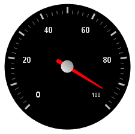

////

|metadata|
{
    "name": "wingauge-add-a-needle-marker-to-a-gauge",
    "controlName": ["WinGauge"],
    "tags": ["Charting"],
    "guid": "{717E5226-25F6-4EA0-8AB0-A1FE236FC2C5}",  
    "buildFlags": [],
    "createdOn": "0001-01-01T00:00:00Z"
}
|metadata|
////

= Add a Needle Marker to a Gauge

A needle marker is displayed as a pointer that points to a specific value on a scale.

.Note
[NOTE]
====
This topic assumes that you already created a Radial gauge with a scale, labels and tick marks. For information on how to do this, see link:wingauge-add-labels-to-a-gauge.html[Add Labels to a Gauge].
====

The next step after adding a needle marker to your gauge is to link:wingauge-add-a-range-to-a-gauge.html[Add a Range to a Gauge].

You can add a needle marker to your gauge:

* <<gaugeDesigner,using the Gauge Designer>>
* <<designTime,at design time>>
* <<runTime,at run time>>

When you save and run your application after completing the following steps, your gauge should look similar to the gauge below.

[[gaugeDesigner]]
*To add a needle marker to an existing Radial gauge using the Gauge Designer:*

[start=1]
. In the Gauge Explorer, expand Markers.
[start=2]
. Click Add Marker... and select New Needle.
[start=3]
. In the link:wingauge-properties-panel.html[Properties panel], click the link:wingauge-needle-marker-layout-tab.html[Needle Marker Layout tab]. In the link:wingauge-widths-and-extents-pane.html[Widths and Extents pane], set the following properties:

** Widths

*** Start -- 3
*** Mid -- 3
*** End -- 1

** Extents

*** Start -- -20
*** Mid -- 0
*** End -- 65

[start=4]
. In the link:wingauge-value-and-units.html[Value and Units pane] of the Needle Marker Layout tab, set the following properties:

** Value -- 95.00
** Precision -- 1.00
** Units -- Percent

[start=5]
. Click the link:wingauge-appearance-tab.html[Appearance tab]. In the link:wingauge-brush-pane.html[Brush pane], set the following properties:

** Type -- Solid
** Color -- 255, 61, 22

[start=6]
. In the Gauge Explorer, select Anchor.
[start=7]
. In the Brush pane of the Appearance tab of the Properties panel set the following properties:

** Type -- SimpleGradient
** Start Color -- Gainsboro
** End Color -- 64, 64, 64
** Gradient Style -- BackwardDiagonal

[start=8]
. In the link:wingauge-stroke-pane.html[Stroke pane] of the Appearance tab, set the following properties:

** Type -- RadialGradient
** SurroundColor -- Gray
** CenterColor -- WhiteSmoke
** FocusScale -- 0,0
** CenterPoint -- 75, 25

[[designTime]]
*To add a needle marker to an existing Radial gauge at design time:*

[start=1]
. Within the Gauges collection editor, click the Radial Gauge.
[start=2]
. Locate the link:{ApiPlatform}win.ultrawingauge{ApiVersion}~infragistics.ultragauge.resources.radialgauge~scales.html[Scales] property and click the Ellipsis (…) to launch the Scales collection editor.
[start=3]
. Locate the link:{ApiPlatform}win.ultrawingauge{ApiVersion}~infragistics.ultragauge.resources.radialgaugescale~markers.html[Markers] property and click the Ellipsis (…) to launch the Markers collection editor.
[start=4]
. Click the Add button and select Add Needle.
[start=5]
. Locate the link:{ApiPlatform}win.ultrawingauge{ApiVersion}~infragistics.ultragauge.resources.brushelement.html[BrushElement] property. From the BrushElement drop-down list, select Solid Fill. This will create a new Solid Fill brush element.
[start=6]
. Expand the newly created BrushElement property and locate the link:{ApiPlatform}win.ultrawingauge{ApiVersion}~infragistics.ultragauge.resources.solidfillbrushelement~color.html[Color] property. Set the color to Red.
[start=7]
. Locate and expand the link:{ApiPlatform}win.ultrawingauge{ApiVersion}~infragistics.ultragauge.resources.radialgaugeneedleanchor.html[Anchor] property and click on its BrushElement property.
[start=8]
. From the BrushElement drop-down list, select SimpleGradient and set the following properties:

** Type -- SimpleGradient
** StartColor -- Gainsboro
** EndColor -- 64, 64, 64
** GradientStyle -- BackwardDiagonal

[start=9]
. Set the Value property to 95

[[runTime]]
*To add a needle maker to an existing Radial gauge at run time:*

[start=1]
. Add the following steps to the load event.
[start=2]
. Create instances of the classes:

*In Visual Basic:*

----
Dim myNeedle As New RadialGaugeNeedle()
Dim mySolidFillBrushElement2 As New SolidFillBrushElement()
Dim mySimpleGradientBrushElement As New SimpleGradientBrushElement()
----

*In C#:*

----
RadialGaugeNeedle myNeedle = new RadialGaugeNeedle();
SolidFillBrushElement mySolidFillBrushElement2 = new SolidFillBrushElement();
SimpleGradientBrushElement mySimpleGradientBrushElement = _
  new SimpleGradientBrushElement();
----

[start=3]
. Set the following color properties for the needle:

** Type -- Solid
** Color -- Red

*In Visual Basic:*

----
mySolidFillBrushElement2.Color = System.Drawing.Color.Red
myNeedle.BrushElement = mySolidFillBrushElement2
----

*In C#:*

----
mySolidFillBrushElement2.Color = System.Drawing.Color.Red;
myNeedle.BrushElement = mySolidFillBrushElement2;
----

[start=4]
. Set the following property for the anchor:

** Radius -- 10
** Measure -- Percent

*In Visual Basic:*

----
myNeedle.Anchor.RadiusMeasure = _
  Infragistics.UltraGauge.Resources.Measure.Percent
myNeedle.Anchor.Radius = 10
----

*In C#:*

----
myNeedle.Anchor.RadiusMeasure = 
  Infragistics.UltraGauge.Resources.Measure.Percent;
myNeedle.Anchor.Radius = 10;
----

[start=5]
. Set the following color properties for the anchor:

** Type -- SimpleGradient
** EndColor -- WhiteSmoke
** StartColor -- Gray
** GradientStyle -- BackwardDiagonal

*In Visual Basic:*

----
myNeedle.Anchor.BrushElement = mySimpleGradientBrushElement
mySimpleGradientBrushElement.EndColor = System.Drawing.Color.WhiteSmoke
mySimpleGradientBrushElement.GradientStyle = _
  Infragistics.UltraGauge.Resources.Gradient.BackwardDiagonal
mySimpleGradientBrushElement.StartColor = System.Drawing.Color.Gray
----

*In C#:*

----
myNeedle.Anchor.BrushElement = mySimpleGradientBrushElement;
mySimpleGradientBrushElement.EndColor = System.Drawing.Color.WhiteSmoke;
mySimpleGradientBrushElement.GradientStyle = 
  Infragistics.UltraGauge.Resources.Gradient.BackwardDiagonal;
mySimpleGradientBrushElement.StartColor = System.Drawing.Color.Gray;
----

[start=6]
. Set the following properties:

** AllowDrag -- true
** EndExtent -- 65
** EndWidth -- 1
** MidExtent -- 0
** MidWidth -- 3
** Precision -- 1
** StartExtent -- -20
** StartWidth -- 3
** Value -- 95
** WidthMeasure -- Percent

*In Visual Basic:*

----
myNeedle.AllowDrag = True
myNeedle.EndExtent = 65
myNeedle.EndWidth = 1
myNeedle.MidExtent = 0
myNeedle.MidWidth = 3
myNeedle.Precision = 1
myNeedle.StartExtent = -20
myNeedle.StartWidth = 3
myNeedle.Value = 95
myNeedle.WidthMeasure = Measure.Percent
----

*In C#:*

----
myNeedle.AllowDrag = true;
myNeedle.EndExtent = 65;
myNeedle.EndWidth = 1;
myNeedle.MidExtent = 0;
myNeedle.MidWidth = 3;
myNeedle.Precision = 1;
myNeedle.StartExtent = -20;
myNeedle.StartWidth = 3;
myNeedle.Value = 95;
myNeedle.WidthMeasure = Measure.Percent;
----

[start=7]
. Add the needle marker to the Markers collection:

*In Visual Basic:*

----
myScale.Markers.Add(myNeedle)
----

*In C#:*

----
myScale.Markers.Add(myNeedle)
----

== Related Topic

link:wingauge-add-a-range-to-a-gauge.html[Add a Range to a Gauge]