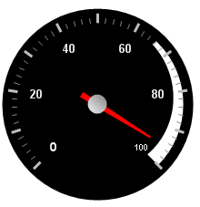

////

|metadata|
{
    "name": "wingauge-add-a-range-to-a-gauge",
    "controlName": ["WinGauge"],
    "tags": ["Charting"],
    "guid": "{77106E92-DCA9-45E9-BC29-3E985642DA5E}",  
    "buildFlags": [],
    "createdOn": "0001-01-01T00:00:00Z"
}
|metadata|
////

= Add a Range to a Gauge

Ranges are visual elements displayed on your gauge that begins and ends at specified values on a scale. Adding a range to the scale of your gauge lets you highlight specific sections.

.Note
[NOTE]
====
*Note:* This topic assumes that you already created a Radial gauge with a scale, labels, needle marker and tick marks. For information on how to do this, see link:wingauge-add-a-needle-marker-to-a-gauge.html[Add a Needle Marker to a Gauge].
====

You can add range to your scale at design time and runtime.

* <<gaugeDesigner,Gauge designer>>
* <<designTime,Design time>>
* <<runTime,Run time>>

When you save and run your application after completing the ollowing steps, your gauge should look similar to the gauge below.

[[gaugeDesigner]]
*To add ranges to your scales using the Gauge Designer:*

[start=1]
. In the Gauge Explorer, expand Ranges.
[start=2]
. Click Add Ranges and select New Range.
[start=3]
. In the link:wingauge-value-pane.html[Value pane] of the link:wingauge-range-layout-tab.html[Range Layout tab] of the link:wingauge-properties-panel.html[Properties panel], set the following properties:

** Start Value -- 66
** End Value -- 100

[start=4]
. In the link:wingauge-extent-pane.html[Extent pane] of the Range Layout tab, set the following properties:

** Inner Start -- 75
** Inner End -- 85
** Outer -- 90

[start=5]
. Click the link:wingauge-appearance-tab.html[Appearance tab]. In the link:wingauge-brush-pane.html[Brush pane], set the following properties:

** Type -- Solid
** Color -- White

[[designTime]]
*To add ranges to your scales at design time:*

[start=1]
. In the Gauges collection editor, click the  pick:[win-forms="link:{ApiPlatform}win.ultrawingauge{ApiVersion}~infragistics.ultragauge.resources.radialgauge~scales.html[Scales]"]  property. Then, click the ellipsis button (…) to open the Scales collection editor.
[start=2]
. Click the  pick:[win-forms="link:{ApiPlatform}win.ultrawingauge{ApiVersion}~infragistics.ultragauge.resources.radialgaugescale~ranges.html[Ranges]"]  property, then click the ellipsis button (...) to open the Ranges collection editor
[start=3]
. Click Add.
[start=4]
. Click the  pick:[win-forms="link:{ApiPlatform}win.ultrawingauge{ApiVersion}~infragistics.ultragauge.resources.brushelement.html[BrushElement]"]  property, and from the drop-down list, select Solid Fill.
[start=5]
. Expand the BrushElement property and set the  pick:[win-forms="link:{ApiPlatform}win.ultrawingauge{ApiVersion}~infragistics.ultragauge.resources.solidfillbrushelement~color.html[Color]"]  property to White.
[start=6]
. Set the following properties:

** StartValue -- 66
** EndValue -- 100
** InnerExtentStart -- 75
** InnerExtentEnd -- 85
** OuterExtent -- 90

[[runTime]]
*To add ranges to your scales at run time:*

[start=1]
. Add the following steps to the load event.
[start=2]
. Create instances of the classes:

*In Visual Basic:*

----
Dim myRange As New RadialGaugeRange
Dim mySolidFillBrushElement3 As New SolidFillBrushElement()
----

*In C#:*

----
RadialGaugeRange myRange = new RadialGaugeRange();
SolidFillBrushElement mySolidFillBrushElement3 = new SolidFillBrushElement();
----

[start=3]
. Set the following color properties:

** Type -- Solid
** Color -- White

*In Visual Basic:*

----
mySolidFillBrushElement3.Color = System.Drawing.Color.White
myRange.BrushElement = mySolidFillBrushElement3
----

*In C#:*

----
mySolidFillBrushElement3.Color = System.Drawing.Color.White;
myRange.BrushElement = mySolidFillBrushElement3;
----

[start=4]
. Set the following properties:

** EndValue -- 100
** InnerExtentEnd -- 75
** InnerExtentStart -- 85
** OuterExtent -- 90
** StartValue -- 66

*In Visual Basic:*

----
myRange.EndValue = 100
myRange.InnerExtentEnd = 75
myRange.InnerExtentStart = 85
myRange.OuterExtent = 90
myRange.StartValue = 66
----

*In C#:*

----
myRange.EndValue = 100;
myRange.InnerExtentEnd = 75;
myRange.InnerExtentStart = 85;
myRange.OuterExtent = 90;
myRange.StartValue = 66;
----

[start=5]
. Add your range to the Ranges collection:

*In Visual Basic:*

----
myScale.Ranges.Add(myRange)
----

*In C#:*

----
myScale.Ranges.Add(myRange);
----