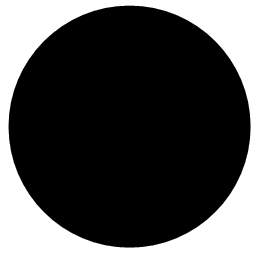

////

|metadata|
{
    "name": "wingauge-add-a-scale-to-a-gauge",
    "controlName": ["WinGauge"],
    "tags": ["Charting"],
    "guid": "{059E97D3-F0CA-48E8-B002-303C46ED7712}",  
    "buildFlags": [],
    "createdOn": "0001-01-01T00:00:00Z"
}
|metadata|
////

= Add a Scale to a Gauge

The *Scales* property displays the range of values on your gauge.

.Note
[NOTE]
====
This topic assumes that you already created a Radial gauge with a Dial. For information on how to create a dial, see link:wingauge-create-a-dial.html[Create a Dial.]
====

The next step after adding a scale to your gauge is to link:wingauge-add-tick-marks-to-a-scale-on-a-gauge.html[Add Tick Marks to a Scale to a Gauge].

You can add scales to your gauge:

* <<gaugeDesigner,using the Gauge Designer>>
* <<designTime,at design time>>
* <<runTime,at run time>>

When you save and run your application after completing the following steps, your gauge should look similar to the gauge below. The scale on the gauge is not visible until you add tick marks.

[[gaugeDesigner]]
*To add scales to your gauge using the Gauge Designer:*

[start=1]
. In the Gauge Explorer, expand the *Scales* property.
[start=2]
. Click Add Scale and select New Scale.
[start=3]
. In the link:wingauge-properties-panel.html[Properties panel], in the link:wingauge-sweep-angle-pane.html[Sweep Angle pane] set the following properties:

** Start -- 135
** End -- 405

[start=4]
. In the Axis pane of the Sweep Angle pane, set the End Value to 100.00.

[[designTime]]
*To add scales to your gauge at design time:*

[start=1]
. In the Gauges Collection editor window, click the  pick:[win-forms="link:{ApiPlatform}win.ultrawingauge{ApiVersion}~infragistics.ultragauge.resources.radialgauge~scales.html[Scales]"]  property. Then, click the ellipsis button to open the Scales editor.
[start=2]
. In the editor, click Add to add a new Scales.
[start=3]
. Set the  pick:[win-forms="link:{ApiPlatform}win.ultrawingauge{ApiVersion}~infragistics.ultragauge.resources.radialgaugescale~endangle.html[EndAngle]"]  property to 405.
[start=4]
. Set the  pick:[win-forms="link:{ApiPlatform}win.ultrawingauge{ApiVersion}~infragistics.ultragauge.resources.radialgaugescale~startangle.html[StartAngle]"]  property to 135.
[start=5]
. Click the  pick:[win-forms="link:{ApiPlatform}win.ultrawingauge{ApiVersion}~infragistics.ultragauge.resources.axis.html[Axis]"]  property. Then, from the drop-down list, select Numeric Axis.
[start=6]
. Expand the Axis property and set the StartValue property to 0\.
[start=7]
. Set EndValue to 100.

[[runTime]]
*To add scales to your gauge at run time:*

[start=1]
. Add the following steps to the load event.
[start=2]
. Create instances of the classes:

*In Visual Basic:*

----
Dim myScale As New RadialGaugeScale()
Dim numericAxis1 As New NumericAxis()
----

*In C#:*

----
RadialGaugeScale myScale = new RadialGaugeScale();
NumericAxis numericAxis1 = new NumericAxis();
----

[start=3]
. Set the following property:

** Margin -- (10, 10, 10, Pixels)

*In Visual Basic:*

----
myRadialGauge.Margin = New Margin(10, 10, 10, 10, Measure.Pixels)
----

*In C#:*

----
myRadialGauge.Margin = new Margin(10, 10, 10, 10, Pixels);
----

[start=4]
. Set the following Axis property and add the numeric axis to the scale:

** EndValue = 100

*In Visual Basic:*

----
numericAxis1.EndValue = 100
myScale.Axes.Add(numericAxis1)
----

*In C#:*

----
numericAxis1.EndValue = 100;
myScale.Axes.Add(numericAxis1);
----

[start=5]
. Set the following properties:

** EndAngle -- 405
** StartAngle -- 135

*In Visual Basic:*

----
myScale.EndAngle = 405
myScale.StartAngle = 135
----

*In C#:*

----
myScale.EndAngle = 405;
myScale.StartAngle = 135;
----

[start=6]
. Add your scales to the Scales collection:

*In Visual Basic:*

----
myRadialGauge.Scales.Add(myScale)
----

*In C#:*

----
myRadialGauge.Scales.Add(myScale);
----

== Related Topic

link:wingauge-add-tick-marks-to-a-scale-on-a-gauge.html[Add Tick Marks to a Scale on a Gauge]