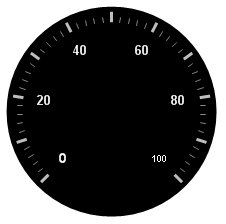

////

|metadata|
{
    "name": "wingauge-add-labels-to-a-gauge",
    "controlName": ["WinGauge"],
    "tags": ["Charting"],
    "guid": "{8A6691CE-7813-403E-91F1-BE58274004C5}",  
    "buildFlags": [],
    "createdOn": "0001-01-01T00:00:00Z"
}
|metadata|
////

= Add Labels to a Gauge

Labels are numeric or text values that are associated with the values of the scale. You need to add labels to a gauge in order to represent values on the scale.

.Note
[NOTE]
====
This topic assumes that you already created a Radial gauge with a scale and tick marks. For information on how to do this, see link:wingauge-add-tick-marks-to-a-scale-on-a-gauge.html[Add Tick Marks to a Scale on a Gauge.]
====

The next step after adding labels to your gauge is to link:wingauge-add-a-needle-marker-to-a-gauge.html[Add a Needle Marker to a Gauge].

You can add labels to your scale:

* <<gaugeDesigner,using the Gauge Designer>>
* <<designTime,at design time>>
* <<runTime,at run time>>

When you save and run your application after completing the following steps, your form should look similar to the form below.

[[gaugeDesigner]]
*To add labels to your scales using the Gauge Designer:*

[start=1]
. In the Gauge Explorer, expand Scale.
[start=2]
. Select Labels.
[start=3]
. In the link:wingauge-properties-panel.html[Properties panel], click the link:wingauge-labels-layout-tab.html[Labels Layout tab]. In the link:wingauge-orientation-pane.html[Orientation pane], set the following properties:

** Extent -- 65
** Orientation -- Horizontal

[start=4]
. In the link:wingauge-formatting-pane.html[Formatting pane] of the Labels Layout tab, set the following properties:

** Frequency -- 20.00
** Span Max -- 18

[start=5]
. Click the Labels Appearance tab. In the link:wingauge-brush-pane.html[Brush pane], set the following properties:

** Type -- Solid
** Color -- White

[start=6]
. In the link:wingauge-font-pane.html[Font pane] of the Labels Appearance tab, set the following properties:

** Font -- Arial
** Size -- 14
** Type -- Pixel
** Style -- Bold

[start=7]
. You can see the labels applied to your Radial gauge in the interactive preview area.

[[designTime]]
*To add labels to your scales at design time:*

[start=1]
. In the Scales collection editor, with a Scale selected, expand the link:{ApiPlatform}win.ultrawingauge{ApiVersion}~infragistics.ultragauge.resources.radialgaugescale~labels.html[Labels] property.
[start=2]
. Click the link:{ApiPlatform}win.ultrawingauge{ApiVersion}~infragistics.ultragauge.resources.brushelement.html[BrushElement] property. Then, from the drop-down list, select Solid Fill.
[start=3]
. Expand the BrushElement property, and set the link:{ApiPlatform}win.ultrawingauge{ApiVersion}~infragistics.ultragauge.resources.solidfillbrushelement~color.html[Color] property to White.
[start=4]
. Set the link:{ApiPlatform}win.ultrawingauge{ApiVersion}~infragistics.ultragauge.resources.gaugescalelabelsappearance~extent.html[Extent] property to 65.
[start=5]
. Set the link:{ApiPlatform}win.ultrawingauge{ApiVersion}~infragistics.ultragauge.resources.gaugescalelabelsappearance~frequency.html[Frequency] property to 20\.
[start=6]
. Expand the link:{ApiPlatform}win.ultrawingauge{ApiVersion}~infragistics.ultragauge.resources.labelappearance~font.html[Font] property, and set the following properties:

** Name -- Arial
** Size -- 14
** Unit -- Pixel
** Bold -- True

[[runTime]]
*To add labels to your scales at run time:*

[start=1]
. Add the following steps to the load event.
[start=2]
. Create an instance of the class:

*In Visual Basic:*

----
Dim mySolidFillBrushElement1 As New SolidFillBrushElement()
----

*In C#:*

----
SolidFillBrushElement mySolidFillBrushElement1 = new SolidFillBrushElement();
----

[start=3]
. Set the following color properties:

** Type -- Solid
** Color -- White

*In Visual Basic:*

----
mySolidFillBrushElement1.Color = System.Drawing.Color.White
myScale.Labels.BrushElement = mySolidFillBrushElement1
----

*In C#:*

----
mySolidFillBrushElement1.Color = System.Drawing.Color.White;
myScale.Labels.BrushElement = mySolidFillBrushElement1;
----

[start=4]
. Set the following properties:

** Font -- Arial
** Font Size -- 14
** Font Type -- Pixel
** Font Style -- Bold
** Extent -- 65
** Frequency -- 20
** Orientation -- Horizontal
** SpanMaximum -- 18

*In Visual Basic:*

----
myScale.Labels.Extent = 65
myScale.Labels.Font = _
  New System.Drawing.Font("Arial", 14.0F, _
  System.Drawing.FontStyle.Bold, System.Drawing.GraphicsUnit.Pixel)
myScale.Labels.Frequency = 20
myScale.Labels.Orientation = _
  Infragistics.UltraGauge.Resources.RadialLabelOrientation.Horizontal
myScale.Labels.SpanMaximum = 18
----

*In C#:*

----
myScale.Labels.Extent = 65;
myScale.Labels.Font = 
  new System.Drawing.Font("Arial", 14F, 
  System.Drawing.FontStyle.Bold, System.Drawing.GraphicsUnit.Pixel);
myScale.Labels.Frequency = 20;
myScale.Labels.Orientation = 
  Infragistics.UltraGauge.Resources.RadialLabelOrientation.Horizontal;
myScale.Labels.SpanMaximum = 18;
----

== Related Topic

link:wingauge-add-a-needle-marker-to-a-gauge.html[Add a Needle Marker to a Gauge]