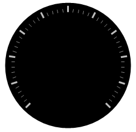

////

|metadata|
{
    "name": "wingauge-add-tick-marks-to-a-scale-on-a-gauge",
    "controlName": ["WinGauge"],
    "tags": ["Charting"],
    "guid": "{F7D5EEAA-EE37-45AE-BB8D-F04C021F36EC}",  
    "buildFlags": [],
    "createdOn": "0001-01-01T00:00:00Z"
}
|metadata|
////

= Add Tick Marks to a Scale on a Gauge

The Tickmark property on the WinGauge control is used to visually display the values on a scale of your Radial or Linear gauge.

.Note
[NOTE]
====
This topic assumes that you already created a Radial gauge with a scale. For information on how to do this, see link:wingauge-add-a-scale-to-a-gauge.html[Add a Scale to a Gauge].
====

The next step after adding tick marks to a scale on your gauge is to link:wingauge-add-labels-to-a-gauge.html[Add Labels to a Gauge].

You can add tick marks to your scale:

* <<gaugeDesigner,using the Gauge Designer>>
* <<designTime,at design time>>
* <<runTime,at run time>>

When you save and run your application after completing the following steps, your gauge should look similar to the gauge below.

[[gaugeDesigner]]
*To add tick marks to your scales using the Gauge Designer:*

[start=1]
. In the Gauge Explorer, expand Scale.
[start=2]
. Select Major Tickmarks.
[start=3]
. In the link:wingauge-tickmark-extent-pane.html[Extent pane] of the link:wingauge-tickmark-layout-tab.html[Tickmark Layout tab] of the link:wingauge-properties-panel.html[Properties panel], set the following properties:

** Start -- 85
** End -- 95

[start=4]
. In the link:wingauge-widths-pane.html[Widths pane] of the Tickmark Layout tab, set the following properties:

** Start -- 3
** End -- 3

[start=5]
. In the link:wingauge-tickmark-orientation-pane.html[Orientation pane] of the Tickmark Layout tab, set the Frequency to 10.00\.
[start=6]
. In the Gauge Explorer, select Minor Tickmarks
[start=7]
. In the Extent pane of the Properties panel, set the following properties:

** Start -- 85
** End -- 90

[start=8]
. In the Widths pane of the Tickmark Layout tab, set the following properties:

** Start -- 1
** End -- 1

[start=9]
. In the Orientations pane of the Tickmark Layout tab, set the Frequency to 2.00.

[[designTime]]
*To add tick marks to your scales at design time:*

[start=1]
. In the Gauges Collection editor window, click the link:{ApiPlatform}win.ultrawingauge{ApiVersion}~infragistics.ultragauge.resources.radialgauge~scales.html[Scales] property. Then, click the ellipsis (…) button to open the Scales editor.
[start=2]
. Expand the link:{ApiPlatform}win.ultrawingauge{ApiVersion}~infragistics.ultragauge.resources.radialgaugescale~majortickmarks.html[MajorTickmarks] property. Then click the link:{ApiPlatform}win.ultrawingauge{ApiVersion}~infragistics.ultragauge.resources.brushelement.html[BrushElement] property, and from the drop-down list, select Solid Fill.
[start=3]
. Expand the BrushElement property and set the link:{ApiPlatform}win.ultrawingauge{ApiVersion}~infragistics.ultragauge.resources.solidfillbrushelement~color.html[Color] property to 189, 189, 189.
[start=4]
. Under the MajorTickmarks property, set the following properties:

** StartExtent -- 75
** StartWidth -- 3
** Frequency -- 10
** EndExtent -- 85
** EndWidth -- 3

[start=5]
. Expand the link:{ApiPlatform}win.ultrawingauge{ApiVersion}~infragistics.ultragauge.resources.radialgaugescale~minortickmarks.html[MinorTickmarks] property. Then click the BrushElement property, and from the drop down list, select SolidFill.

[start=6]
. Expand the BrushElement property. Then set the Color property to 240, 240, 240\.
[start=7]
. Under the MinorTickmarks property, set the following properties:

** StartExtent -- 85
** StartWidth -- 1
** Frequency -- 2
** EndExtent -- 90
** EndWidth -- 1

[[runTime]]
*To add tick marks to your scales at run time:*

[start=1]
. Add the following steps to the load event.
[start=2]
. Create instances of the classes:

*In Visual Basic:*

----
Dim mySolidFillBrushElementMajor As New SolidFillBrushElement()
Dim mySolidFillBrushElementMinor As New SolidFillBrushElement()
Dim mySolidFillBrushElementMinorStroke As New SolidFillBrushElement()
Dim myStrokeElement As New StrokeElement()
----

*In C#:*

----
SolidFillBrushElement mySolidFillBrushElementMajor = new SolidFillBrushElement();
SolidFillBrushElement mySolidFillBrushElementMinor = new SolidFillBrushElement();
SolidFillBrushElement mySolidFillBrushElementMinorStroke = 
  new SolidFillBrushElement();
StrokeElement myStrokeElement = new StrokeElement();
----

[start=3]
. Set the following *MajorTickmarks* properties:

** Color -- 189, 189, 189
** StartExtent -- 85
** StartWidth -- 3
** Frequency -- 10
** EndExtent -- 95
** EndWidth -- 3

*In Visual Basic:*

----
mySolidFillBrushElementMajor.Color = System.Drawing.Color.FromArgb( _
  CInt(CByte(189)), _
  CInt(CByte(189)), _
  CInt(CByte(189)))
myScale.MajorTickmarks.BrushElement = mySolidFillBrushElementMajor
myScale.MajorTickmarks.EndExtent = 95
myScale.MajorTickmarks.EndWidth = 3
myScale.MajorTickmarks.Frequency = 10
myScale.MajorTickmarks.StartExtent = 85
myScale.MajorTickmarks.StartWidth = 3
----

*In C#:*

----
mySolidFillBrushElementMajor.Color = System.Drawing.Color.FromArgb(
  ((int)(((byte)(189)))), 
  ((int)(((byte)(189)))), 
  ((int)(((byte)(189)))));
myScale.MajorTickmarks.BrushElement = mySolidFillBrushElementMajor;
myScale.MajorTickmarks.EndExtent = 95;
myScale.MajorTickmarks.EndWidth = 3;
myScale.MajorTickmarks.Frequency = 10;
myScale.MajorTickmarks.StartExtent = 85;
myScale.MajorTickmarks.StartWidth = 3;
----

[start=4]
. Set the following *MinorTickmarks* properties:

** Color -- 240, 240, 240
** StartExtent -- 85
** StartWidth -- 1
** Frequency -- 2
** EndExtent -- 90
** EndWidth -- 1

*In Visual Basic:*

----
mySolidFillBrushElementMinor.Color = System.Drawing.Color.FromArgb( _
  CInt(CByte(240)), _
  CInt(CByte(240)), _
  CInt(CByte(240)))
myScale.MinorTickmarks.BrushElement = mySolidFillBrushElementMinor
myScale.MinorTickmarks.EndExtent = 90
myScale.MinorTickmarks.EndWidth = 1
myScale.MinorTickmarks.Frequency = 2
myScale.MinorTickmarks.StartExtent = 85
mySolidFillBrushElementMinorStroke.Color = System.Drawing.Color.FromArgb( _
  CInt(CByte(135)), _
  CInt(CByte(135)), _
  CInt(CByte(135)))
myStrokeElement.BrushElement = mySolidFillBrushElementMinorStroke
myScale.MinorTickmarks.StrokeElement = myStrokeElement
----

*In C#:*

----
mySolidFillBrushElementMinor.Color = System.Drawing.Color.FromArgb(
  ((int)(((byte)(240)))), 
  ((int)(((byte)(240)))), 
  ((int)(((byte)(240)))));
myScale.MinorTickmarks.BrushElement = mySolidFillBrushElementMinor;
myScale.MinorTickmarks.EndExtent = 90;
myScale.MinorTickmarks.EndWidth = 1;
myScale.MinorTickmarks.Frequency = 2;
myScale.MinorTickmarks.StartExtent = 85;
mySolidFillBrushElementMinorStroke.Color = System.Drawing.Color.FromArgb(
  ((int)(((byte)(135)))), 
  ((int)(((byte)(135)))), 
  ((int)(((byte)(135)))));
myStrokeElement.BrushElement = mySolidFillBrushElementMinorStroke;
myScale.MinorTickmarks.StrokeElement = myStrokeElement;          
----

== Related Topic

link:wingauge-add-labels-to-a-gauge.html[Add Labels to a Gauge]