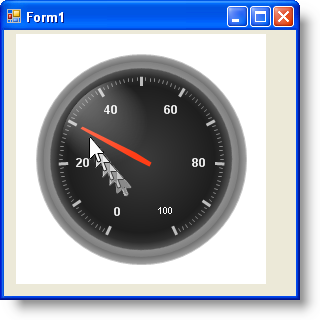

////

|metadata|
{
    "name": "wingauge-allow-manual-movement-of-the-needle",
    "controlName": ["WinGauge"],
    "tags": ["Charting"],
    "guid": "{6F99A66E-4264-4633-BB79-71CFC006BAEB}",  
    "buildFlags": [],
    "createdOn": "0001-01-01T00:00:00Z"
}
|metadata|
////

= Allow Manual Movement of the Needle

This topic shows how you can configure a needle to be dragged by the end user. This functionality is useful because it allows the end-user to adjust the values on the scale that the needle is pointing to.

This topic assumes that you have a gauge already created. For information on how to create a gauge, see link:wingauge-creating-a-gauge-in-design-view.html[Creating a Gauge in Design View].

*To allow manual movement of the needle on your gauge:*

[start=1]
. In the Markers Editor, click on the  pick:[win-forms="link:{ApiPlatform}win.ultrawingauge{ApiVersion}~infragistics.ultragauge.resources.radialgaugeneedle.html[RadialGaugeNeedle]"]  property, and from its properties, locate the  pick:[win-forms="link:{ApiPlatform}win.ultrawingauge{ApiVersion}~infragistics.ultragauge.resources.radialgaugeneedle~allowdrag.html[AllowDrag]"]  property.
[start=2]
. Set the AllowDrag property to True.
[start=3]
. Close out all dialogs by clicking the OK Button(s).
[start=4]
. Save and run the application.

You can now drag the needle to point at different values on the scale of your gauge:

